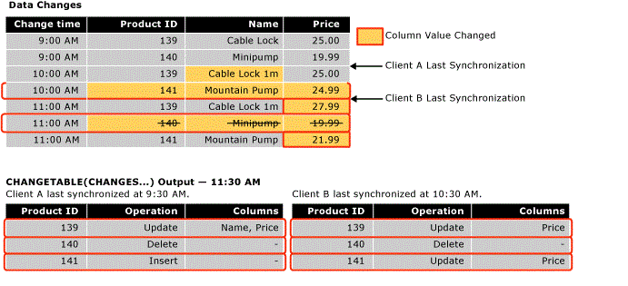

# Work with Change Tracking (SQL Server)
[!INCLUDE[tsql-appliesto-ss2008-asdb-xxxx-xxx-md](../../includes/tsql-appliesto-ss2008-asdb-xxxx-xxx-md.md)]

  Applications that use change tracking must be able to obtain tracked changes, apply these changes to another data store, and update the source database. This topic describes how to perform these tasks, and also the role change tracking plays when a failover occurs and a database must be restored from a backup.  
  
##  <a name="Obtain"></a> Obtain Changes by Using Change Tracking Functions  
 Describes how to use the change tracking functions to obtain changes and information about the changes that were made to a database.  
  
### About the Change Tracking Functions  
 Applications can use the following functions to obtain the changes that are made in a database and information about the changes:  
  
 CHANGETABLE(CHANGES ...) function  
 This rowset function is used to query for change information. The function queries the data stored in the internal change tracking tables. The function returns a results set that contains the primary keys of rows that have changed together with other change information such as the operation, columns updated and version for the row.  
  
 CHANGETABLE(CHANGES ...) takes a last synchronization version as an argument. The last sychronization version is obtained using the `@last_synchronization_version` variable. The semantics of the last synchronization version are as follows:  
  
-   The calling client has obtained changes and knows about all changes up to and including the last synchronization version.  
  
-   CHANGETABLE(CHANGES ...) will therefore return all changes that have occurred after the last synchronization version.  
  
     The following illustration shows how CHANGETABLE(CHANGES ...) is used to obtain changes.  
  
       
  
 CHANGE_TRACKING_CURRENT_VERSION() function  
 Is used to obtain the current version that will be used the next time when querying changes. This version represents the version of the last committed transaction.  
  
 CHANGE_TRACKING_MIN_VALID_VERSION() function  
 Is used to obtain the minimum valid version that a client can have and still obtain valid results from CHANGETABLE(). The client should check the last synchronization version against the value thatis returned by this function. If the last synchronization version is less than the version returned by this function, the client will be unable to obtain valid results from CHANGETABLE() and will have to reinitialize.  
  
### Obtaining Initial Data  
 Before an application can obtain changes for the first time, the application must send a query to obtain the initial data and the synchronization version. The application must obtain the appropriate data directly from the table, and then use CHANGE_TRACKING_CURRENT_VERSION() to obtain the initial version. This version will be passed to CHANGETABLE(CHANGES ...) the first time that changes are obtained.  
  
 The following example shows how to obtain the initial synchronization version and the initial data set.  
  
```sql  
    -- Obtain the current synchronization version. This will be used next time that changes are obtained.  
    SET @synchronization_version = CHANGE_TRACKING_CURRENT_VERSION();  
  
    -- Obtain initial data set.  
    SELECT  
        P.ProductID, P.Name, P.ListPrice  
    FROM  
        SalesLT.Product AS P  
```  
  
### Using the Change Tracking Functions to Obtain Changes  
 To obtain the changed rows for a table and information about the changes, use CHANGETABLE(CHANGES...). For example, the following query obtains changes for the `SalesLT.Product` table.  
  
```sql  
SELECT  
    CT.ProductID, CT.SYS_CHANGE_OPERATION,  
    CT.SYS_CHANGE_COLUMNS, CT.SYS_CHANGE_CONTEXT  
FROM  
    CHANGETABLE(CHANGES SalesLT.Product, @last_synchronization_version) AS CT  
  
```  
  
 Usually, a client will want to obtain the latest data for a row instead of only the primary keys for the row. Therefore, an application would join the results from CHANGETABLE(CHANGES ...) with the data in the user table. For example, the following query joins with the `SalesLT.Product` table to obtain the values for the `Name` and `ListPrice` columns. Note the use of `OUTER JOIN`. This is required to make sure that the change information is returned for those rows that have been deleted from the user table.  
  
```sql  
SELECT  
    CT.ProductID, P.Name, P.ListPrice,  
    CT.SYS_CHANGE_OPERATION, CT.SYS_CHANGE_COLUMNS,  
    CT.SYS_CHANGE_CONTEXT  
FROM  
    SalesLT.Product AS P  
RIGHT OUTER JOIN  
    CHANGETABLE(CHANGES SalesLT.Product, @last_synchronization_version) AS CT  
ON  
    P.ProductID = CT.ProductID  
```  
  
 To obtain the version for use in the next change enumeration, use CHANGE_TRACKING_CURRENT_VERSION(), as shown in the following example.  
  
```sql  
SET @synchronization_version = CHANGE_TRACKING_CURRENT_VERSION()  
```  
  
 When an application obtains changes, it must use both CHANGETABLE(CHANGES...) and CHANGE_TRACKING_CURRENT_VERSION(), as shown in the following example.  
  
```sql  
-- Obtain the current synchronization version. This will be used the next time CHANGETABLE(CHANGES...) is called.  
SET @synchronization_version = CHANGE_TRACKING_CURRENT_VERSION();  
  
-- Obtain incremental changes by using the synchronization version obtained the last time the data was synchronized.  
SELECT  
    CT.ProductID, P.Name, P.ListPrice,  
    CT.SYS_CHANGE_OPERATION, CT.SYS_CHANGE_COLUMNS,  
    CT.SYS_CHANGE_CONTEXT  
FROM  
    SalesLT.Product AS P  
RIGHT OUTER JOIN  
    CHANGETABLE(CHANGES SalesLT.Product, @last_synchronization_version) AS CT  
ON  
    P.ProductID = CT.ProductID  
```  
  
### Version Numbers  
 A database that has change tracking enabled has a version counter that increases as changes are made to change tracked tables. Each changed row has a version number that is associated with it. When a request is sent to an application to query for changes, a function is called that supplies a version number. The function returns information about all the changes that have been made since that version. In some ways, change tracking version is similar in concept to the **rowversion** data type.  
  
### Validating the Last Synchronized Version  
 Information about changes is maintained for a limited time. The length of time is controlled by the CHANGE_RETENTION parameter that can be specified as part of the ALTER DATABASE.  
  
 Be aware that the time specified for CHANGE_RETENTION determines how frequently all applications must request changes from the database. If an application has a value for *last_synchronization_version* that is older than the minimum valid synchronization version for a table, that application cannot perform valid change enumeration. This is because some change information might have been cleaned up. Before an application obtains changes by using CHANGETABLE(CHANGES ...), the application must validate the value for *last_synchronization_version* that it plans to pass to CHANGETABLE(CHANGES ...). If the value of *last_synchronization_version* is not valid, that application must reinitialize all the data.  
  
 The following example shows how to verify the validity of the value of `last_synchronization_version` for each table.  
  
```sql  
-- Check individual table.  
IF (@last_synchronization_version < CHANGE_TRACKING_MIN_VALID_VERSION(  
                                   OBJECT_ID('SalesLT.Product')))  
BEGIN  
  -- Handle invalid version and do not enumerate changes.  
  -- Client must be reinitialized.  
END  
```  
  
 As the following example shows, the validity of the value of `last_synchronization_version` can be checked against all tables in the database.  
  
```sql  
-- Check all tables with change tracking enabled  
IF EXISTS (  
  SELECT COUNT(*) FROM sys.change_tracking_tables  
  WHERE min_valid_version > @last_synchronization_version )  
BEGIN  
  -- Handle invalid version & do not enumerate changes  
  -- Client must be reinitialized  
END  
```  
  
### Using Column Tracking  
 Column tracking enables applications to obtain the data for only the columns that have changed instead of the whole row. For example, consider the scenario in which a table has one or more columns that are large, but rarely change; and also has other columns that frequently change. Without column tracking, an application can only determine that a row has changed and would have to synchronize all the data that includes the large column data. However, by using column tracking, an application can determine whether the large column data changed and only synchronize the data if it has changed.  
  
 Column tracking information appears in the SYS_CHANGE_COLUMNS column that is returned by the CHANGETABLE(CHANGES ...) function.  
  
 Column tracking can be used so that NULL is returned for a column that has not changed. If the column can be changed to NULL, a separate column must be returned to indicate whether the column changed.  
  
 In the following example, the `CT_ThumbnailPhoto` column will be `NULL` if that column did not change. This column could also be `NULL` because it was changed to `NULL` - the application can use the `CT_ThumbNailPhoto_Changed` column to determine whether the column changed.  
  
```sql  
DECLARE @PhotoColumnId int = COLUMNPROPERTY(  
    OBJECT_ID('SalesLT.Product'),'ThumbNailPhoto', 'ColumnId')  
  
SELECT  
    CT.ProductID, P.Name, P.ListPrice, -- Always obtain values.  
    CASE  
           WHEN CHANGE_TRACKING_IS_COLUMN_IN_MASK(  
                     @PhotoColumnId, CT.SYS_CHANGE_COLUMNS) = 1  
            THEN ThumbNailPhoto  
            ELSE NULL  
      END AS CT_ThumbNailPhoto,  
      CHANGE_TRACKING_IS_COLUMN_IN_MASK(  
                     @PhotoColumnId, CT.SYS_CHANGE_COLUMNS) AS  
                                   CT_ThumbNailPhoto_Changed  
     CT.SYS_CHANGE_OPERATION, CT.SYS_CHANGE_COLUMNS,  
     CT.SYS_CHANGE_CONTEXT  
FROM  
     SalesLT.Product AS P  
INNER JOIN  
     CHANGETABLE(CHANGES SalesLT.Product, @last_synchronization_version) AS CT  
ON  
     P.ProductID = CT.ProductID AND  
     CT.SYS_CHANGE_OPERATION = 'U'  
```  
  
### Obtaining Consistent and Correct Results  
 Obtaining the changed data for a table requires multiple steps. Be aware that inconsistent or incorrect results could be returned if certain issues are not considered and handled.  
  
 For example, to obtain the changes that were made to a Sales table and SalesOrders table, an application would perform the following steps:  
  
1.  Validate the last synchronized version by using CHANGE_TRACKING_MIN_VALID_VERSION().  
  
2.  Obtain the version that can be used to obtain change the next time by using CHANGE_TRACKING_CURRENT_VERSION().  
  
3.  Obtain the changes for the Sales table by using CHANGETABLE(CHANGES ...).  
  
4.  Obtain the changes for the SalesOrders table by using CHANGETABLE(CHANGES ...).  
  
 Two processes are occurring in the database that can affect the results that are returned by the previous steps:  
  
-   The cleanup process runs in the background and removes change tracking information that is older than the specified retention period.  
  
     The cleanup process is a separate background process that uses the retention period that is specified when you configure change tracking for the database. The issue is that the cleanup process can occur in the time between when the last synchronization version was validated and when the call to CHANGETABLE(CHANGES...) is made. A last synchronization version that was just valid might no longer be valid by the time the changes are obtained. Therefore, incorrect results might be returned.  
  
-   Ongoing DML operations are occurring in the Sales and SalesOrders tables, such as the following operations:  
  
    -   Changes can be made to the tables after the version for next time has been obtained by using CHANGE_TRACKING_CURRENT_VERSION(). Therefore, more changes can be returned than expected.  
  
    -   A transaction could commit in the time between the call to obtain changes from the Sales table and the call to obtain changes from the SalesOrders table. Therefore, the results for the SalesOrder table could have foreign key value that does not exist in the Sales table.  
  
 To overcome the previously listed challenges, we recommend that you use snapshot isolation. This will help to ensure consistency of change information and avoid race conditions that are related to the background cleanup task. If you do not use snapshot transactions, developing an application that uses change tracking could require significantly more effort.  
  
#### Using Snapshot Isolation  
 Change tracking has been designed to work well with snapshot isolation. Snapshot isolation must be enabled for the database. All the steps that are required to obtain changes must be included inside a snapshot transaction. This will ensure that all changes that are made to data while obtaining changes will not be visible to the queries inside the snapshot transaction.  
  
 To obtain data inside a snapshot transaction, perform the following steps:  
  
1.  Set the transaction isolation level to snapshot and start a transaction.  
  
2.  Validate the last synchronization version by using CHANGE_TRACKING_MIN_VALID_VERSION().  
  
3.  Obtain the version to be used the next time by using CHANGE_TRACKING_CURRENT_VERSION().  
  
4.  Obtain the changes for the Sales table by using CHANGETABLE(CHANGES ...)  
  
5.  Obtain the changes for the Salesorders table by using CHANGETABLE(CHANGES ...)  
  
6.  Commit the transaction.  
  
 Some points to remember as all steps to obtain changes are inside a snapshot transaction:  
  
-   If cleanup occurs after the last synchronization version is validated, the results from CHANGETABLE(CHANGES ...) will still be valid as the delete operations performed by cleanup will not be visible inside the transaction.  
  
-   Any changes that are made to the Sales table or the SalesOrders table after the next synchronization version is obtained will not be visible, and the calls to CHANGETABLE(CHANGES ...) will never return changes with a version later than that returned by CHANGE_TRACKING_CURRENT_VERSION(). Consistency between the Sales table and the SalesOrders table will also be maintained, because the transactions that were committed in the time between calls to CHANGETABLE(CHANGES ...) will not be visible.  
  
 The following example shows how snapshot isolation is enabled for a database.  
  
```sql  
-- The database must be configured to enable snapshot isolation.  
ALTER DATABASE AdventureWorksLT  
    SET ALLOW_SNAPSHOT_ISOLATION ON;  
```  
  
 A snapshot transaction is used as follows:  
  
```sql  
SET TRANSACTION ISOLATION LEVEL SNAPSHOT;  
BEGIN TRAN  
  -- Verify that version of the previous synchronization is valid.  
  -- Obtain the version to use next time.  
  -- Obtain changes.  
COMMIT TRAN  
```  
  
 For more information about snapshot transactions, see [SET TRANSACTION ISOLATION LEVEL &#40;Transact-SQL&#41;](../../t-sql/statements/set-transaction-isolation-level-transact-sql.md).  
  
#### Alternatives to Using Snapshot Isolation  
 There are alternatives to using snapshot isolation, but they require more work to make sure all application requirements are met. To make sure the *last_synchronization_version* is valid and data is not removed by the cleanup process before changes are obtained, do the following:  
  
1.  Check *last_synchronization_version* after the calls to CHANGETABLE().  
  
2.  Check *last_synchronization_version* as part of each query to obtain changes by using CHANGETABLE().  
  
 Changes can occur after the synchronization version for the next enumeration has been obtained. There are two ways to handle this situation. The option that is used depends on the application and how it can handle the side-effects of each approach:  
  
-   Ignore changes that have a version larger than the new synchronization version.  
  
     This approach has the side effect that a new or updated row would be skipped if it was created or updated before the new synchronization version, but then updated afterward. If there is a new row, a referential integrity problem might occur if there was a row in another table that was created that referenced the skipped row. If there is an updated existing row, the row will be skipped and not synchronized until the next time.  
  
-   Include all changes, even those that have a version larger than the new synchronization version.  
  
     The rows that have a version larger than the new synchronization version will be obtained again on the next synchronization. This must be expected and handled by the application.  
  
 In addition to the previous two options, you can devise approach that combines both options, depending on the operation. For example, you might want an application for which it is best to ignore changes newer than the next synchronization version in which the row was created or deleted, but updates are not ignored.  
  
> [!NOTE]  
>  Choosing the approach that will work for the application when you are using change tracking (or any custom tracking mechanism), requires significant analysis. Therefore, it is much simpler to use snapshot isolation.  
  
##  <a name="Handles"></a> How Change Tracking Handles Changes to a Database  
 Some applications that use change tracking perform two-way synchronization with another data store. That is, changes that are made in the [!INCLUDE[ssNoVersion](../../includes/ssnoversion-md.md)] database are updated in the other data store, and changes that are made in the other store are updated in the [!INCLUDE[ssNoVersion](../../includes/ssnoversion-md.md)] database.  
  
 When an application updates the local database with changes from another data store, the application must perform the following operations:  
  
-   Check for conflicts.  
  
     A conflict occurs when the same data is changed at the same time in both data stores. The application must be able to check for a conflict and obtain enough information to enable the conflict to be resolved.  
  
-   Store application context information.  
  
     The application stores data that has the change tracking information. This information would be available together with other change tracking information when changes were obtained from the local database. A common example of this contextual information is an identifier for the data store that was the source of the change.  
  
 To perform the previous operations, a synchronization application can use the following functions:  
  
-   CHANGETABLE(VERSION...)  
  
     When an application is making changes, it can use this function to check for conflicts. The function obtains the latest change tracking information for a specified row in a change tracked table. The change tracking information includes the version of the row that was last changed. This information enables an application to determine whether the row was changed after the last time that the application was synchronized.  
  
-   WITH CHANGE_TRACKING_CONTEXT  
  
     An application can use this clause to store context data.  
  
### Checking for Conflicts  
 In a two-way synchronization scenario, the client application must determine whether a row has not been updated since the application last obtained the changes.  
  
 The following example shows how to use the CHANGETABLE(VERSION ...) function to check for conflicts in the most efficient way, without a separate query. In the example, `CHANGETABLE(VERSION ...)` determines the `SYS_CHANGE_VERSION` for the row specified by `@product id`. `CHANGETABLE(CHANGES ...)` can obtain the same information, but that would be less efficient. If the value of `SYS_CHANGE_VERSION` for the row is larger than the value of `@last_sync_version`, there is a conflict. If there is a conflict, the row will not be updated. The `ISNULL()` check is required because there might be no change information available for the row. No change information would exist if the row had not been updated since change tracking was enabled or since the change information was cleaned up.  
  
```sql  
-- Assumption: @last_sync_version has been validated.  
  
UPDATE  
    SalesLT.Product  
SET  
    ListPrice = @new_listprice  
FROM  
    SalesLT.Product AS P  
WHERE  
    ProductID = @product_id AND  
    @last_sync_version >= ISNULL (  
        SELECT CT.SYS_CHANGE_VERSION  
        FROM CHANGETABLE(VERSION SalesLT.Product,  
                        (ProductID), (P.ProductID)) AS CT),  
        0)  
```  
  
 The following code can check the updated row count and can identify more information about the conflict.  
  
```sql  
-- If the change cannot be made, find out more information.  
IF (@@ROWCOUNT = 0)  
BEGIN  
    -- Obtain the complete change information for the row.  
    SELECT  
        CT.SYS_CHANGE_VERSION, CT.SYS_CHANGE_CREATION_VERSION,  
        CT.SYS_CHANGE_OPERATION, CT.SYS_CHANGE_COLUMNS  
    FROM  
        CHANGETABLE(CHANGES SalesLT.Product, @last_sync_version) AS CT  
    WHERE  
        CT.ProductID = @product_id;  
  
    -- Check CT.SYS_CHANGE_VERSION to verify that it really was a conflict.  
    -- Check CT.SYS_CHANGE_OPERATION to determine the type of conflict:  
    -- update-update or update-delete.  
    -- The row that is specified by @product_id might no longer exist   
    -- if it has been deleted.  
END  
```  
  
### Setting Context Information  
 By using the WITH CHANGE_TRACKING_CONTEXT clause, an application can store context information together with the change information. This information can then be obtained from the SYS_CHANGE_CONTEXT column that is returned by CHANGETABLE(CHANGES ...).  
  
 Context information is typically used to identify the source of the changes. If the source of the change can be identified, that information can be used by a data store to avoid obtaining changes when it synchronizes again.  
  
```sql  
  -- Try to update the row and check for a conflict.  
  WITH CHANGE_TRACKING_CONTEXT (@source_id)  
  UPDATE  
     SalesLT.Product  
  SET  
      ListPrice = @new_listprice  
  FROM  
      SalesLT.Product AS P  
  WHERE  
     ProductID = @product_id AND  
     @last_sync_version >= ISNULL (  
         (SELECT CT.SYS_CHANGE_VERSION FROM CHANGETABLE(VERSION SalesLT.Product,  
         (ProductID), (P.ProductID)) AS CT),  
         0)  
```  
  
### Ensuring Consistent and Correct Results  
 An application must consider the cleanup process when it validates the value of @last_sync_version. This is because data could have been removed after CHANGE_TRACKING_MIN_VALID_VERSION() was called, but before the update was made.  
  
> [!IMPORTANT]  
>  We recommend that you use snapshot isolation and make the changes within a snapshot transaction.  
  
```sql  
-- Prerequisite is to ensure ALLOW_SNAPSHOT_ISOLATION is ON for the database.  
  
SET TRANSACTION ISOLATION LEVEL SNAPSHOT;  
BEGIN TRAN  
    -- Verify that last_sync_version is valid.  
    IF (@last_sync_version <  
CHANGE_TRACKING_MIN_VALID_VERSION(OBJECT_ID('SalesLT.Product')))  
    BEGIN  
       RAISERROR (N'Last_sync_version too old', 16, -1);  
    END  
    ELSE  
    BEGIN  
        -- Try to update the row.  
        -- Check @@ROWCOUNT and check for a conflict.  
    END  
COMMIT TRAN  
```  
  
> [!NOTE]  
>  There is a possibility that the row being updated within the snapshot transaction could have been updated in another transaction after the snapshot transaction was started. In this case, a snapshot isolation update conflict will occur and lead to the transaction being terminated. If this happens, retry the update. This will then lead to a change tracking conflict being detected and no rows being changed.  
  
##  <a name="DataRestore"></a> Change Tracking and Data Restore  
 Applications that require synchronization must consider the case in which a database that has change tracking enabled reverts to an earlier version of the data. This can occur after a database is restored from a backup, when there is a failover to an asynchronous database mirror, or when there is a failure when using log shipping. The following scenario illustrates the issue:  
  
1.  Table T1 is change tracked, and the minimum valid version for table is 50.  
  
2.  A client application synchronizes data at version 100 and obtains information about all changes between versions 50 and 100.  
  
3.  Additional changes are made to table T1 after version 100.  
  
4.  At version 120, there is a failure and the database administrator restores the database with data loss. After the restore operation, the table contains data up through version 70, and the minimum synchronized version is still 50.  
  
     This means that the synchronized data store has data that no longer exists in the primary data store.  
  
5.  T1 is updated many times. This brings the current version to 130.  
  
6.  The client application synchronizes again and supplies a last-synchronized version of 100. The client validates this number successfully because 100 is greater than 50.  
  
     The client obtains changes between version 100 and 130. At this point, the client is not aware that the changes between 70 and 100 are not the same as before. The data on the client and server are not synchronized.  
  
 Note that if the database was recovered to a point after version 100, there would be no problems with synchronization. The client and server would synchronize data correctly during the next synchronization interval.  
  
 Change tracking does not provide support for recovering from the loss of data. However, there are two options for detecting these types of synchronization issues:  
  
-   Store a database version ID on the server, and update this value whenever a database is recovered or otherwise loses data. Each client application would store the ID, and each client would have to validate this ID when it synchronizes data. If data loss occurs, the IDs will not match and the clients would reinitialize. One drawback is if the data loss had not crossed the last synchronized boundary, the client might do unnecessary reinitialization.  
  
-   When a client queries for changes, record the last synchronization version number for each client on the server. If there is a problem with the data, the last synchronized version numbers would not match. This indicates that a reinitialization is required.  
  
## See Also  
 [Track Data Changes &#40;SQL Server&#41;](../../relational-databases/track-changes/track-data-changes-sql-server.md)   
 [About Change Tracking &#40;SQL Server&#41;](../../relational-databases/track-changes/about-change-tracking-sql-server.md)   
 [Manage Change Tracking &#40;SQL Server&#41;](../../relational-databases/track-changes/manage-change-tracking-sql-server.md)   
 [Enable and Disable Change Tracking &#40;SQL Server&#41;](../../relational-databases/track-changes/enable-and-disable-change-tracking-sql-server.md)   
 [CHANGETABLE &#40;Transact-SQL&#41;](../../relational-databases/system-functions/changetable-transact-sql.md)   
 [CHANGE_TRACKING_MIN_VALID_VERSION &#40;Transact-SQL&#41;](../../relational-databases/system-functions/change-tracking-min-valid-version-transact-sql.md)   
 [CHANGE_TRACKING_CURRENT_VERSION &#40;Transact-SQL&#41;](../../relational-databases/system-functions/change-tracking-current-version-transact-sql.md)   
 [WITH CHANGE_TRACKING_CONTEXT &#40;Transact-SQL&#41;](../../relational-databases/system-functions/with-change-tracking-context-transact-sql.md)  
  
  
