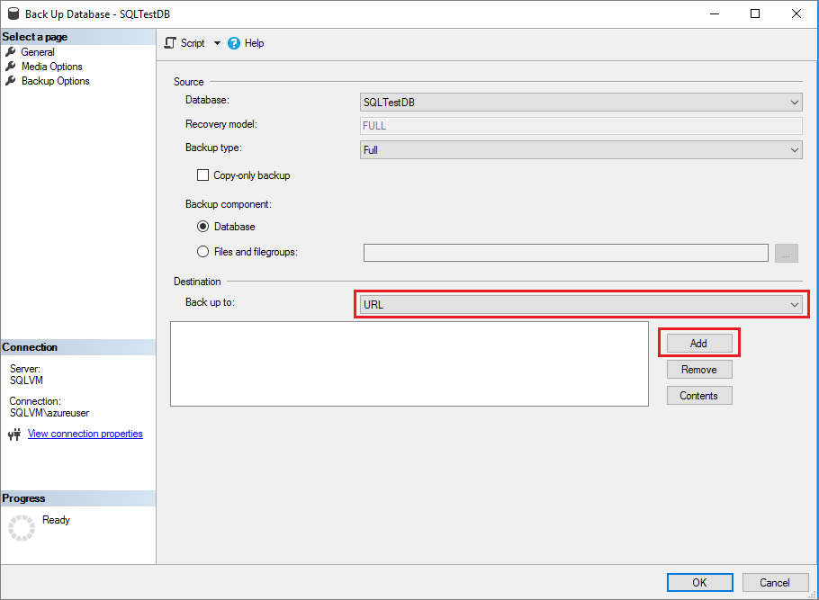
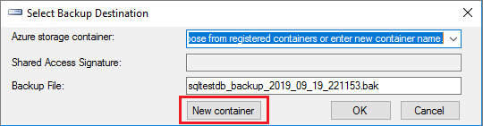
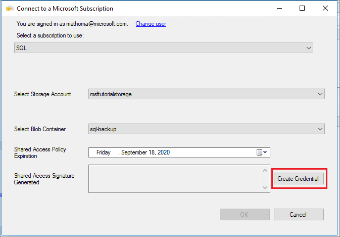
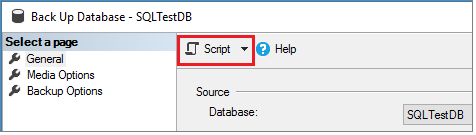
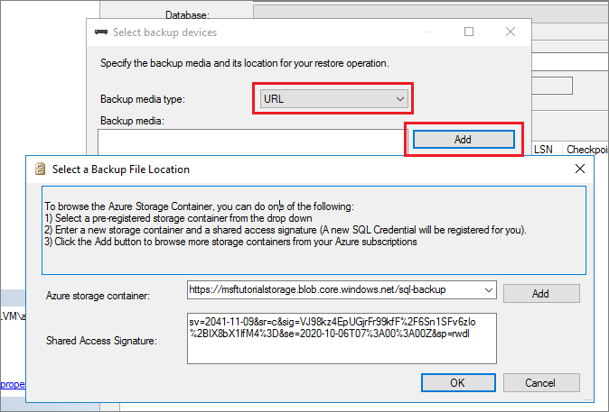
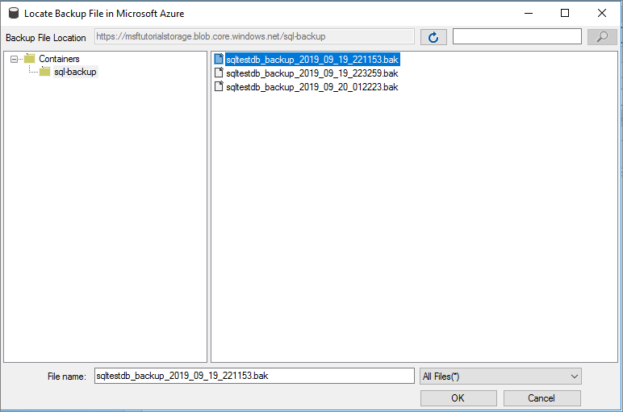

# Quickstart: SQL backup and restore to Azure Blob Storage

[!INCLUDE [sqlserver2016-asdbmi](../includes/applies-to-version/sqlserver2016-asdbmi.md)]

This quickstart helps you understand how to write backups to and restore from the Azure Blob Storage.  The article explains how to create an Azure Blob Storage container, write a backup to Azure Blob Storage, and then perform a restore.

> [!NOTE]
> SQL Server 2012 SP1 CU2 introduced support for back up to Azure Blob storage. SQL Server 2014 and prior does not support the Shared Access Signature (SAS) that is described in this quickstart article.
>
> For SQL Server 2014 and prior, use [Tutorial: SQL Server 2014 Backup and Restore to Microsoft Azure Blob storage](/previous-versions/sql/2014/relational-databases/backup-restore/sql-server-backup-to-url).
>
  
## Prerequisites

To complete this quickstart, you must be familiar with [!INCLUDE[ssNoVersion](../includes/ssnoversion-md.md)] backup and restore concepts and T-SQL syntax.  You need an Azure storage account, SQL Server Management Studio (SSMS), and access to either a server that's running SQL Server or Azure SQL Managed Instance. Additionally, the account used to issue the BACKUP and RESTORE commands should be in the **db_backupoperator** database role with **alter any credential** permissions. 

- Get a free [Azure Account](https://azure.microsoft.com/offers/ms-azr-0044p/).
- Create an [Azure storage account](/azure/storage/common/storage-quickstart-create-account?tabs=portal).
- Install [SQL Server Management Studio](../ssms/download-sql-server-management-studio-ssms.md).
- Install [SQL Server 2017 Developer Edition](https://www.microsoft.com/sql-server/sql-server-downloads) or deploy [Azure SQL Managed Instance](/azure/sql-database/sql-database-managed-instance-get-started) with connectivity established through an [Azure SQL virtual machine](/azure/sql-database/sql-database-managed-instance-configure-vm) or [point-to-site](/azure/sql-database/sql-database-managed-instance-configure-p2s).
- Assign the user account to the role of [db_backupoperator](./security/authentication-access/database-level-roles.md) and grant [alter any credential](../t-sql/statements/alter-credential-transact-sql.md) permissions. 

## Create Azure Blob Storage container
A container provides a grouping of a set of blobs. All blobs must be in a container. A storage account can contain an unlimited number of containers, but must have at least one container. A container can store an unlimited number of blobs. 

To create a Container, follow these steps:

1. Open the Azure portal. 
1. Navigate to your Storage Account. 
1. Select the storage account, scroll down to **Blob Services**.
1. Select **Blobs** and then select  **+ Container** to add a new container. 
1. Enter the name for the container and make note of the container name you specified. This information is used in the URL (path to backup file) in the T-SQL statements later in this quickstart. 
1. Select **OK**. 
    
    

  > [!NOTE]
  > Authentication to the storage account is required for SQL Server backup and restore even if you choose to create a public container. You can also create a container programmatically using REST APIs. For more information, see [Create container](/rest/api/storageservices/Create-Container)

## Create a test database 
In this step, create a test database using SQL Server Management Studio (SSMS). 

1. Launch [SQL Server Management Studio (SSMS)](../ssms/download-sql-server-management-studio-ssms.md) and connect to your SQL Server instance.
1. Open a **New Query** window. 
1. Run the following Transact-SQL (T-SQL) code to create your test database. Refresh the **Databases** node in **Object Explorer** to see your new database. Newly created databases on SQL Managed Instance automatically have TDE enabled so you'll need to disable it to proceed. 

```sql
USE [master]
GO

-- Create database
CREATE DATABASE [SQLTestDB]
GO

-- Create table in database
USE [SQLTestDB]
GO
CREATE TABLE SQLTest (
    ID INT NOT NULL PRIMARY KEY,
    c1 VARCHAR(100) NOT NULL,
    dt1 DATETIME NOT NULL DEFAULT getdate()
)
GO

-- Populate table 
USE [SQLTestDB]
GO

INSERT INTO SQLTest (ID, c1) VALUES (1, 'test1')
INSERT INTO SQLTest (ID, c1) VALUES (2, 'test2')
INSERT INTO SQLTest (ID, c1) VALUES (3, 'test3')
INSERT INTO SQLTest (ID, c1) VALUES (4, 'test4')
INSERT INTO SQLTest (ID, c1) VALUES (5, 'test5')
GO

SELECT * FROM SQLTest
GO

-- Disable TDE for newly-created databases on SQL Managed Instance 
USE [SQLTestDB];
GO
ALTER DATABASE [SQLTestDB] SET ENCRYPTION OFF;
GO
DROP DATABASE ENCRYPTION KEY
GO
```

## Create credential

Use the GUI in SQL Server Management Studio to create the credential by following the steps below. Alternatively, you can create the credential [programmatically](tutorial-use-azure-blob-storage-service-with-sql-server-2016.md#2---create-a-sql-server-credential-using-a-shared-access-signature) as well. 

1. Expand the **Databases** node within **Object Explorer** of [SQL Server Management Studio(SSMS)](../ssms/download-sql-server-management-studio-ssms.md).
1. Right-click your new `SQLTestDB` database, hover over **Tasks** and then select **Back up...** to launch the **Back Up Database** wizard. 
1. Select **URL** from the **Back up to** destination drop-down, and then select **Add** to launch the **Select Backup Destination** dialog box. 

   

1. Select **New container** on the **Select Backup Destination** dialog box to launch the **Connect to a Microsoft Subscription** window. 

   

1. Sign in to the Azure portal by selecting **Sign In...** and then proceed through the sign-in process. 
1. Select your **subscription** from the drop-drown. 
1. Select your **storage account** from the drop-down. 
1. Select the container you created previously from the drop-down. 
1. Select **Create Credential** to generate your *Shared Access Signature (SAS)*.  **Save this value as you'll need it for the restore.**

   

1. Select **OK** to close the **Connect to a Microsoft Subscription** window. This populates the *Azure storage container* value on the **Select Backup Destination** dialog box. Select **OK** to choose the selected storage container, and close the dialog box. 
1. At this point, you can either skip ahead to step 4 in the next section to take the backup of the database, or close the **Back up Database** wizard if you want to proceed with using Transact-SQL to back up the database instead. 


## Back up database
In this step, back up the database `SQLTestDB` to your Azure Blob storage account using either the GUI within SQL Server Management Studio, or Transact-SQL (T-SQL). 

# [SSMS](#tab/SSMS)

1. If the **Back Up Database** wizard is not already open, expand the **Databases** node within **Object Explorer** of [SQL Server Management Studio(SSMS)](../ssms/download-sql-server-management-studio-ssms.md).
1. Right-click your new `SQLTestDB` database, hover over **Tasks** and then select **Back up...** to launch the **Back Up Database** wizard. 
1. Select **URL** from the **Back up to** drop down, and then select **Add** to launch the **Select Backup Destination** dialog box. 

   

1. Select the container you created in the previous step in the **Azure storage container** drop-down. 

   

1. Select **OK** on the **Back Up Database** wizard to back up your database. 
1. Select **OK** once your database is backed up successfully to close all backup-related windows. 

   > [!TIP]
   > You can script out the Transact-SQL behind this command by selecting **Script** at the top of the **Back Up Database** wizard: 
   > 


# [Transact-SQL](#tab/tsql)

Back up your database using Transact-SQL by running the following command: 


```sql
USE [master]

BACKUP DATABASE [SQLTestDB] 
TO  URL = N'https://msftutorialstorage.blob.core.windows.net/sql-backup/sqltestdb_backup_2020_01_01_000001.bak' 
WITH  COPY_ONLY, CHECKSUM
GO
```

---

## Delete database
In this step, delete the database before performing the restore. This step is only necessary for the purpose of this tutorial, but is unlikely to be used in normal database management procedures. You can skip this step, but then you'll either need to change the name of the database during the restore on a managed instance, or run the restore command `WITH REPLACE` to restore the database successfully on-premises. 

# [SSMS](#tab/SSMS)

1. Expand the **Databases** node in **Object explorer**, right-click the `SQLTestDB` database, and select delete to launch the **Delete object** wizard. 
1. On a managed instance, select **OK** to delete the database. On-premises, check the checkbox next to **Close existing connections** and then select **OK** to delete the database. 

# [Transact-SQL](#tab/tsql)

Delete the database by running the following Transact-SQL command:

```sql
USE [master]
GO
DROP DATABASE [SQLTestDB]
GO

-- If connections currently exist on-premises, you'll need to set the database into single user mode first
USE [master]
GO
ALTER DATABASE [SQLTestDB] SET  SINGLE_USER WITH ROLLBACK IMMEDIATE
GO
USE [master]
GO
DROP DATABASE [SQLTestDB]
GO
```

---


## Restore database 
In this step, restore the database using either the GUI in SQL Server Management Studio, or with Transact-SQL. 

# [SSMS](#tab/SSMS)

1. Right-click the **Databases** node in **Object Explorer** within SQL Server Management Studio and select **Restore Database**. 
1. Select **Device** and then select the ellipses (...) to choose the device. 

   

1. Select **URL** from the **Backup media type** drop-down and select **Add** to add your device. 

   

1. Select the container from the drop-down and then paste in the Shared Access Signature (SAS) you saved when creating the credential. 

   

1. Select **OK** to select the backup file location. 
1. Expand **Containers** and select the container where your backup file exists. 
1. Select the backup file you want to restore and then select **OK**. If no files are visible, then you may be using the wrong SAS key. You can regenerate the SAS key again by following the same steps as before to add the container. 

   

1. Select **OK** to close the **Select backup devices** dialog box.
1. Select **OK** to restore your database.

# [Transact-SQL](#tab/tsql)

To restore your on-premises database from Azure Blob storage, modify the following Transact-SQL command to use your own storage account and then run it within a new query window.

```sql
USE [master]
RESTORE DATABASE [SQLTestDB] FROM 
URL = N'https://msftutorialstorage.blob.core.windows.net/sql-backup/sqltestdb_backup_2020_01_01_000001.bak'
```

---


## See also 
Following is some recommended reading to understand the concepts and best practices when using Azure Blob Storage for [!INCLUDE[ssNoVersion](../includes/ssnoversion-md.md)] backups.  
  
-   [SQL Server Backup and Restore with Microsoft Azure Blob Storage](../relational-databases/backup-restore/sql-server-backup-and-restore-with-microsoft-azure-blob-storage-service.md)   
-   [SQL Server Backup to URL Best Practices and Troubleshooting](../relational-databases/backup-restore/sql-server-backup-to-url-best-practices-and-troubleshooting.md)  
