# Tutorial: Use Azure Blob storage service with SQL Server 2016

[!INCLUDE[appliesto-ss-xxxx-xxxx-xxx-md](../includes/appliesto-ss-xxxx-xxxx-xxx-md.md)]
Welcome to the  Working with SQL Server 2016 in Microsoft Azure Blob Storage service tutorial. This tutorial helps you understand how to use the Microsoft Azure Blob storage service for SQL Server data files and SQL Server backups.  
  
SQL Server integration support for the Microsoft Azure Blob storage service began as a SQL Server 2012 Service Pack 1 CU2 enhancement, and has been enhanced further with SQL Server 2014 and SQL Server 2016. For an overview of the functionality and benefits of using this feature, see [SQL Server Data Files in Microsoft Azure](../relational-databases/databases/sql-server-data-files-in-microsoft-azure.md). For a live demo, see [Demo of Point in Time Restore](https://channel9.msdn.com/Blogs/Windows-Azure/File-Snapshot-Backups-Demo).  

This tutorial shows you how to work with  SQL Server Data Files in Microsoft Azure Blob storage service in multiple sections. Each section is focused on a specific task and the sections should be completed in sequence. First, you will learn how to create a new container in Blob storage with a stored access policy and a shared access signature. Then, you will learn how to create a SQL Server credential to integrate SQL Server with Azure Blob storage. Next, you will back up a database to Blob storage and restore it to an Azure virtual machine. You will then use SQL Server 2016 file-snapshot transaction log backup to restore to a point in time and to a new database. Finally, the tutorial will demonstrate the use of meta data system stored procedures and functions to help you understand and work with file-snapshot backups.
  
## Prerequisites

To complete this tutorial, you must be familiar with [!INCLUDE[ssNoVersion](../includes/ssnoversion-md.md)] backup and restore concepts and T-SQL syntax. 
To use this tutorial, you need an Azure storage account, SQL Server Management Studio (SSMS), access to an instance of SQL Server on-premises, access to an Azure virtual machine (VM) running SQL Server 2016, and an AdventureWorks2016 database. Additionally, the account used to issue the BACKUP and RESTORE commands should be in the **db_backupoperator** database role with **alter any credential** permissions. 

- Get a free [Azure Account](https://azure.microsoft.com/offers/ms-azr-0044p/).
- Create an [Azure storage account](https://docs.microsoft.com/azure/storage/common/storage-quickstart-create-account?tabs=portal).
- Install [SQL Server 2017 Developer Edition](https://www.microsoft.com/sql-server/sql-server-downloads).
- Provision an [Azure VM running SQL Server](https://azure.microsoft.com/documentation/articles/virtual-machines-provision-sql-server/)
- Install [SQL Server Management Studio](https://docs.microsoft.com/sql/ssms/download-sql-server-management-studio-ssms).
- Download [AdventureWorks2016 sample databases](https://docs.microsoft.com/sql/samples/adventureworks-install-configure).
- Assign the user account to the role of [db_backupoperator](https://docs.microsoft.com/sql/relational-databases/security/authentication-access/database-level-roles) and grant [alter any credential](https://docs.microsoft.com/sql/t-sql/statements/alter-credential-transact-sql) permissions. 

[!INCLUDE[Freshness](../includes/paragraph-content/fresh-note-steps-feedback.md)]

## 1 - Create stored access policy and shared access storage

In this section, you will use an [Azure PowerShell](https://azure.microsoft.com/documentation/articles/powershell-install-configure/) script to create a shared access signature on an Azure Blob container using a stored access policy.  
  
> [!NOTE]  
> This script is written using Azure PowerShell 5.0.10586.  
  
A shared access signature is a URI that grants restricted access rights to containers, blobs, queues, or tables. A stored access policy provides an additional level of control over shared access signatures on the server side including revoking, expiring, or extending access. When using this new enhancement, you need to create a policy on a container with at least read, write, and list rights.  
  
You can create a stored access policy and a shared access signature by using Azure PowerShell, the Azure Storage SDK, the Azure REST API, or a third-party utility. This tutorial demonstrates how to use an Azure PowerShell script to complete this task. The script uses the Resource Manager deployment model and creates  the following new resources  
  
-   Resource group   
-   Storage account  
-   Azure blob container   
-   SAS policy    

This script starts by declaring a number of variables to specify the names for the above resources and the names of the following required input values:  
  
-   A prefix name used in naming other resource objects    
-   Subscription name    
-   Data center location  

  
The script completes by generating the appropriate CREATE CREDENTIAL statement that you will use in [2 - Create a SQL Server credential using a shared access signature](#2---create-a-sql-server-credential-using-a-shared-access-signature). This statement is copied to your clipboard for you and is output to the console for you to see.  
  
To create a policy on the container and generate a Shared Access Signature (SAS) key, follow these steps:  
  
1.  Open Window PowerShell or Windows PowerShell ISE (see version requirements above).  
  
2.  Edit and then execute the b script:  
  
    ```powershell
    # Define global variables for the script  
    $prefixName = '<a prefix name>'  # used as the prefix for the name for various objects  
    $subscriptionID=='<your subscription ID>'   # the ID  of subscription name you will use  
    $locationName = '<a data center location>'  # the data center region you will use  
    $storageAccountName= $prefixName + 'storage' # the storage account name you will create or use  
    $containerName= $prefixName + 'container'  # the storage container name to which you will attach the SAS policy with its SAS token  
    $policyName = $prefixName + 'policy' # the name of the SAS policy 

    # Set a variable for the name of the resource group you will create or use  
    $resourceGroupName=$prefixName + 'rg'   
  
    # Add an authenticated Azure account for use in the session   
    Connect-AzAccount    
  
    # Set the tenant, subscription and environment for use in the rest of   
    Set-AzContext -SubscriptionId $subscriptionID   
  
    # Create a new resource group - comment out this line to use an existing resource group  
    New-AzResourceGroup -Name $resourceGroupName -Location $locationName   
  
    # Create a new Azure Resource Manager storage account - comment out this line to use an existing Azure Resource Manager storage account  
    New-AzStorageAccount -Name $storageAccountName -ResourceGroupName $resourceGroupName -Type Standard_RAGRS -Location $locationName   
  
    # Get the access keys for the Azure Resource Manager storage account  
    $accountKeys = Get-AzStorageAccountKey -ResourceGroupName $resourceGroupName -Name $storageAccountName  
  
    # Create a new storage account context using an Azure Resource Manager storage account  
    $storageContext = New-AzStorageContext -StorageAccountName $storageAccountName -StorageAccountKey $accountKeys[0].Value

    # Creates a new container in blob storage  
    $container = New-AzStorageContainer -Context $storageContext -Name $containerName  
  
    # Sets up a Stored Access Policy and a Shared Access Signature for the new container  
    $policy = New-AzStorageContainerStoredAccessPolicy -Container $containerName -Policy $policyName -Context $storageContext -StartTime $(Get-Date).ToUniversalTime().AddMinutes(-5) -ExpiryTime $(Get-Date).ToUniversalTime().AddYears(10) -Permission rwld

    # Gets the Shared Access Signature for the policy  
    $sas = New-AzStorageContainerSASToken -name $containerName -Policy $policyName -Context $storageContext
    Write-Host 'Shared Access Signature= '$($sas.Substring(1))''  

    # Sets the variables for the new container you just created
    $container = Get-AzStorageContainer -Context $storageContext -Name $containerName
    $cbc = $container.CloudBlobContainer 
  
    # Outputs the Transact SQL to the clipboard and to the screen to create the credential using the Shared Access Signature  
    Write-Host 'Credential T-SQL'  
    $tSql = "CREATE CREDENTIAL [{0}] WITH IDENTITY='Shared Access Signature', SECRET='{1}'" -f $cbc.Uri,$sas.Substring(1)   
    $tSql | clip  
    Write-Host $tSql 

    # Once you're done with the tutorial, remove the resource group to clean up the resources. 
    # Remove-AzResourceGroup -Name $resourceGroupName  
    ```  

3.  After the script completes, the CREATE CREDENTIAL statement will be in your clipboard for use in the next section.  


## 2 - Create a SQL Server credential using a shared access signature

In this section, you will create a credential to store the security information that will be used by SQL Server to write to and read from the Azure container that you created in the previous step.  
  
A SQL Server credential is an object that is used to store authentication information required to connect to a resource outside of SQL Server. The credential stores the URI path of the storage container and the shared access signature for this container.  

To create a SQL Server credential, follow these steps:  
  
1.  Connect to SQL Server Management Studio.  
2.  Open a new query window and connect to the SQL Server instance of the database engine in your on-premises environment.  
  
3.  In the new query window, paste the CREATE CREDENTIAL statement with the shared access signature from section 1 and execute that script.  
  
    The script will look like the following code.  
  
    ```sql   
    /* Example:
    USE master  
    CREATE CREDENTIAL [https://msfttutorial.blob.core.windows.net/containername] 
    WITH IDENTITY='SHARED ACCESS SIGNATURE'   
    , SECRET = 'sharedaccesssignature' 
    GO */
    
    USE master  
    CREATE CREDENTIAL [https://<mystorageaccountname>.blob.core.windows.net/<mystorageaccountcontainername>] 
      -- this name must match the container path, start with https and must not contain a forward slash at the end
    WITH IDENTITY='SHARED ACCESS SIGNATURE' 
      -- this is a mandatory string and should not be changed   
     , SECRET = 'sharedaccesssignature' 
       -- this is the shared access signature key that you obtained in section 1.   
    GO    
    ```  
  
4.  To see all available credentials, you can run the following statement in a query window connected to your instance:  
  
    ```sql  
    SELECT * from sys.credentials  
    ```  
  
5.  Open a new query window and connect to the SQL Server instance of the database engine in your Azure virtual machine.  
  
6.  In the new query window, paste the CREATE CREDENTIAL statement with the shared access signature from section 1 and execute that script.  
  
7.  Repeat steps 5 and 6 for any additional SQL Server instances that you wish to have access to the Azure container.  

## 3 - Database backup to URL

In this section, you will back up the AdventureWorks2016 database in your on-premises SQL Server 2016 instance to the Azure container that you created in [Section 1](#1---create-stored-access-policy-and-shared-access-storage).
  
> [!NOTE]  
> If you wish to backup a SQL Server 2012 SP1 CU2 or later database or a SQL Server 2014 database to this Azure container, you can use the  deprecated syntax documented [here](https://docs.microsoft.com/sql/relational-databases/backup-restore/sql-server-backup-to-url?view=sql-server-2014) to backup to URL using the WITH CREDENTIAL syntax.  
  
To back up a database to Blob storage, follow these steps:  
  
1.  Connect to SQL Server Management Studio.  
2.  Open a new query window and connect to the SQL Server 2016 instance of the database engine in your Azure virtual machine.  
3.  Copy and paste the following Transact-SQL script into the query window. Modify the URL appropriately for your storage account name and the container that you specified in section 1 and then execute this script.  
  
    ```sql  
  
    -- To permit log backups, before the full database backup, modify the database to use the full recovery model.  
    USE master;  
    ALTER DATABASE AdventureWorks2016  
       SET RECOVERY FULL;  
  
    -- Back up the full AdventureWorks2016 database to the container that you created in section 1  
    BACKUP DATABASE AdventureWorks2016   
       TO URL = 'https://<mystorageaccountname>.blob.core.windows.net/<mystorageaccountcontainername>/AdventureWorks2016_onprem.bak'  
  
    ```  
  
4.  Open Object Explorer and connect to Azure storage using your storage account and account key. 
    1.  Expand Containers,  expand the container that you created in section 1 and verify that the backup from step 3 above appears in this container.  
  
   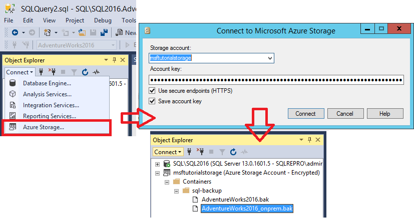


## 4 -  Restore database to virtual machine from URL

In this section, you will restore the AdventureWorks2016 database to your SQL Server 2016 instance in your Azure virtual machine.
  
> [!NOTE]  
> For the purposes of simplicity in this tutorial, we are using the same container for the data and log files that we used for the database backup. In a production environment, you would likely use multiple containers, and frequently multiple data files as well. With SQL Server 2016, you could also consider striping your backup across multiple blobs to increase backup performance when backing up a large database.  
  
To restore the AdventureWorks2016 database from Azure blob storage to your SQL Server 2016 instance in your Azure virtual machine, follow these steps:  
  
1.  Connect to SQL Server Management Studio.   
2.  Open a new query window and connect to the SQL Server 2016 instance of the database engine in your Azure virtual machine.   
3.  Copy and paste the following Transact-SQL script into the query window. Modify the URL appropriately for your storage account name and the container that you specified in section 1 and then execute this script.  
  
    ```sql  
    -- Restore AdventureWorks2016 from URL to SQL Server instance using Azure blob storage for database files  
    RESTORE DATABASE AdventureWorks2016   
       FROM URL = 'https://<mystorageaccountname>.blob.core.windows.net/<mystorageaccountcontainername>/AdventureWorks2016_onprem.bak'   
       WITH  
          MOVE 'AdventureWorks2016_data' to 'https://<mystorageaccountname>.blob.core.windows.net/<mystorageaccountcontainername>/AdventureWorks2016_Data.mdf'  
         ,MOVE 'AdventureWorks2016_log' to 'https://<mystorageaccountname>.blob.core.windows.net/<mystorageaccountcontainername>/AdventureWorks2016_Log.ldf'  
    --, REPLACE  
  
    ```  
  
4.  Open Object Explorer and connect to your Azure SQL Server 2016 instance.   
5.  In Object Explorer, expand the Databases node and verify that the AdventureWorks2016 database has been restored (refresh the node as necessary)    
    1. Right-click AdventureWorks2016, and select Properties.
    1. Select Files and verify that the paths for the two database files are URLs pointing to blobs in your Azure blog container(select Cancel when done).
    
     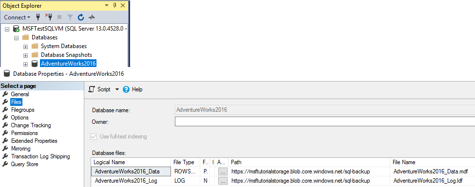

    
8.  In Object Explorer, connect to Azure storage.
    1. Expand Containers, expand the container that you created in section 1 and verify that the AdventureWorks2016_Data.mdf and AdventureWorks2016_Log.ldf from step 3 above appears in this container, along with the backup file from section 3 (refresh the node as necessary).  
  
   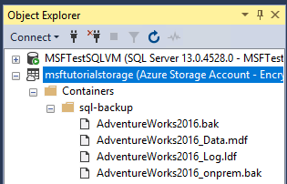

## 5 - Backup database using file-snapshot backup

In this section, you will back up the AdventureWorks2016 database in your Azure virtual machine using file-snapshot backup to perform a nearly instantaneous backup  using Azure snapshots. For more information on file-snapshot backups, see [File-Snapshot Backups for Database Files in Azure](../relational-databases/backup-restore/file-snapshot-backups-for-database-files-in-azure.md)  
  
To back up the AdventureWorks2016 database using file-snapshot backup, follow these steps:  
  
1.  Connect to SQL Server Management Studio.   
2.  Open a new query window and connect to the SQL Server 2016 instance of the database engine in your Azure virtual machine.  
3.  Copy, paste, and execute the following Transact-SQL script into the query window (do not close this query window - you will execute this script again in step 5. This system stored procedure enables you to view the existing file snapshot backups for each file that comprises a specified database. You will notice that there are no file snapshot backups for this database.  
  
    ```sql  
    -- Verify that no file snapshot backups exist  
    SELECT * FROM sys.fn_db_backup_file_snapshots ('AdventureWorks2016');  
    ```  
  
4.  Copy and paste the following Transact-SQL script into the query window. Modify the URL appropriately for your storage account name and the container that you specified in section 1 and then execute this script. Notice how quickly this backup occurs.  
  
    ```sql  
    -- Backup the AdventureWorks2016 database with FILE_SNAPSHOT  
    BACKUP DATABASE AdventureWorks2016   
       TO URL = 'https://<mystorageaccountname>.blob.core.windows.net/<mystorageaccountcontainername>/AdventureWorks2016_Azure.bak'   
       WITH FILE_SNAPSHOT;    
    ```  
  
5.  After verifying that the script in step 4 executed successfully, execute the following script again. Notice that the file-snapshot backup operation in step 4 generated file-snapshots of both the data and log file.  
  
    ```sql  
    -- Verify that two file-snapshot backups exist  
    SELECT * FROM sys.fn_db_backup_file_snapshots ('AdventureWorks2016');  
  
    ```  
  
    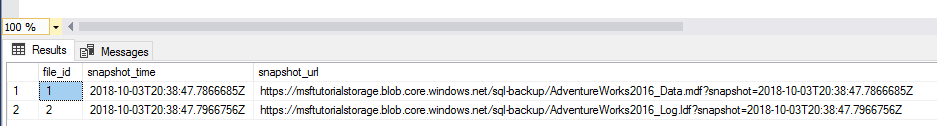 
  
6.  In Object Explorer, in your SQL Server 2016 instance in your Azure virtual machine, expand the Databases node and verify that the AdventureWorks2016 database has been restored to this instance (refresh the node as necessary).  
7.  In Object Explorer, connect to Azure storage.   
8.  Expand Containers,  expand the container that you created in section 1 and verify that the AdventureWorks2016_Azure.bak from step 4 above appears in this container, along with the backup file from section 3 and the database files from section 4 (refresh the node as necessary).  
  
    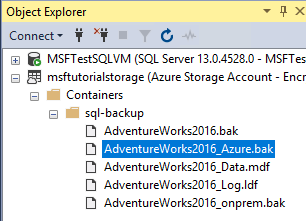

## 6 -  Generate activity and backup log using file-snapshot backup

In this section, you will generate activity in the AdventureWorks2016 database and periodically create transaction log backups using file-snapshot backups. For more information on using file snapshot backups, see [File-Snapshot Backups for Database Files in Azure](../relational-databases/backup-restore/file-snapshot-backups-for-database-files-in-azure.md).  
  
To generate activity in the AdventureWorks2016 database and periodically create transaction log backups using file-snapshot backups, follow these steps:  
  
1.  Connect to SQL Server Management Studio.   
2.  Open two new query windows and connect each to the SQL Server 2016 instance of the database engine in your Azure virtual machine.   
3.  Copy, paste, and execute the following Transact-SQL script into one of the query windows. Notice that the Production.Location table has 14 rows before we add new rows in step 4.  
  
    ```sql 
    -- Verify row count at start  
    SELECT COUNT (*) from AdventureWorks2016.Production.Location;    
    ```  
  
4.  Copy and paste the following two Transact-SQL scripts into the two separate query windows. Modify the URL appropriately for your storage account name and the container that you specified in section 1 and then execute these scripts simultaneously in separate query windows. These scripts will take about seven minutes to complete.  
  
    ```sql  
    -- Insert 30,000 new rows into the Production.Location table in the AdventureWorks2014 database in batches of 75  
    DECLARE @count INT=1, @inner INT;  
    WHILE @count < 400  
       BEGIN  
          BEGIN TRAN;  
             SET @inner =1;  
                WHILE @inner <= 75  
                   BEGIN;  
                      INSERT INTO AdventureWorks2016.Production.Location    
                         (Name, CostRate, Availability, ModifiedDate)   
                            VALUES (NEWID(), .5, 5.2, GETDATE());  
                      SET @inner = @inner + 1;  
                   END;  
          COMMIT;  
       WAITFOR DELAY '00:00:01';   
       SET @count = @count + 1;  
       END;  
    SELECT COUNT (*) from AdventureWorks2014.Production.Location;    
    ```  
  
    ```sql  
    --take 7 transaction log backups with FILE_SNAPSHOT, one per minute, and include the row count and the execution time in the backup file name   
    DECLARE @count INT=1, @device NVARCHAR(120), @numrows INT;  
    WHILE @count <= 7  
       BEGIN  
             SET @numrows = (SELECT COUNT (*) FROM AdventureWorks2016.Production.Location);  
             SET @device = 'https://<mystorageaccountname>.blob.core.windows.net/<mystorageaccountcontainername>/tutorial-' + CONVERT (varchar(10),@numrows) + '-' + FORMAT(GETDATE(), 'yyyyMMddHHmmss') + '.bak';  
             BACKUP LOG AdventureWorks2016 TO URL = @device WITH FILE_SNAPSHOT;  
             SELECT * from sys.fn_db_backup_file_snapshots ('AdventureWorks2016');  
          WAITFOR DELAY '00:1:00';   
             SET @count = @count + 1;  
       END;  
    ```  
  
5.  Review the output of the first script and notice that final row count is now 29,939.  
  
    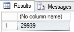
  
6.  Review the output of the second script and notice that each time the BACKUP LOG statement is executed that  two new file snapshots are created, one file snapshot of the log file and one file snapshot of the data file - for a total of two file snapshots for each database file. After the second script completes, notice that there are now a total of 16 file snapshots, 8 for each database file - one from the BACKUP DATABASE statement and one for each execution of the BACKUP LOG statement.  
  
   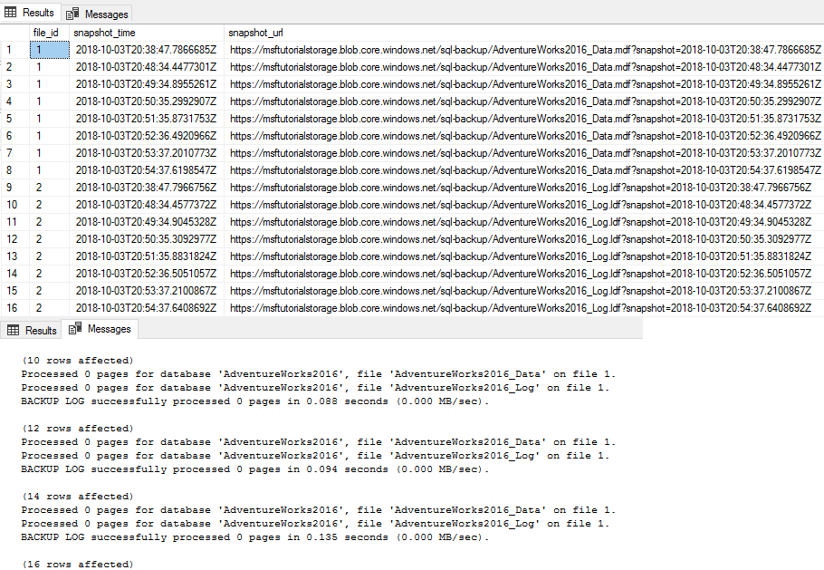
  
7.  In Object Explorer, connect to Azure storage.  
  
8.  Expand Containers,  expand the container that you created in section 1 and verify that seven new backup files appear, along with the data files from the previous sections (refresh the node as needed).  
  
    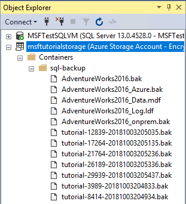

## 7 - Restore a database to a point in time

In this section, you will restore the AdventureWorks2016 database to a point in time between two of the transaction log backups.  
  
With traditional backups, to accomplish point in time restore, you would need to use the full database backup, perhaps a differential backup, and all of the transaction log files up to and just past the point in time to which you wish to restore. With file-snapshot backups, you only need the two adjacent log backup files that provide the goal posts framing the time to which you wish to restore. You only need two log file snapshot backup sets because each log backup creates a file snapshot of each database file (each data file and the log file).  
  
To restore a database to a specified point in time from file snapshot backup sets, follow these steps:  
  
1.  Connect to SQL Server Management Studio.  
2.  Open a new query window and connect to the SQL Server 2016 instance of the database engine in your Azure virtual machine.   
3.  Copy, paste, and execute the following Transact-SQL script into the query window. Verify that the Production.Location table has 29,939 rows before we restore it to a point in time when there are fewer rows in step 5.  
  
    ```sql
    -- Verify row count at start  
    SELECT COUNT (*) from AdventureWorks2016.Production.Location   
    ```  
  
     
  
4.  Copy and paste the following Transact-SQL script into the query window. Select two adjacent log backup files and convert the file name into the date and time you will need for this script. Modify the URL appropriately for your storage account name and the container that you specified in section 1, provide the first and second backup file names, provide the STOPAT time  in the format of "June 26, 2018 01:48 PM" and then execute this script. This script will take a few minutes to complete  
  
    ```sql  
    -- restore and recover to a point in time between the times of two transaction log backups, and then verify the row count  
    ALTER DATABASE AdventureWorks2016 SET SINGLE_USER WITH ROLLBACK IMMEDIATE;  
    RESTORE DATABASE AdventureWorks2016   
       FROM URL = 'https://<mystorageaccountname>.blob.core.windows.net/<mystorageaccountcontainername>/<firstbackupfile>.bak'   
       WITH NORECOVERY,REPLACE;  
    RESTORE LOG AdventureWorks2016   
       FROM URL = 'https://<mystorageaccountname>.blob.core.windows.net/<mystorageaccountcontainername>/<secondbackupfile>.bak'    
       WITH RECOVERY, STOPAT = 'June 26, 2018 01:48 PM';  
    ALTER DATABASE AdventureWorks2016 set multi_user;  
    -- get new count  
    SELECT COUNT (*) FROM AdventureWorks2016.Production.Location ;
    ```  
  
5.  Review the output. Notice that after the restore the row count is 18,389, which is a row count number between log backup 5 and 6 (your row count will vary).  
  
    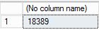

## 8 -  Restore as new database from log backup

In this section, you will restore the AdventureWorks2016 database as a new database from a file-snapshot transaction log backup.  
  
In this scenario, you are performing a restore to a SQL Server instance on a different virtual machine for the purposes of business analysis and reporting. Restoring to a different instance on a different virtual machine offloads the workload to a virtual machine dedicated and sized for this purpose, removing its resource requirements from the transactional system.  
  
Restore from a transaction log backup with file-snapshot backup is very quick, substantially quicker than with traditional streaming backups. With traditional streaming backups, you would need to use the full database backup, perhaps a differential backup, and some or all of the transaction log backups (or a new full database backup). However, with file-snapshot log backups, you only need the most recent log backup (or any other log backup or any two adjacent log backups for point in time restore to a point between two log backup times). To be clear, you only need one log file-snapshot backup set because each file-snapshot log backup creates a file snapshot of each database file (each data file and the log file).  
  
To restore a database to a new database from a transaction log backup using file snapshot backup, follow these steps:  
  
1.  Connect to SQL Server Management Studio.   
2.  Open a new query window and connect to the SQL Server 2016 instance of the database engine in an Azure virtual machine.  
  
    > [!NOTE]  
    > If this is a different Azure virtual machine than you have been using for the previous sections, make sure you have followed the steps in [2 - Create a SQL Server credential using a shared access signature](#2---create-a-sql-server-credential-using-a-shared-access-signature). If you wish to restore to a different container, follow the steps in [1 - Create stored access policy and shared access storage](#1---create-stored-access-policy-and-shared-access-storage) for the new container.  
  
3.  Copy and paste the following Transact-SQL script into the query window. Select the log backup file you wish to use. Modify the URL appropriately for your storage account name and the container that you specified in section 1, provide the log backup file name and then execute this script.  
  
    ```sql  
    -- restore as a new database from a transaction log backup file  
    RESTORE DATABASE AdventureWorks2016_EOM   
        FROM URL = 'https://<mystorageaccountname>.blob.core.windows.net/<mystorageaccountcontainername>/<logbackupfile.bak'    
        WITH MOVE 'AdventureWorks2016_data' to 'https://<mystorageaccountname>.blob.core.windows.net/<mystorageaccountcontainername>/AdventureWorks2014_EOM_Data.mdf'  
       , MOVE 'AdventureWorks2016_log' to 'https://<mystorageaccountname>.blob.core.windows.net/<mystorageaccountcontainername>/AdventureWorks2014_EOM_Log.ldf'  
       , RECOVERY  
    --, REPLACE   
    ```  
  
4.  Review the output to verify the restore was successful.   
5.  In Object Explorer, connect to  Azure storage.    
6.  Expand Containers, expand the container that you created in section 1 (refresh if necessary) and verify that the new data and log  files appear in the container, along with the blobs from the previous sections.  
  
    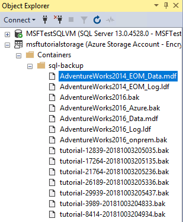

## 9 - Manage backup sets and file-snapshot backups

In this section, you will delete a backup set using the [sp_delete_backup &#40;Transact-SQL&#41;](../relational-databases/system-stored-procedures/snapshot-backup-sp-delete-backup.md) system stored procedure. This system stored procedure deletes the backup file and the file snapshot on each database file associated with this backup set.  
  
> [!NOTE]  
> If you attempt to delete a backup set by simply deleting the backup file from the Azure Blob container, you will only delete the backup file itself - the associated file snapshots will remain. If you find yourself in this scenario, use the [sys.fn_db_backup_file_snapshots &#40;Transact-SQL&#41;](../relational-databases/system-functions/sys-fn-db-backup-file-snapshots-transact-sql.md) system function to identify the URL of the orphaned file snapshots and use the [sp_delete_backup_file_snapshot &#40;Transact-SQL&#41;](../relational-databases/system-stored-procedures/snapshot-backup-sp-delete-backup-file-snapshot.md) system stored procedure to delete each orphaned file snapshot. For more information, see  [File-Snapshot Backups for Database Files in Azure](../relational-databases/backup-restore/file-snapshot-backups-for-database-files-in-azure.md).  
  
To delete a file-snapshot backup set, follow these steps:  
  
1.  Connect to SQL Server Management Studio.  
2.  Open a new query window and connect to the SQL Server 2016 instance of the database engine in your Azure virtual machine (or to any SQL Server 2016 instance with permissions to read and write on this container).   
3.  Copy and paste the following Transact-SQL script into the query window. Select the log backup you wish to delete along with its associated file snapshots. Modify the URL appropriately for your storage account name and the container that you specified in section 1, provide the log backup file name and then execute this script.  
  
  ```sql
  sys.sp_delete_backup 'https://<mystorageaccountname>.blob.core.windows.net/<mystorageaccountcontainername>/tutorial-21764-20181003205236.bak';  
  ```  
  
4.  In Object Explorer, connect to Azure storage.  
5.  Expand Containers, expand the container that you created in section 1 and verify that the backup file you used in step 3 no longer appears in this container (refresh the node as necessary).  
  
    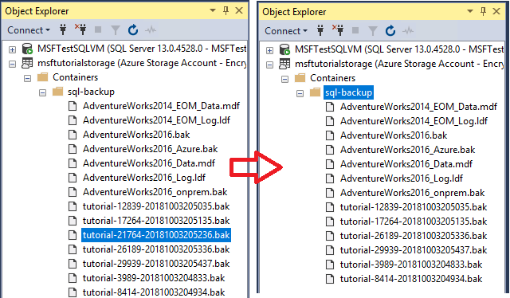
  
6.  Copy, paste, and execute the following Transact-SQL script into the query window to verify that two file snapshots have been deleted.  
  
    ```sql  
    -- verify that two file snapshots have been removed  
    SELECT * from sys.fn_db_backup_file_snapshots ('AdventureWorks2016');   
    ```  
    

## 10 - Remove resources

Once you're done with this tutorial, and to conserve resources, be sure to delete the resource group created in this tutorial. 

To delete the resource group, run the following powershell code:

  ```powershell
  # Define global variables for the script  
  $prefixName = '<prefix name>'  # should be the same as the beginning of the tutorial
  
  # Set a variable for the name of the resource group you will create or use  
  $resourceGroupName=$prefixName + 'rg'   
  
  # Adds an authenticated Azure account for use in the session   
  Connect-AzAccount    
  
  # Set the tenant, subscription and environment for use in the rest of   
  Set-AzContext -SubscriptionId $subscriptionID    
    
  # Remove the resource group
  Remove-AzResourceGroup -Name $resourceGroupName   
  ```


  
## See Also

[SQL Server Data Files in Microsoft Azure](../relational-databases/databases/sql-server-data-files-in-microsoft-azure.md)  
[File-Snapshot Backups for Database Files in Azure](../relational-databases/backup-restore/file-snapshot-backups-for-database-files-in-azure.md)  
[SQL Server Backup to URL](../relational-databases/backup-restore/sql-server-backup-to-url.md) 
[Shared Access Signatures, Part 1: Understanding the SAS Model](https://azure.microsoft.com/documentation/articles/storage-dotnet-shared-access-signature-part-1/)  
[Create Container](https://msdn.microsoft.com/library/azure/dd179468.aspx)  
[Set Container ACL](https://msdn.microsoft.com/library/azure/dd179391.aspx)  
[Get Container ACL](https://msdn.microsoft.com/library/azure/dd179469.aspx)
[Credentials &#40;Database Engine&#41;](../relational-databases/security/authentication-access/credentials-database-engine.md)  
[CREATE CREDENTIAL &#40;Transact-SQL&#41;](../t-sql/statements/create-credential-transact-sql.md)  
[sys.credentials &#40;Transact-SQL&#41;](../relational-databases/system-catalog-views/sys-credentials-transact-sql.md)  
[sp_delete_backup &#40;Transact-SQL&#41;](../relational-databases/system-stored-procedures/snapshot-backup-sp-delete-backup.md)  
[sys.fn_db_backup_file_snapshots &#40;Transact-SQL&#41;](../relational-databases/system-functions/sys-fn-db-backup-file-snapshots-transact-sql.md)  
[sp_delete_backup_file_snapshot &#40;Transact-SQL&#41;](../relational-databases/system-stored-procedures/snapshot-backup-sp-delete-backup-file-snapshot.md) [File-Snapshot Backups for Database Files in Azure](../relational-databases/backup-restore/file-snapshot-backups-for-database-files-in-azure.md)  
