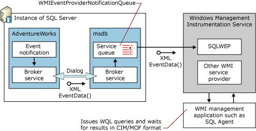

# Understanding the WMI Provider for Server Events
[!INCLUDE [SQL Server](../../includes/applies-to-version/sqlserver.md)]
  The WMI Provider for Server Events lets you use the Windows Management Instrumentation (WMI) to monitor events in [!INCLUDE[ssNoVersion](../../includes/ssnoversion-md.md)]. The provider works by turning [!INCLUDE[ssNoVersion](../../includes/ssnoversion-md.md)] into a managed WMI object. Any event that can generate an event notification in [!INCLUDE[ssNoVersion](../../includes/ssnoversion-md.md)] can be leveraged by the WMI by using this provider. Additionally, as a management application that interacts with the WMI, [!INCLUDE[ssNoVersion](../../includes/ssnoversion-md.md)] Agent can respond to these events, increasing the scope of events covered by [!INCLUDE[ssNoVersion](../../includes/ssnoversion-md.md)] Agent over earlier releases.  
  
 Management applications such as [!INCLUDE[ssNoVersion](../../includes/ssnoversion-md.md)] Agent can access [!INCLUDE[ssNoVersion](../../includes/ssnoversion-md.md)] events using the WMI Provider for Server Events by issuing WMI Query Language (WQL) statements. WQL is a simplified subset of structured query language (SQL), with some WMI-specific extensions. In using WQL, an application retrieves an event type against a specific database or database object. The WMI Provider for Server Events translates the query into an event notification, effectively creating an event notification in the target database. For more information about how event notifications work in [!INCLUDE[ssNoVersion](../../includes/ssnoversion-md.md)], see [WMI Provider for Server Events Concepts](./wmi-provider-for-server-events-concepts.md). The events that can be queried are listed in [WMI Provider for Server Events Classes and Properties](../../relational-databases/wmi-provider-server-events/wmi-provider-for-server-events-classes-and-properties.md).  
  
 When an event occurs that triggers the event notification to send a message, the message goes to a predefined target service in **msdb** that is named **SQL/Notifications/ProcessWMIEventProviderNotification/v1.0**. The service puts the event into a predefined queue in **msdb** that is named **WMIEventProviderNotificationQueue**. (Both the service and the queue are created dynamically by the provider when it first connects to [!INCLUDE[ssNoVersion](../../includes/ssnoversion-md.md)].) The provider then reads the event data from this queue and transforms it into managed object format (MOF) before returning it to the application. The following illustration shows this process.  
  
   
  
 For example, consider the following WQL Query:  
  
```  
SELECT * FROM DDL_DATABASE_LEVEL_EVENTS  
WHERE DatabaseName = 'AdventureWorks'  
```  
  
 In response to this query, the WMI Provider for Server Events creates the equivalent event notification in the target database:  
  
```  
USE AdventureWorks ;  
GO  
CREATE EVENT NOTIFICATION SQLWEP_76CF38C1_18BB_42DD_A7DC_C8820155B0E9  
    ON DATABASE  
    WITH FAN_IN  
    FOR DDL_DATABASE_LEVEL_EVENTS  
    TO SERVICE  
        'SQL/Notifications/ProcessWMIEventProviderNotification/v1.0',   
        'A7E5521A-1CA6-4741-865D-826F804E5135';  
GO  
```  
  
 In this example, `SQLWEP_76CF38C1_18BB_42DD_A7DC_C8820155B0E9` is a [!INCLUDE[tsql](../../includes/tsql-md.md)] identifier that is made up of the prefix `SQLWEP_` and a GUID. `SQLWEP` creates a new GUID for each identifier. The value `A7E5521A-1CA6-4741-865D-826F804E5135` in the `TO SERVICE` clause is the GUID that identifies the broker instance in the **msdb** database.  
  
 For more information about how to work with WQL, see [Using WQL with the WMI Provider for Server Events](https://technet.microsoft.com/library/ms180524\(v=sql.105\).aspx).  
  
 Management applications direct the WMI Provider for Server Events to an instance of [!INCLUDE[ssNoVersion](../../includes/ssnoversion-md.md)] by connecting to a WMI namespace that is defined by the provider. The Windows WMI service maps this namespace to the provider DLL, Sqlwep.dll, and loads it into memory. The provider manages a WMI namespace for Server Events for each instance of [!INCLUDE[ssNoVersion](../../includes/ssnoversion-md.md)], and the format is: \\\\.\\*root*\Microsoft\SqlServer\ServerEvents\\*instance_name*, where *instance_name* defaults to MSSQLSERVER. For more information about how to connect to a WMI namespace for an instance of [!INCLUDE[ssNoVersion](../../includes/ssnoversion-md.md)], see [Using WQL with the WMI Provider for Server Events](https://technet.microsoft.com/library/ms180524\(v=sql.105\).aspx).  
  
 The provider DLL, Sqlwep.dll, is loaded only one time into the WMI host service of the operating system of the server, regardless of how many instances of [!INCLUDE[ssNoVersion](../../includes/ssnoversion-md.md)] are on the server.  
  
 For an example of a [!INCLUDE[ssNoVersion](../../includes/ssnoversion-md.md)] Agent management application that uses the WMI Provider for Server Events, see [Sample: Creating a SQL Server Agent Alert Using the WMI Provider for Server Events](./sample-creating-a-sql-server-agent-alert-with-the-wmi-provider.md). For an example of a management application that uses the WMI Provider for Server Events in managed code, see [Sample: Using the WMI Event Provider in Managed Code](./sample-using-the-wmi-event-provider-with-the-net-framework.md). More information is also available about WMI in the [!INCLUDE[msCoName](../../includes/msconame-md.md)] [!INCLUDE[dnprdnshort](../../includes/dnprdnshort-md.md)] SDK.  
  
## See Also  
 [WMI Provider for Server Events Concepts](./wmi-provider-for-server-events-concepts.md)  
  
