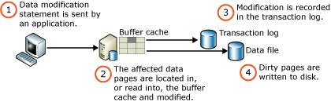

# Writing Pages
[!INCLUDE[SQL Server Azure SQL Database Synapse Analytics PDW ](../includes/applies-to-version/sql-asdb-asdbmi-asa-pdw.md)]

The I/O from an instance of the [!INCLUDE[ssDE](../includes/ssde-md.md)] includes logical and physical writes. A logical write occurs when data is modified in a page in the buffer cache. A physical write occurs when the page is written from the [buffer cache](../relational-databases/memory-management-architecture-guide.md) to disk.

When a page is modified in the buffer cache, it is not immediately written back to disk; instead, the page is marked as dirty. This means that a page can have more than one logical write made before it is physically written to disk. For each logical write, a transaction log record is inserted in the log cache that records the modification. The log records must be written to disk before the associated dirty page is removed from the buffer cache and written to disk. SQL Server uses a technique known as write-ahead logging that prevents writing a dirty page before the associated log record is written to disk. This is essential to the correct working of the recovery manager. For more information, see [Write-Ahead Transaction Log](../relational-databases/sql-server-transaction-log-architecture-and-management-guide.md).

The following illustration shows the process for writing a modified data page.

When the buffer manager writes a page, it searches for adjacent dirty pages that can be included in a single gather-write operation. Adjacent pages have consecutive page IDs and are from the same file; the pages do not have to be contiguous in memory. The search continues both forward and backward until one of the following events occurs:

 * A clean page is found.
 * 32 pages have been found.
 * A dirty page is found whose log sequence number (LSN) has not yet been flushed in the log.
 * A page is found that cannot be immediately latched.

In this way, the entire set of pages can be written to disk with a single gather-write operation. 

Just before a page is written, the form of page protection specified in the database is added to the page. If torn page protection is added, the page must be latched EX(clusively) for the I/O. This is because the torn page protection modifies the page, making it unsuitable for any other thread to read. If checksum page protection is added, or the database uses no page protection, the page is latched with an UP(date) latch for the I/O. This latch prevents anyone else from modifying the page during the write, but still allows readers to use it. For more information about disk I/O page protection options, see [Buffer Management](../relational-databases/memory-management-architecture-guide.md).

A dirty page is written to disk in one of three ways: 

* Lazy writing   
 The lazy writer is a system process that keeps free buffers available by removing infrequently used pages from the buffer cache. Dirty pages are first written to disk. 

* Eager writing   
 The eager write process writes dirty data pages associated with minimally logged operations such as bulk insert and select into. This process allows creating and writing new pages to take place in parallel. That is, the calling operation does not have to wait until the entire operation finishes before writing the pages to disk.

* Checkpoint   
 The checkpoint process periodically scans the buffer cache for buffers with pages from a specified database and writes all dirty pages to disk. Checkpoints save time during a later recovery by creating a point at which all dirty pages are guaranteed to have been written to disk. The user may request a checkpoint operation by using the CHECKPOINT command, or the [!INCLUDE[ssDE](../includes/ssde-md.md)] may generate automatic checkpoints based on the amount of log space used and time elapsed since the last checkpoint. In addition, a checkpoint is generated when certain activities occur. For example, when a data or log file is added or removed from a database, or when the instance of SQL Server is stopped. For more information, see [Checkpoints and the Active Portion of the Log](../relational-databases/sql-server-transaction-log-architecture-and-management-guide.md).

The lazy writing, eager writing, and checkpoint processes do not wait for the I/O operation to complete. They always use asynchronous (or overlapped) I/O and continue with other work, checking for I/O success later. This allows SQL Server to maximize both CPU and I/O resources for the appropriate tasks.

## See Also
[Pages and Extents Architecture Guide](../relational-databases/pages-and-extents-architecture-guide.md)   
 [Reading Pages](../relational-databases/reading-pages.md)
