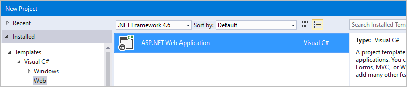
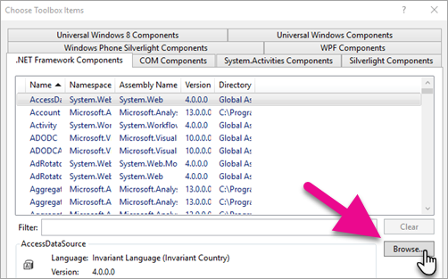

# Integrate Reporting Services Using the Report Viewer Controls - Get Started

The Report Viewer controls can be used to integrate Reporting Services RDL reports into WebForms and WinForms apps. For detailed information about recent updates see the [changelog](./release-notes-ssrs-application-integration.md).

## Add the Report Viewer control to a new web project

1. Create a new **ASP.NET Empty Web Site** or open an existing ASP.NET project.

    You can use .NET Framework 4.6 or any newer version.

    

2. Install the Report Viewer control NuGet package via the **NuGet package manager console**.

    ```
    Install-Package Microsoft.ReportingServices.ReportViewerControl.WebForms
    ```
3. Add a new .aspx page to the project and register the Report Viewer control assembly for use within the page.

    ```
    <%@ Register assembly="Microsoft.ReportViewer.WebForms, Version=15.0.0.0, Culture=neutral, PublicKeyToken=89845dcd8080cc91" namespace="Microsoft.Reporting.WebForms" tagprefix="rsweb" %>
    ```
    
4. Add a **ScriptManagerControl** to the page.

5. Add the Report Viewer control to the page. The snippet below can be updated to reference a report hosted on a remote report server.

    ```
    <rsweb:ReportViewer ID="ReportViewer1" runat="server" ProcessingMode="Remote">
      <ServerReport ReportPath="" ReportServerUrl="" />
    </rsweb:ReportViewer>
    ```
    
The final page should look like the following.

```html
<%@ Page Language="C#" AutoEventWireup="true" CodeBehind="WebForm1.aspx.cs" Inherits="Sample" %>

<%@ Register assembly="Microsoft.ReportViewer.WebForms, Version=15.0.0.0, Culture=neutral, PublicKeyToken=89845dcd8080cc91" namespace="Microsoft.Reporting.WebForms" tagprefix="rsweb" %>

<!DOCTYPE html>

<html xmlns="http://www.w3.org/1999/xhtml">
<head runat="server">
    <meta http-equiv="X-UA-Compatible" content="IE=edge" /> 
    <title></title>
</head>
<body>
    <form id="form1" runat="server">
    <asp:ScriptManager runat="server"></asp:ScriptManager>        
        <rsweb:ReportViewer ID="ReportViewer1" runat="server" ProcessingMode="Remote">
            <ServerReport ReportServerUrl="https://AContosoDepartment/ReportServer" ReportPath="/LatestSales" />
        </rsweb:ReportViewer>
    </form>
</body>
</html>
```

## Update an existing project to use the Report Viewer control

Make sure to update any assembly references to version *15.0.0.0*, including the project's web.config and all .aspx pages that reference the viewer control.

### Sample web.config changes

```xml
<?xml version="1.0"?>
<!--
  For more information on how to configure your ASP.NET application, please visit
  https://go.microsoft.com/fwlink/?LinkId=169433
  -->
<configuration>
  <system.web>
    <compilation debug="true" targetFramework="4.6">
      <assemblies>
        <!-- All assemblies updated to version 15.0.0.0. -->
        <add assembly="Microsoft.ReportViewer.Common, Version=15.0.0.0, Culture=neutral, PublicKeyToken=89845DCD8080CC91"/>
        <add assembly="Microsoft.ReportViewer.DataVisualization, Version=15.0.0.0, Culture=neutral, PublicKeyToken=89845DCD8080CC91"/>
        <add assembly="Microsoft.ReportViewer.Design, Version=15.0.0.0, Culture=neutral, PublicKeyToken=89845DCD8080CC91"/>
        <add assembly="Microsoft.ReportViewer.ProcessingObjectModel, Version=15.0.0.0, Culture=neutral, PublicKeyToken=89845DCD8080CC91"/>
        <add assembly="Microsoft.ReportViewer.WebDesign, Version=15.0.0.0, Culture=neutral, PublicKeyToken=89845DCD8080CC91"/>
        <add assembly="Microsoft.ReportViewer.WebForms, Version=15.0.0.0, Culture=neutral, PublicKeyToken=89845DCD8080CC91"/>
        <add assembly="Microsoft.ReportViewer.WinForms, Version=15.0.0.0, Culture=neutral, PublicKeyToken=89845DCD8080CC91"/>
      </assemblies>
      <buildProviders>
        <!-- Version updated to 15.0.0.0. -->
        <add extension=".rdlc"
          type="Microsoft.Reporting.RdlBuildProvider, Microsoft.ReportViewer.WebForms, Version=15.0.0.0, Culture=neutral, PublicKeyToken=89845DCD8080CC91"/>
      </buildProviders>
    </compilation>
    <httpRuntime targetFramework="4.6"/>
    <httpHandlers>
      <!-- Version updated to 15.0.0.0 -->
      <add path="Reserved.ReportViewerWebControl.axd" verb="*"
        type="Microsoft.Reporting.WebForms.HttpHandler, Microsoft.ReportViewer.WebForms, Version=15.0.0.0, Culture=neutral, PublicKeyToken=89845DCD8080CC91"
        validate="false"/>
    </httpHandlers>
  </system.web>
  <system.webServer>
    <validation validateIntegratedModeConfiguration="false"/>
    <modules runAllManagedModulesForAllRequests="true"/>
    <handlers>
      <!-- Version updated to 15.0.0.0 -->
      <add name="ReportViewerWebControlHandler" verb="*" path="Reserved.ReportViewerWebControl.axd" preCondition="integratedMode"
        type="Microsoft.Reporting.WebForms.HttpHandler, Microsoft.ReportViewer.WebForms, Version=15.0.0.0, Culture=neutral, PublicKeyToken=89845DCD8080CC91"/>
    </handlers>
  </system.webServer>
</configuration>
```

### Sample .aspx

```
<%@ Page Language="C#" AutoEventWireup="true" CodeBehind="WebForm1.aspx.cs" Inherits="SampleAspx" %>

<!-- Update version to 15.0.0.0 -->
<%@ Register assembly="Microsoft.ReportViewer.WebForms, Version=15.0.0.0, Culture=neutral, PublicKeyToken=89845dcd8080cc91" namespace="Microsoft.Reporting.WebForms" tagprefix="rsweb" %>

<!DOCTYPE html>
```

## Add the Report Viewer control to a new Windows Forms project

1. Create a new **Windows Forms Application** or open an existing project.

    You can use .NET Framework 4.6 or any newer version.
    
    

2. Install the Report Viewer control NuGet package via the **NuGet package manager console**.

    ```
    Install-Package Microsoft.ReportingServices.ReportViewerControl.WinForms
    ```
3. Add a new control from code or [add the control to the toolbox](#add-the-control-to-visual-studio-toolbar).

    ```csharp
    private Microsoft.Reporting.WinForms.ReportViewer reportViewer1;
    
    private void InitializeComponent()
    {
        this.reportViewer1 = new Microsoft.Reporting.WinForms.ReportViewer();
        this.SuspendLayout();
        // 
        // reportViewer1
        // 
        this.reportViewer1.Location = new System.Drawing.Point(168, 132);
        this.reportViewer1.Name = "reportViewer1";
        this.reportViewer1.ServerReport.BearerToken = null;
        this.reportViewer1.Size = new System.Drawing.Size(396, 246);
        this.reportViewer1.TabIndex = 0;
        // 
        // Form1
        // 
        this.Controls.Add(this.reportViewer1);
    }
    ```

## How to set 100% height on the Report Viewer control

If setting the height of the viewer control to 100% the parent element is required to have a defined height, or all ancestors are required to have percentage heights.

### Set the height of all the ancestors to 100%

```html
<!DOCTYPE html>
<html xmlns="http://www.w3.org/1999/xhtml">
<head runat="server">
    <style>
        html,body,form,#div1 {
            height: 100%; 
        }
    </style>
   </head>
<body>
    <form id="form1" runat="server">
    <div id="div1" >
            <asp:ScriptManager runat="server"></asp:ScriptManager>
        <rsweb:ReportViewer ID="ReportViewer1" runat="server" ProcessingMode="Remote" Height="100%" Width="100%">
            <ServerReport ReportServerUrl="https://test/ReportServer" ReportPath="/testreport" />
        </rsweb:ReportViewer>
    </div>
    </form>
</body>
</html>
```

### Set the parent's height attribute

For more information about viewport percentage lengths, see [Viewport-percentage lengths](http://www.w3.org/TR/css3-values/#viewport-relative-lengths).

```html
<!DOCTYPE html>
<html xmlns="http://www.w3.org/1999/xhtml">
<head runat="server">
</head>
<body>
    <form id="form1" runat="server">
    <div style="height:100vh;">
            <asp:ScriptManager runat="server"></asp:ScriptManager>
        <rsweb:ReportViewer ID="ReportViewer1" runat="server" ProcessingMode="Remote" Height="100%" Width="100%">
            <ServerReport ReportServerUrl="https://test/ReportServer" ReportPath="/testreport" />
        </rsweb:ReportViewer>
    </div>
    </form>
</body>
</html>
```

## Add the control to Visual Studio toolbar

The Report Viewer Control is now shipped as a NuGet package and no longer shows in the Visual Studio toolbox by default. You can add the control to the toolbox manually.

1. Install the NuGet package for either the WinForms or WebForms as mentioned above.

2. Remove the Report Viewer Control that is listed in the toolbox.

    

3. Right-click in anywhere in the toolbox and then select **Choose Items...**.

    
    
4. On the **.NET Framework Components**, select **Browse**.

    

5. Select the **Microsoft.ReportViewer.WinForms.dll** or **Microsoft.ReportViewer.WebForms.dll** from the NuGet package you installed.

    > [!NOTE] 
    > The NuGet package will be installed in the solution directory of your project. The path to the dll will be similar to the following: `{Solution Directory}\packages\Microsoft.ReportingServices.ReportViewerControl.Winforms.{version}\lib\net40` or `{Solution Directory}\packages\Microsoft.ReportingServices.ReportViewerControl.WebForms.{version}\lib\net40`.

6. The new control should display within the toolbox. You can then move it to another tab within the toolbox if you wish.

    

## Common issues
    
The viewer control is designed for modern browsers. The control may not work as expected if the browser renders the page using IE compatibility mode. Intranet sites may require a meta tag to override default browser behavior.

```html
<meta http-equiv="X-UA-Compatible" content="IE=edge" />
```

## NuGet.org pages

Here are links to articles on the NuGet.org site about the WebForm and WinForm versions of the Report Viewer control:

- Microsoft.ReportingServices.ReportViewerControl.WebForms
[https://www.nuget.org/packages/Microsoft.ReportingServices.ReportViewerControl.WebForms/](https://www.nuget.org/packages/Microsoft.ReportingServices.ReportViewerControl.WebForms/)
- Microsoft.ReportingServices.ReportViewerControl.Winforms
[https://www.nuget.org/packages/Microsoft.ReportingServices.ReportViewerControl.WinForms/](https://www.nuget.org/packages/Microsoft.ReportingServices.ReportViewerControl.WinForms/)


## Forum feedback

Let the team know about issues on the [Reporting Services forums](/answers/topics/sql-server-reporting-services.html).

## See also

[Data collection in the Report Viewer control](../../reporting-services/application-integration/integrating-reporting-services-using-reportviewer-controls-data-collection.md)
