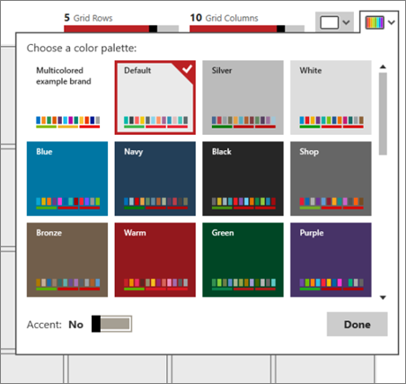
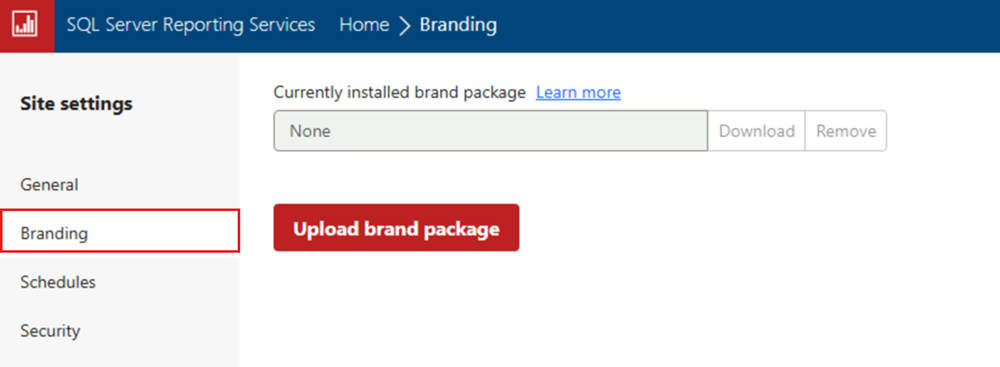

# Branding the web portal

[!INCLUDE[ssrs-appliesto](../includes/ssrs-appliesto.md)] [!INCLUDE[ssrs-appliesto-2016-and-later](../includes/ssrs-appliesto-2016-and-later.md)] [!INCLUDE[ssrs-appliesto-pbirs](../includes/ssrs-appliesto-pbirs.md)]

You can alter the appearance of the web portal by branding it to your business. This is done through a brand package. The brand package is designed so you don't need deep cascading stylesheet (CSS) knowledge to create it.

<iframe width="560" height="315" src="https://www.youtube.com/embed/m08kLuofwFA" frameborder="0" allowfullscreen></iframe>

## Creating the brand package
  
A brand package for Reporting Services consists of three items and is packaged as a zip file.
  
- colors.json  
- metadata.xml  
- logo.png (optional)  
  
The files must have the names listed above. Package these files into a zip file. The zip file can be named however you like.  
  
### metadata.xml
  
The metadata.xml file allows you to set the name of the brand package, and has a reference entry for both your colors.json and logo.png files.  
  
To change the name of your brand package, change the **name** attribute of the **SystemResourcePackage** element.  

```xml
    name="Multicolored example brand"  
```
  
You can optionally include a logo picture in your brand package. This item would be listed within the Contents element.  
  
Example without a logo file.  

```xml
<Contents>  
    <Item key="colors" path="colors.json" />  
</Contents>  
```

Example with a logo file.  
  
```xml
<Contents>  
    <Item key="colors" path="colors.json" />  
    <Item key="logo" path="logo.png" />  
</Contents>  
```

### colors.json
  
When the brand package is uploaded, the server extracts the appropriate name/value pairs from the colors.json file and merges them with the master LESS stylesheet, brand.less. This LESS file is then processed and the resulting CSS file is served to the client. All colors in the stylesheet follow the six-character hexadecimal representation of a color.  
  
The LESS stylesheet contains blocks that reference some predefined LESS variables like the following.  

```css
/* primary buttons */   
.btn-primary {   
    color:@primaryButtonColor;   
    background-color:@primaryButtonBg;   
}  
```
  
While this syntax resembles CSS, the color values prefixed with the @symbol are unique to LESS. They're variables whose values are set by the json file.  
  
For example, if the colors.json file had the following values.  

```json
"primary":"#009900",   
"primaryContrast":"#ffffff"   
```

The processed output would look up the **\@primaryButtonBg** LESS variable and see that it maps to the json property called **primary**, which in this example is #009900. It would therefore output the proper CSS.  

```css
    .btn-primary {   
        color:#ffffff;   
        background-color:#009900;   
    }  
```

All of the primary buttons would be rendered dark green with white text.  
  
The colors.json file, for Reporting Services, has two main categories in which items are grouped.  
  
- **Interface**: includes items that are specific to the Reporting Services web portal.  
- **Theme**: includes items that are specific to mobile reports that you create.  
  
The interface section is broken down into the following groupings.  
  
|Section|Description|  
|---|---|  
|Primary|Button and hover colors.|  
|Secondary|Title bar, search bar, left hand menu (if displayed) and text color for those items|  
|Neutral Primary|Home and report area backgrounds.|  
|Neutral Secondary|Text box and folder options backgrounds, and the settings menu.|  
|Neutral Tertiary|Site settings backgrounds.|  
|Danger/Warning/Success messages|Colors for those messages.|  
|KPI|Controls the colors for a good (1), neutral (0), neutral (-1) and none.|  

::: moniker range="<=sql-server-ver15"

The first time you connect to a server with the Mobile Report Publisher that has a brand package deployed, the theme will be added to the available themes you can use in the upper right-hand menu of the app.  
  
  
  
You can then use that theme for any mobile reports that you create, even if they aren't for the same server that you have the theme deployed on.
::: moniker-end 
 
### Using a logo
  
If you include a logo with your brand package, it will appear in the web portal in place of the name you set for the web portal in the Site Settings menu.  
  
The file you include for the logo must use the PNG file format. The file dimensions will be scaled once uploaded to the server. It should scale to around 290 px x 60 px.  
   
## <a name="#applying-the-brand-package-to-the-web-portal"></a>Applying the brand package to the web portal
  
Follow these steps to add, download, or remove a brand package.  
  
1.  Select the **gear** in the upper right.  
  
2.  Select **Site Settings**.  
  
      
  
3.  Select **Branding**.  
  
     
  
**Currently installed brand package** either displays the name of the package that has been uploaded, or it displays None.  
  
**Upload brand package** prompts you to select a zip file from a local folder and then apply the package to the web portal. You see it take effect immediately.  
  
You can also **Download** or **Remove** the package. Removing the package resets the web portal to the default brand immediately.  
  
## metadata.xml example

```xml
<?xml version="1.0" encoding="utf-8"?>  
<SystemResourcePackage xmlns="http://schemas.microsoft.com/sqlserver/reporting/2016/01/systemresourcepackagemetadata"  
    type="UniversalBrand"  
    version="2.0.2"  
    name="Multicolored example brand"  
    >  
    <Contents>  
        <Item key="colors" path="colors.json" />  
        <Item key="logo" path="logo.png" />  
    </Contents>  
</SystemResourcePackage>  
```

## colors.json example

```json
{  
    "name":"Multicolored example brand",  
    "version":"1.0",  
    "interface":{  
        "primary":"#b31e1e",  
        "primaryAlt":"#ca0806",  
        "primaryAlt2":"#621013",  
        "primaryAlt3":"#e40000",  
        "primaryAlt4":"#e14e50",  
        "primaryContrast":"#fff",  

        "secondary":"#042200",  
        "secondaryAlt":"#0f4400",  
        "secondaryAlt2":"#155500",  
        "secondaryAlt3":"#217700",  
        "secondaryContrast":"#49e63c",  

        "neutralPrimary":"#d8edff",  
        "neutralPrimaryAlt":"#c9e6ff",  
        "neutralPrimaryAlt2":"#aedaff",  
        "neutralPrimaryAlt3":"#88c8ff",  
        "neutralPrimaryContrast":"#0a2b4c",  

        "neutralSecondary":"#e9d8eb",  
        "neutralSecondaryAlt":"#d9badc",  
        "neutralSecondaryAlt2":"#b06cb5",  
        "neutralSecondaryAlt3":"#a75bac",  
        "neutralSecondaryContrast":"#250a26",  

        "neutralTertiary":"#f79220",  
        "neutralTertiaryAlt":"#f8a54b",  
        "neutralTertiaryAlt2":"#facc9b",  
        "neutralTertiaryAlt3":"#fce3c7",  
        "neutralTertiaryContrast":"#391d00",  

        "danger":"#ff0000",  
        "success":"#00ff00",  
        "warning":"#ff8800",  
        "info":"#00ff",  
        "dangerContrast":"#fff",  
        "successContrast":"#fff",  
        "warningContrast":"#fff",  
        "infoContrast":"#fff",  

        "kpiGood":"#4fb443",  
        "kpiBad":"#de061a",  
        "kpiNeutral":"#d9b42c",  
        "kpiNone":"#333",  
        "kpiGoodContrast":"#fff",  
        "kpiBadContrast":"#fff",  
        "kpiNeutralContrast":"#fff",  
        "kpiNoneContrast":"#fff",
        
        "itemTypeIconColor":"#ffffff",
        "reportIconBackground":"#12239e",
        "excelIconBackground":"#217346",
        "folderIconBackground":"#4668c5",
        "datasetIconBackground":"#c94f0f",
        "otherIconBackground":"#000000"        
        },  
        "theme":{  
        "dataPoints":[  
            "#0072c6",  
            "#f68c1f",  
            "#269657",  
            "#dd5900",  
            "#5b3573",  
            "#22bdef",  
            "#b4009e",  
            "#008274",  
            "#fdc336",  
            "#ea3c00",  
            "#00188f",  
            "#9f9f9f"  
        ],  

        "good":"#85ba00",  
        "bad":"#e90000",  
        "neutral":"#edb327",  
        "none":"#333",  

        "background":"#fff",  
        "foreground":"#222",  
        "mapBase":"#00aeef",  
        "panelBackground":"#f6f6f6",  
        "panelForeground":"#222",  
        "panelAccent":"#00aeef",  
        "tableAccent":"#00aeef",  

        "altBackground":"#f6f6f6",  
        "altForeground":"#000",  
        "altMapBase":"#f68c1f",  
        "altPanelBackground":"#235378",  
        "altPanelForeground":"#fff",  
        "altPanelAccent":"#fdc336",  
        "altTableAccent":"#fdc336"  
    }  
}  
```

##  <a name="bkmk_download_samples"></a> To Download the Sample Branding Packages
 Download the samples from the GitHub site [Sample Branding Packages](https://github.com/microsoft/sql-server-samples/tree/master/samples/features/reporting-services/branding) to a local folder. For more information, see the section [Applying the brand package to the web portal](#applying-the-brand-package-to-the-web-portal) in this article. 

## Next steps

More questions? [Try asking the Reporting Services forum](/answers/search.html?c=&f=&includeChildren=&q=ssrs+OR+reporting+services&redirect=search%2fsearch&sort=relevance&type=question+OR+idea+OR+kbentry+OR+answer+OR+topic+OR+user)
