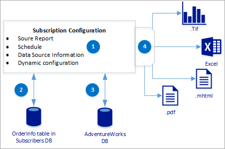

# Create a Data-Driven Subscription (SSRS Tutorial)
This [!INCLUDE[ssRSnoversion](../includes/ssrsnoversion-md.md)] tutorial teaches you the concepts of data-driven subscriptions by walking you through a simple example that creates a data-driven subscription to generate and save filtered report output to a file share. 
[!INCLUDE[ssRSnoversion](../includes/ssrsnoversion-md.md)] data-driven subscriptions allow you to customize and automate the distribution of a report based on dynamic subscriber data. Data-driven subscriptions are intended for the following kinds of scenarios:  
  
-   Distributing reports to a large recipient pool whose membership may change from one distribution to the next. For example, email a monthly report to all current customers.  
  
-   Distributing reports to a specific group of recipients based on predefined criteria. For example, send a sales performance report to all of the sales managers in an organization.
+ Automate the generation of reports in a wide variety of formats, for example .xlsx and .pdf.  
  
## What You Will Learn  
 This tutorial is divided into three lessons:  
 Lesson | Comments
 ------- | --------------
 [Lesson 1: Create a Sample Subscriber Database](../reporting-services/lesson-1-creating-a-sample-subscriber-database.md) | In this lesson you will create a table local [!INCLUDE[ssNoVersion](../includes/ssnoversion-md.md)] database that contains subscriber information. the information Order Numbers to use for filtering and output file formats.
[Lesson 2: Configure Report Data Source Properties](../reporting-services/lesson-2-modifying-the-report-data-source-properties.md) |In this lesson, you will configure a report data source so that the report can run unattended on a schedule. Unattended processing requires stored credentials. You will also modify the report dataset to include a parameter that is supplied by the subscriber data. This parameter is used to filter the report data based on order number.
 [Lesson 3: Define a Data-Driven Subscription](../reporting-services/lesson-3-defining-a-data-driven-subscription.md) | In this lesson you will create a data-driven subscription. This lesson guides you through each page in the Data-Driven Subscription Wizard.

 The Following diagram illustrates the basic workflow of the tutorial

Step  |Description 
---------|---------
(1)     |  The subscription configuration notes the source report, schedule, and the field mapping to the subscribers Database.        
(2)     | The OrderInfo table contains 4 order numbers to use for filtering, 1 per file. The table also contains the file formats for the generated reports.
(3)     | Information from the Adventureworks database is filtered and return in the report. 
(4)     | The reports are created in the file formats specified in the Orderinfo table.

 
 
    
  
## Requirements  
Data-driven subscriptions are typically created and maintained by report server administrators. The steps to create data-driven subscriptions require building queries, knowledge of data sources that contain subscriber data, and elevated permissions on a report server.  
  
The tutorial uses the *Sales order* report created in the tutorial [Create a Basic Table Report &#40;SSRS Tutorial&#41;](../reporting-services/create-a-basic-table-report-ssrs-tutorial.md) and data from the sample database **AdventureWorks2014**.  
  
Your computer must have the following installed to use this tutorial:  
  
-   An edition of [!INCLUDE[ssNoVersion](../includes/ssnoversion-md.md)] that supports data-driven subscriptions. For more information, see [Editions and Features of SQL Server 2017](../sql-server/editions-and-components-of-sql-server-2017.md).  
  
-   The report server must be running in native mode. The user interface described in this tutorial is based on a native mode report server. Subscriptions are supported on SharePoint mode report servers but the user interface will be different than what is described in this tutorial.  
  
-   SQL Server Agent service must be running.  
  
-   A report that includes parameters. This tutorial assumes the sample report, `Sales Orders` you create using the tutorial [Create a Basic Table Report &#40;SSRS Tutorial&#41;](../reporting-services/create-a-basic-table-report-ssrs-tutorial.md).  
  
-   The **AdventureWorks2014** sample database, which provides data to the sample report.  
  
-   A [!INCLUDE[ssRSnoversion_md](../includes/ssrsnoversion-md.md)] role assignment that includes the Manage all subscriptions task on the sample report. This task is required for defining a data-driven subscription. If you are an administrator on the computer, the default role assignment for local administrators provides the permissions necessary for creating data-driven subscriptions. For more information, see [Granting Permissions on a Native Mode Report Server](../reporting-services/security/granting-permissions-on-a-native-mode-report-server.md).  
  
-   A shared folder for which you have write permissions. The shared folder must be accessible over a network connection.  
  
**Estimated time to complete the tutorial:** 30 minutes. An additional 30 minutes if you have not completed the basic report tutorial.  
  
## See Also  
[Data-Driven Subscriptions](../reporting-services/subscriptions/data-driven-subscriptions.md)  
[Create a Basic Table Report &#40;SSRS Tutorial&#41;](../reporting-services/create-a-basic-table-report-ssrs-tutorial.md)
 

