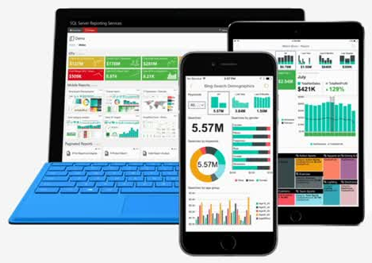
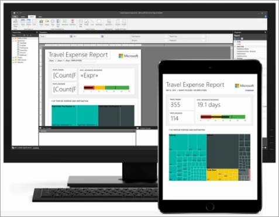
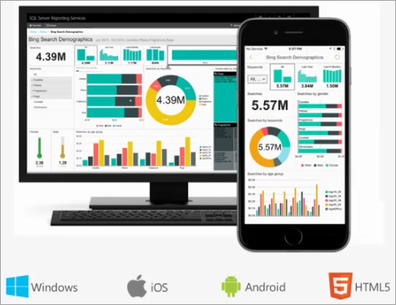
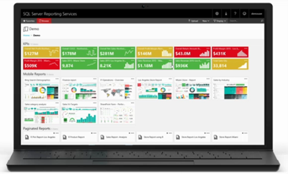

# What is SQL Server Reporting Services (SSRS)?

[!INCLUDE [ssrs-appliesto](../includes/ssrs-appliesto.md)] [!INCLUDE [ssrs-appliesto-2016-and-later](../includes/ssrs-appliesto-2016-and-later.md)] [!INCLUDE [ssrs-appliesto-not-pbirs](../includes/ssrs-appliesto-not-pbirs.md)]

Looking for Power BI Report Server? See [What is Power BI Report Server?](https://docs.microsoft.com/power-bi/report-server/get-started).

Create, deploy, and manage mobile and paginated Reporting Services reports on premises with the range of ready-to-use tools and services that SQL Server Reporting Services (SSRS) provides.

## Create, deploy, and manage mobile and paginated reports

SQL Server Reporting Services is a solution that customers deploy on their own premises for creating, publishing, and managing reports, then delivering them to the right users in different ways, whether that's viewing them in web browser, on their mobile device, or as an email in their in-box.

SQL Server Reporting Services offers an updated suite of products:

* **"Traditional" paginated reports** brought up to date, so you can create modern-looking reports, with updated tools and new features for creating them.
* **New mobile reports** with a responsive layout that adapts to different devices and the different ways you hold them.
* **A modern web portal** you can view in any modern browser. In the new portal, you can organize and display mobile and paginated Reporting Services reports and KPIs. You can also store Excel workbooks on the portal.

Read on for more about each.

### What's new in Reporting Services

These sources will keep you up-to-date on new features in SQL Server Reporting Services.

* [What's New in Reporting Services](../reporting-services/what-s-new-in-sql-server-reporting-services-ssrs.md)
* [SQL Server Reporting Services Team Blog](https://blogs.msdn.microsoft.com/sqlrsteamblog/)
* The [Guy in a Cube YouTube channel](https://www.youtube.com/channel/UCFp1vaKzpfvoGai0vE5VJ0w)

## Paginated reports

Reporting Services is associated with "traditional" paginated document-style reports, in which the more data you have, the more rows in the tables, and the more pages the report would have. That's great for generating fixed-layout, pixel-perfect documents optimized for printing, such as PDF and Word files.

That core BI workload still exists today, so we've modernized it. Now you can create modern-looking reports with updated new features, using [Report Builder](../reporting-services/report-builder/report-builder-in-sql-server-2016.md) or Report Designer in [SQL Server Data Tools (SSDT)](../reporting-services/tools/reporting-services-in-sql-server-data-tools-ssdt.md).

* We updated all the default styles and color palettes, so by default you create reports with a new minimalist modern style.
* We updated the Parameter pane, so you can arrange parameters however you want.
* You can export to new formats such as PowerPoint. Reporting Services visualizations in PowerPoint are live and editable, not just screen shots.
* You can create a hybrid Power BI/Reporting Services experience:  Rather than recreating your on-premises Reporting Services reports in Power BI, you can pin visuals from those reports to your Power BI dashboards. Then you can monitor everything in one place on your Power BI dashboard.

## Mobile reports

Mobile computing has shifted the devices we need to work, meaning people today have a different reporting need. The fixed-layout report experience doesn't work well when you introduce tablets and phones. Something designed for a wide PC screen isn't the optimal experience on a small phone screen that's not just smaller but a portrait or landscape orientation.

What you need with these widely different screen form factors is not a fixed layout, but a responsive layout that adapts to these different devices and the different ways you hold them. For that we've added a new report type: mobile reports, based on the Datazen technology we acquired about a year ago and integrated into the product. You can migrate your existing Datazen reports to Reporting Services with the [SQL Server Migration Assistant for Datazen](https://www.microsoft.com/download/details.aspx?id=53128). 

You create these mobile reports in the new [Mobile Report Publisher](../reporting-services/mobile-reports/create-mobile-reports-with-sql-server-mobile-report-publisher.md) app. Then in the native [Power BI apps for mobile devices](https://powerbi.microsoft.com/documentation/powerbi-power-bi-apps-for-mobile-devices/) for Windows 10, iOS, Android, and HTML5, you can access the data you have in Power BI the cloud, plus your on-premises SQL Server Reporting Services data. As you create visualizations, Mobile Report Publisher automatically generates sample data for each, so you see how the visualization will look with your data, and what kind of data works well in each visualization.

## Web portal

For end users of native-mode Reporting Services, the front door is a modern web portal you can view in any modern browser. You can access all your Reporting Services mobile and paginated reports and KPIs in the new portal.

You can apply your own custom branding to your web portal. And you can create KPIs right in the web portal. KPIs can surface key business metrics at a glance in the browser, without having to open a report. 

The new web portal is a complete rewrite of Report Manager. Now it's a single-page, standards-based HTML5 app, which modern browsers are optimized for: Edge, Internet Explorer 10 and 11, Chrome, Firefox, Safari, and all the major browsers.

The content on the web portal is organized by type: Reporting Services mobile and paginated reports and KPIs, Excel workbooks, shared datasets, and shared data sources to use as building blocks for your reports. You can store and manage them securely here, in the traditional folder hierarchy. You can tag your favorites, and you can manage the content if you have that role.

And you can still schedule report processing, access reports on demand,and subscribe to published reports in the new web portal.

More about the [Web portal (SSRS Native Mode)](../reporting-services/web-portal-ssrs-native-mode.md).

## Reporting Services in SharePoint integrated mode

You publish reports to Reporting Services in SharePoint integrated mode. You can schedule report processing, access reports on demand, subscribe to published reports, and export reports to other applications such as Microsoft Excel. Create data alerts on reports published to a SharePoint site and receive email messages when report data changes.  

More about [Reporting Services Report Server in SharePoint integrated mode](../reporting-services/report-server-sharepoint/reporting-services-report-server-sharepoint-mode.md).

## [!INCLUDE[ssRSnoversion](../includes/ssrsnoversion-md.md)] programming features

Take advantage of [!INCLUDE[ssRSnoversion](../includes/ssrsnoversion-md.md)] programming features so you can  extend and customize your reporting functionality, with APIs to integrate or extend data and report processing in custom applications.

More [Reporting Services Developer Documentation](../reporting-services/reporting-services-developer-documentation.md). 

## Next steps

* [Install Reporting Services](../reporting-services/install-windows/install-reporting-services.md)  
* [Install Report Builder](../reporting-services/install-windows/install-report-builder.md)   
* [Download SQL Server Data Tools (SSDT)](https://go.microsoft.com/fwlink/?LinkID=616714)  

More questions? [Try asking the Reporting Services forum](https://go.microsoft.com/fwlink/?LinkId=620231)
