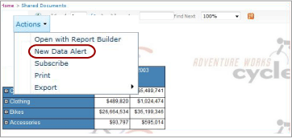

# Data Alert Designer

[!INCLUDE [ssrs-appliesto](../includes/ssrs-appliesto.md)] [!INCLUDE [ssrs-appliesto-2016](../includes/ssrs-appliesto-2016.md)] [!INCLUDE [ssrs-appliesto-not-2017](../includes/ssrs-appliesto-not-2017.md)] [!INCLUDE[ssrs-appliesto-sharepoint-2013-2016i](../includes/ssrs-appliesto-sharepoint-2013-2016.md)] [!INCLUDE [ssrs-appliesto-not-pbirs](../includes/ssrs-appliesto-not-pbirs.md)]

[!INCLUDE [ssrs-previous-versions](../includes/ssrs-previous-versions.md)]

You create and edit data alert definitions in Data Alert Designer. An alert definition is a collection of metadata, including the report data that you are interested in, the rules that report data must satisfy to create data alert instances and send data alert messages, the recipients of the alert message, and so forth.  

> [!NOTE]
> Reporting Services integration with SharePoint is no longer available after SQL Server 2016.

 To create an alert definition you do a number of related tasks:  
  
-   Select the report and the report data feed that includes data that you want to use.  
  
-   Define the rules and clauses that cause an alert to be sent. The rules can be simple or complex, using multiple clauses combined by AND operators.  
  
-   Define the frequency that the alert message is sent and the date and time the alert starts and stops. Alert messages can be sent only when results change.  
  
-   Specify the email addresses of alert message recipients.  
  
-   Customize the **Subject** line of the alert message.  
  
-   Provide a description of alert to include in alert message.  
  
> [!NOTE]  
>  Because the [!INCLUDE[ssRSnoversion](../includes/ssrsnoversion-md.md)] data alerts feature is available only when you install [!INCLUDE[ssRSnoversion](../includes/ssrsnoversion-md.md)] in SharePoint mode, the report on which you want to create an alert must be saved, deployed, or uploaded to a SharePoint document library.  
>   
>  Data alerts cannot be created on reports that use Windows Integrated authentication or prompts for credentials. The reports must use stored credentials. For more information, see [Specify Credential and Connection Information for Report Data Sources](../reporting-services/report-data/specify-credential-and-connection-information-for-report-data-sources.md).  
  
 To open Data Alert Designer, you click the **New Data Alert** option on the **Actions** menu on the report toolbar. If you do not see the **New Data Alert** option, the report is not configured to use stored credentials. You can update the credential type by updating the report data source from the SharePoint library.  
  
##   Data Alert Designer User Interface  
 The Data Alert Designer is divided into areas. The area where you select the report data feed, the area where you create simple or complex conditions by adding rules to conditions, and so on. The following picture shows the areas in Data Alert Designer.  
  
   
  
  
### Alert Data  
 When you open Data Alert Designer, it generates and makes available all the data feeds from the report and the **Report data name** drop-down list contains the names of the feeds. The data feeds are cached in memory while you are creating the alert definition and the table that display the data feed data is populated quickly when you switch between data feeds to explore the report data.  
  
 The first step in creating a data alert definition is to select the report data feed that contains the data that you want the alert to monitor. Reports can have zero or multiple data feeds. If a report has no data feeds, you cannot create alerts on it. A data feed can be generated by any data region, including all types of charts, gauges, indicators as well as tables, matrices, and lists.  
  
 If the report is parameterized and you do not see the data and columns that you expect in the report data feed, rerun the report using the appropriate parameter values. The columns and values must be present in the report to be included in the data feed.  
  
 Depending on the layout of the report, it might not be intuitive how many data feeds a report has, nor what data is included in which data feed. The [!INCLUDE[ssRSnoversion](../includes/ssrsnoversion-md.md)]Atom rendering extension generates the data feeds that you use with alerts. The Atom rendering extension provides report data as flattened rowsets, a tabular format in which all columns have the same number of rows. These rowsets are the contents of the data feeds. Because report layout is often complex and contains multiple peer or nested data regions, multiple data feeds are needed to make available all the report data.. For more information about how data feeds are generated from reports, see [Generating Data Feeds from Reports &#40;Report Builder and SSRS&#41;](../reporting-services/report-builder/generating-data-feeds-from-reports-report-builder-and-ssrs.md) and see [Generate Data Feeds from a Report &#40;Report Builder and SSRS&#41;](../reporting-services/report-builder/generate-data-feeds-from-a-report-report-builder-and-ssrs.md).  
  
 When you choose a data feed, the data from the feed displays in a table with rows and columns in the alert data pane of Data Alert Designer. The metadata from the data source that the report uses or the report itself specifies the column names and the data feed populates the field list that you use to define rules in the data condition. The data feed also provides metadata such as the data types of table columns that restrict the values and comparison operators that you can use with fields when you create the rules.  
  
 Some reports have millions of rows of data. The table shows only the first 100 rows of data in the feed.  
  
### Alert Name  
 By default, the alert definition has the same name as the report. You can change the alert name to be more meaningful. This makes it easier for you to manage your alerts, determining which alerts to update, delete and so on.  
  
 You can create multiple alerts on a report. It is possible to have multiple alert definitions with the same name, but it is recommended that you make alert names unique. It makes it easier to differentiate and manage alert definitions. You can view a list of all the alerts you created in Data Alert Manager. For more information, see [Data Alert Manager for Alerting Administrators](../reporting-services/data-alert-manager-for-alerting-administrators.md) and [Manage My Data Alerts in Data Alert Manager](../reporting-services/manage-my-data-alerts-in-data-alert-manager.md).  
  
### Rules and Clauses  
 The scope of data changes and the in the alert rules define the data changes that trigger the alert. The scope of the data changes are as follow:  
  
-   **Any data has**-at least one value in the data satisfies the rules that the condition specifies.  
  
-   **No data has**-no value in the data satisfied the rules that the condition specifies.  
  
 A rule contains zero, one, or many clauses. Multiple rules are combined by the AND logical operator. A rule can include multiple clause combined by the OR operator if the column has the string data type. The following shows basic rules that use only one clause, multiple rules combined by using the AND operator, multiple rules that with one or more OR clauses.  
  
 **Simple rules**  
  
-   Net sales **is greater than** 100000  
  
-   Sales date **is after** 6/1/2010  
  
-   Company Name **is not** Contoso  
  
 **Rules combined by AND operator**  
  
-   Sales **is greater than** 1500.00  
  
     **and** Units Sold **is less than** 500  
  
     Return date **is before** 1/1/2010  
  
-   Sales **is greater than or equal to** 1500.00  
  
     **and** Return date **is after** 1/1/2010  
  
     **and** Units Sold **is greater than** 500  
  
-   Promotion name **contains** Spring  
  
     **and** Units Sold **is greater than** 500  
  
     **and** Returns **is**  0  
  
 **Rules with OR clauses**  
  
-   Last Name **is** Blythe  
  
     **Or**  Petulescu  
  
     **Or**  Martin  
  
-   Return date **is after** 1/1/2010  
  
     **and** Sales Territory **is**  Central  
  
     **Or**  South  
  
     **Or**  North  
  
 Depending on the data type of the field, Data Alert Designer provides different comparisons. Data Alert Designer provides comparisons that are tailored to the data type of the field to which values are compared. The following lists comparisons available for different data types. The **Boolean** data type is not supported in rules.  
  
-   Date time data type comparisons are: **is**, **is not**, **is before**, and **is after**  
  
-   Numeric data type comparisons are: **is**, **is not**, **is less than**, **is less than or equal to**, and **is greater than**, and **is greater than or equal to**  
  
-   String data type comparisons are: **is**, **is not**, and **contains**  
  
 When you create a rule, you specify whether to use to use a value or field in the comparison by choosing **Value Entry Mode** or **Field Selection Mode**. If you choose **Value Entry Mode**, you provide a list of values to compare to. A comparison that includes multiple OR clauses is very similar to the IN logical comparison in [!INCLUDE[tsql](../includes/tsql-md.md)], which is a list of values to test for a match. For more information, see [IN &#40;Transact-SQL&#41;](../t-sql/language-elements/in-transact-sql.md).  
  
 If you choose **Field Selection Mode**, the comparison is between two fields, row by row. The two fields must have compatible data types (for example, two numeric fields) or the comparison is not valid. A list of fields displays automatically when you choose **Field Selection Mode**.  
  
 Data alerts without rules are also valid. This type of alert can be very useful. Imagine a scenario in which you want only to be notified when the report data feed has data. The data feed contains attendee information and the feed is empty until an attendee cancels. In this scenario, you would receive an alert, starting with the first cancellation.  
  
 You can delete individual rules and clauses.  
  
 Rules and clauses are included in the data alert message.  
  
### Schedule Settings  
 The schedule that you define for the data alert defines the recurrence pattern for sending the data alert message and when to start and stop sending the alert messages. The patterns are: once, minute, daily, and weekly. Although an alert has only one schedule you can create complex recurrence patterns that meet most business needs by using these intervals. The following are examples of common recurrence patterns to use in schedules:  
  
-   **Daily every 10 day(s)** - sends alerts once a day, every 10 days.  
  
-   **Weekly every 2 week(s) on Monday** - sends alerts every two weeks on Mondays only.  
  
-   **Hourly every 12 hour(s)** - sends alerts every 12 hours.  
  
-   **Minute every 30 minute(s)** - sends alerts every 30 minutes.  
  
 The recurrence pattern specifies when the alert is sent. If the rules are met during the interval that the pattern specifies, the alert is not sent until the end of the interval.  
  
 If you want to receive a data alert message as soon as possible when report data follow the specified rules, you can schedule the alert to run often. When the report data does not change, you and other recipients might receive many redundant messages. If you want to receive messages only, when the results from applying the rules change, select the **Send message only if results change** option.  
  
> [!IMPORTANT]  
>  It is recommended that you do not use a recurrence pattern that is more frequent than daily unless you have an important business reason to do so. Processing data alert definition in real time is not a supported scenario. Processing data alert definitions too frequently impacts the performance of the report server and the overall [!INCLUDE[ssRSnoversion](../includes/ssrsnoversion-md.md)] deployment.  
  
### Email Settings  
 You specify the email addresses of recipients to receive data alert messages by email in the **Recipient(s)** option. Multiple email addresses are separated by semicolons, the same way that you do in Microsoft Office Outlook email messages. You can also specify distribution groups as recipients, which makes it easier and more efficient to manage the recipient list. If SharePoint can determine your email address when you are creating an alert definition, your email address is automatically added to the recipients list; otherwise, you need to explicitly add yourself as a recipient.  
  
 The default subject of the email is **Data alert for \<alert name>**. You can change the subject to fit your needs.  
  
 You can also provide a description to include in the data alert message in the **Description** option. Including a description, especially if you have data alerts that are similar, will help you quickly differentiate and understand your alert messages. In addition to the alert message that is sent when report data satisfied the specified rules, an alert message is sent to all recipients when an error occurs. For more information, see [Data Alert Messages](../reporting-services/data-alert-messages.md).  
  
 For more information about how the email is generated, see [Reporting Services Data Alerts](../reporting-services/reporting-services-data-alerts.md).  
  
##   Create a Data Alert Definition  
 If you are granted the SharePoint View Items and Create Alerts permissions you can create a data alert definition for any report that you have permission to view as long as the report uses stored credentials or no credentials. You run the report from a SharePoint library. The data that is available for you to use in Data Alert Designer comes from the report. If the report is parameterized, you might need to run the report using different parameter values to ensure the data that you are interested in appears in the report. After the report is open, you click the **New Data Alert** option on the **Actions** menu on the report toolbar to open Data Alert Designer. The following picture shows you how to open Data Alert Designer.  
  
   
  
 For more information, see [Create a Data Alert in Data Alert Designer](../reporting-services/create-a-data-alert-in-data-alert-designer.md).  
  
  
##   Save a Data Alert Definition  
 Data Alert Designer displays the URL of the site where the data alert definition will be saved. Data alert definitions are always saved to the same site as the reports.  
  
> [!NOTE]  
>  The parameter values you chose to run the report are saved in the alert definition and will be used when report is rerun as a step in processing the alert definition. To use different parameter values, you must create a new alert definition.  
  
 Before the alert definition is saved, it is validated. You must correct any errors before the alert definition can be saved successfully. For more information, see [Create a Data Alert in Data Alert Designer](../reporting-services/create-a-data-alert-in-data-alert-designer.md).  
  
  
##   Edit a Data Alert Definition  
 After you save your data alert definition, you can reopen and then edit it in Data Alert Designer. You can add, change, or delete rules and clauses and change the schedule and email settings. If the report data feed that the alert uses has changed and no longer provides the fields that the alert rules reference or the data types or other metadata of the fields have changed, the alert definition is no longer valid, and you must correct it before you can resave it. If you want to use a different data feed, you must create a new alert definition.  
  
 To edit a data alert definition, you right click it in Data Alert Manager and click **Edit**. The following picture shows you the context menu on a data alert in Data Alert Manager.  
  
   
  
 For more information, see [Edit a Data Alert in Alert Designer](../reporting-services/edit-a-data-alert-in-alert-designer.md).  
  
  
##   Related Tasks  
 This section lists procedures that show you how to create and edit alerts.  
  
-   [Edit a Data Alert in Alert Designer](../reporting-services/edit-a-data-alert-in-alert-designer.md)  
  
-   [Create a Data Alert in Data Alert Designer](../reporting-services/create-a-data-alert-in-data-alert-designer.md)  

## See Also

[Reporting Services Data Alerts](../reporting-services/reporting-services-data-alerts.md)   
[Data Alert Manager for Alerting Administrators](../reporting-services/data-alert-manager-for-alerting-administrators.md)  

More questions? [Try asking the Reporting Services forum](https://go.microsoft.com/fwlink/?LinkId=620231)
