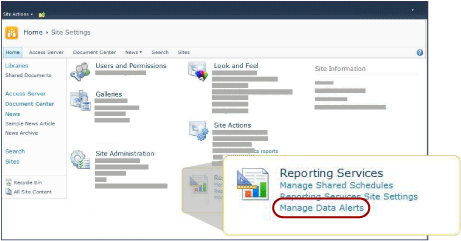

# Data Alert Manager for Alerting Administrators

[!INCLUDE [ssrs-appliesto](../includes/ssrs-appliesto.md)] [!INCLUDE [ssrs-appliesto-2016](../includes/ssrs-appliesto-2016.md)] [!INCLUDE [ssrs-appliesto-not-2017](../includes/ssrs-appliesto-not-2017.md)] [!INCLUDE[ssrs-appliesto-sharepoint-2013-2016i](../includes/ssrs-appliesto-sharepoint-2013-2016.md)] [!INCLUDE [ssrs-appliesto-not-pbirs](../includes/ssrs-appliesto-not-pbirs.md)]

[!INCLUDE [ssrs-previous-versions](../includes/ssrs-previous-versions.md)]

SQL Server Reporting Services provides Data Alert Manager for SharePoint alerting administrators to manage data alerts. Alerting administrators can view information about all alerts saved to the site and delete alerts. The following picture shows the features available to SharePoint alerting managers in Data Alert Manager.

> [!NOTE]
> Reporting Services integration with SharePoint is no longer available after SQL Server 2016.

 When the site is enabled for data alerts, two SharePoint pages, MyDataAlerts.aspx and SiteDataAlerts.aspx are created and added to the SharePoint site. SiteDataAlerts.aspx is Data Alert Manager for alerting administrators. Alerting administrators can open Data Alert Manager from the Site Settings SharePoint page. Alerting administrators must have SharePoint Manage Alerts permission to open Data Alert Manager.  
  
 You can also open Data Alert Manager directly by using a URL. The following shows the syntax of the URL:  
  
 `http: //<site name>/_layouts/ReportServer/ SiteDataAlerts.aspx`  
  
> [!NOTE]  
>  As an alerting administrator, you can grant permission to information workers to access the [!INCLUDE[ssRSnoversion](../includes/ssrsnoversion-md.md)] data alerts features. For more information about the required permissions, see [Reporting Services Data Alerts](../reporting-services/reporting-services-data-alerts.md).  
  
##   Viewing Data Alert Information  
 When Reporting Services is installed and configured in SharePoint, the Site Settings SharePoint page includes the **Reporting Services** options. Alerting administrators click the **Manage Data Alerts** option within Reporting Service to open Data Alert Manager. The following picture shows from where on the Site Settings page you open Data Alert Manager.  
  
   
  
 Data Alert Manager includes a table that lists the alert name, report name, the name of the alert owner, the number the alert message was sent, the last time the alert was run, the last time the alert definition was modified, and the status of the alert message. If the alert cannot be generated or generated or sent, the status column contains information about the error and helps you troubleshoot the alert. For more information, see [Manage All Data Alerts on a SharePoint Site in Data Alert Manager](../reporting-services/manage-all-data-alerts-on-a-sharepoint-site-in-data-alert-manager.md).  
  
 The following table shows sample data from a table in Data Alert Manager. When an error occurs, the error message and the identifier of the entry in the log (a GUID) are included in the **Status** field in the table.  
  
|Alert Name|Report Name|Created By|Sent Alerts|Last Run|Last Modified|Status|  
|----------------|-----------------|----------------|-----------------|--------------|-------------------|------------|  
|SalesQTR|SalesByTerritoryAndQTR|Lauren Johnson|4|6/12/2011|6/1/2011|Last alert ran successfully and alert was sent.|  
|UnitsSold|ProductsSalesByQTR|Michael Blythe|2|7/1/2011|6/28/2011|Last alert ran successfully, but the data was unchanged and no alert was sent.|  
|InventoryCount|StockStatusByQTR|Lauren Johnson|7|7/10/2011|7/2/2011|\<error message>The log file contains detailed information about the error. Refer to the log entry with the identifier: \<GUID>.|  
|TopPromotion|PromotionTracking|Cristian Petculescu|0||5/23/2011|Alert created.|  
  
 For more information see, [Manage All Data Alerts on a SharePoint Site in Data Alert Manager](../reporting-services/manage-all-data-alerts-on-a-sharepoint-site-in-data-alert-manager.md).  
  
 You can view all alerts created by site users. You choose a user and then choose whether to view all their alerts or only alerts for a specific report.  
  
  
##   Delete Data Alerts  
 You delete alerts definitions from Data Alert Manager. Every data alert definition has an owner, the SharePoint user who created it. Owners can delete only the alert definitions that they created. For more information, see [Manage My Data Alerts in Data Alert Manager](../reporting-services/manage-my-data-alerts-in-data-alert-manager.md).  
  
 A SharePoint alerting administrators can list and then delete alert definitions created by all users of the site. For more information, see [Manage All Data Alerts on a SharePoint Site in Data Alert Manager](../reporting-services/manage-all-data-alerts-on-a-sharepoint-site-in-data-alert-manager.md)  
  
 After you delete the alert definition, no further alerts are sent. However, if you query the alerting database you might find that the alert definition still exists. The alerting service performs clean up on a schedule and the alert definition is deleted permanently in the next cleanup. The default cleanup interval is 20 minutes. This and other cleanup intervals are configurable. For more information, see [Reporting Services Data Alerts](../reporting-services/reporting-services-data-alerts.md).  
  
  
##   Related Tasks  
 This section lists a procedure that shows you how to manage your alerts.  
  
-   [Manage All Data Alerts on a SharePoint Site in Data Alert Manager](../reporting-services/manage-all-data-alerts-on-a-sharepoint-site-in-data-alert-manager.md)  

## See Also

[Reporting Services Data Alerts](../reporting-services/reporting-services-data-alerts.md)  

More questions? [Try asking the Reporting Services forum](https://go.microsoft.com/fwlink/?LinkId=620231)
