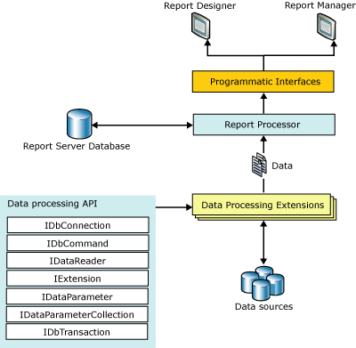

# Data Processing Extensions Overview
  Data processing extensions in [!INCLUDE[ssRSnoversion](../../../includes/ssrsnoversion-md.md)] enable you to connect to a data source and retrieve data. They also serve as a bridge between a data source and a dataset. [!INCLUDE[ssRSnoversion](../../../includes/ssrsnoversion-md.md)] data processing extensions are modeled after a subset of the [!INCLUDE[msCoName](../../../includes/msconame-md.md)] [!INCLUDE[dnprdnshort](../../../includes/dnprdnshort-md.md)] data provider interfaces.  
  
 The following table lists the data processing extensions included with [!INCLUDE[ssRSnoversion](../../../includes/ssrsnoversion-md.md)].  
  
|Data processing extension|Description|  
|-------------------------------|-----------------|  
|Data processing extension for [!INCLUDE[ssNoVersion](../../../includes/ssnoversion-md.md)]|Uses the .NET Framework Data Provider for SQL Server to connect to and retrieve data from the [!INCLUDE[ssDEnoversion](../../../includes/ssdenoversion-md.md)].|  
|Data processing extension for OLE DB|Uses the .NET Framework Data Provider for OLE DB. With this extension, the report server can query any data source that has an OLE DB provider.|  
|Data processing extension for Oracle|Uses the .NET Framework Data Provider for Oracle. With this extension, the report server can access Oracle data sources through Oracle client connectivity software.|  
|Data processing extension for ODBC|Uses the .NET Framework Data Provider for ODBC. With this extension, the report server can access data in any database for which there is an ODBC driver.|  
  
 You can use the [!INCLUDE[ssRS](../../../includes/ssrs.md)] data processing API to add custom data processing to your report server.  
  
> [!NOTE]  
>  [!INCLUDE[ssRSnoversion](../../../includes/ssrsnoversion-md.md)] has built-in support for data providers in the [!INCLUDE[dnprdnshort](../../../includes/dnprdnshort-md.md)]. If you have already implemented a full data provider, you do not need to implement a [!INCLUDE[ssRSnoversion](../../../includes/ssrsnoversion-md.md)] data processing extension. However, you should consider extending your data provider to include functionality specific to [!INCLUDE[ssRSnoversion](../../../includes/ssrsnoversion-md.md)] 2005, which includes secure connection credentials and server-side aggregates.  
  
 Each of the data processing extensions included with [!INCLUDE[ssRSnoversion](../../../includes/ssrsnoversion-md.md)] uses a common set of interfaces. This ensures that each extension implements comparable functionality.  
  
 You can develop data processing extensions for your own data sources, or you can use the interfaces to add an additional layer of data processing to common database infrastructures. You can deploy your custom data processing extensions to enable seamless integration of data into the existing report servers in your organization. You can also use them as part of a custom reporting suite that you provide to your consumers.  
  
   
Reporting Services data processing extension architecture  
  
 The advantages to implementing a custom [!INCLUDE[ssRSnoversion](../../../includes/ssrsnoversion-md.md)] data processing extension include:  
  
-   A simplified data access architecture, often with better maintainability and improved performance.  
  
-   The ability to directly expose extension-specific functionality to consumers.  
  
-   A specific interface for your consumers to access your data source within [!INCLUDE[ssRSnoversion](../../../includes/ssrsnoversion-md.md)].  
  
## Data Extension Process Flow  
 Before developing your custom data extension, you should understand how the report server uses data extensions to process data. You should also understand the constructors and methods that are called by the report server.  
  
   
The step-by-step process flow of a data extension that is called by the report server  
  
 The illustration shows the following sequence of events:  
  
1.  The report server creates a connection object and passes in the connection string and credentials associated with the report.  
  
2.  The command text of the report is used to create a command object. In the process, the data processing extension may include code that parses the command text and creates any parameters for the command.  
  
3.  Once the command object and any parameters are processed, a data reader is generated that returns a result set and enables the report server to associate the report data with the report layout.  
  
## Developer Requirements  
 Developing a [!INCLUDE[ssRSnoversion](../../../includes/ssrsnoversion-md.md)] data processing extension requires you to have:  
  
-   A deployment computer with Report Designer or a report server installed.  
  
-   A development computer with [!INCLUDE[vsprvsext](../../../includes/vsprvsext-md.md)] or above, or the [!INCLUDE[msCoName](../../../includes/msconame-md.md)] [!INCLUDE[dnprdnshort](../../../includes/dnprdnshort-md.md)] Software Development Kit (SDK) installed.  
  
-   An in-depth understanding of [!INCLUDE[ssRSnoversion](../../../includes/ssrsnoversion-md.md)] features and capabilities.  
  
-   An in-depth understanding of [!INCLUDE[msCoName](../../../includes/msconame-md.md)] [!INCLUDE[vstecado](../../../includes/vstecado-md.md)] architecture, [!INCLUDE[dnprdnshort](../../../includes/dnprdnshort-md.md)] data providers, ADO.NET DataSet objects, and the common [!INCLUDE[vstecado](../../../includes/vstecado-md.md)] interfaces.  
  
-   Development experience in a [!INCLUDE[dnprdnshort](../../../includes/dnprdnshort-md.md)] language such as [!INCLUDE[msCoName](../../../includes/msconame-md.md)] Visual C# or [!INCLUDE[msCoName](../../../includes/msconame-md.md)] [!INCLUDE[vbprvb](../../../includes/vbprvb-md.md)] .NET.  
  
## See Also  
 [Reporting Services Extensions](../../../reporting-services/extensions/reporting-services-extensions.md)   
 [Reporting Services Extension Library](../../../reporting-services/extensions/reporting-services-extension-library.md)  
  
  
