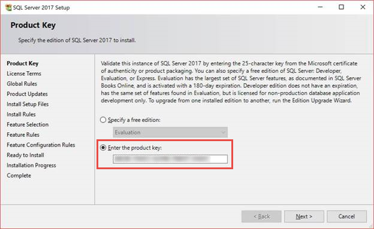
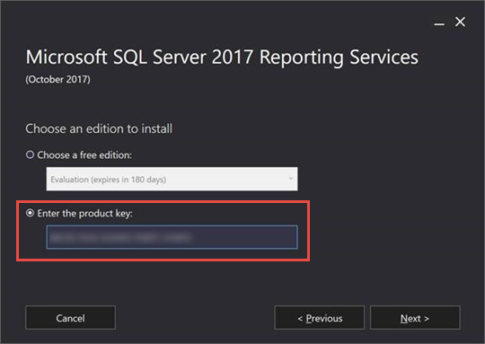

# How to find the product key for SQL Server 2017 Reporting Services

[!INCLUDE[ssrs-appliesto](../../includes/ssrs-appliesto.md)] [!INCLUDE[ssrs-appliesto-2017-and-later](../../includes/ssrs-appliesto-2017-and-later.md)] [!INCLUDE[ssrs-appliesto-not-pbirsi](../../includes/ssrs-appliesto-not-pbirs.md)]

Learn how to find your SQL Server 2017 Reporting Services (SSRS) product key so you can install your server in a production environment.

To find your product key, you start by downloading and running setup for SQL Server 2017.

1. Download SQL Server 2017 from one of these sources:

    - Volume Licensing Service Center
    - MSDN subscription
    - Retail (download from Microsoft Store)

1. Run SQL Server 2017 setup and copy the pre-populated key:

    

1. [Run Reporting Services setup](install-reporting-services.md) and paste the key:

     

You should only have to do this step the first time you install SSRS 2017. Servicing updates shouldn't require you to enter the key.

## Related information

- For information on installing SQL Server Reporting Services native mode, see [Install Reporting Services native mode report server](install-reporting-services-native-mode-report-server.md). 
- For information on installing SQL Server 2016 Reporting Services (and earlier) in SharePoint integration mode, see [Install the first Report Server in SharePoint mode](install-the-first-report-server-in-sharepoint-mode.md).

## Next steps

- [Install SQL Server 2017 Reporting Services](install-reporting-services.md)
- More questions? [Try asking the Reporting Services forum](https://go.microsoft.com/fwlink/?LinkId=620231)
