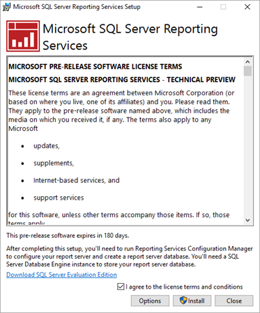
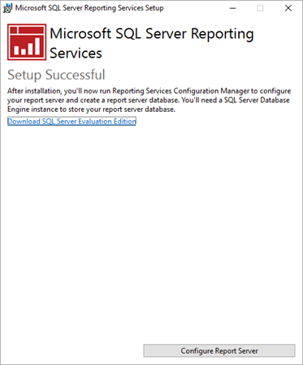
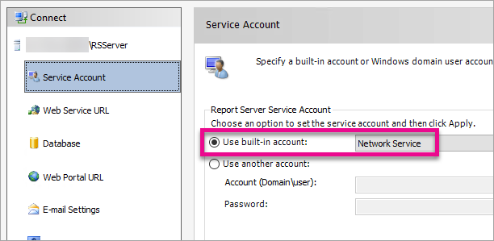
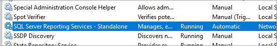

# Install January 2017 Technical Preview Power BI reports
[!INCLUDE[ssrs-appliesto-xxx-preview](../../includes/ssrs-appliesto-xxx-preview.md)]

Learn how to install the January 2017 Technical Preview of Power BI reports in SQL Server Reporting Services. This will install Reporting Services outside of the SQL Server setup experience.

 **Download** 
 
To download the January 2017 Technical Preview of Power BI reports in SQL Server Reporting Services, along with Power BI Desktop (SQL Server Reporting Services), go to the [Microsoft download center](https://go.microsoft.com/fwlink/?linkid=839351). 
  
  For the current release notes, see [Technical Preview of Power BI reports in SSRS - Release notes](../../reporting-services/reporting-services-release-notes.md). 

<iframe width="640" height="360" src="https://www.youtube.com/embed/A9O5BHZ4-9A?showinfo=0" frameborder="0" allowfullscreen></iframe>

##  Requirements  
The January 2017 Technical Preview of Power BI reports in SQL Server Reporting Services will install default values to configure the core settings required to make a report server operational. It has the following requirements:  
  
-   Review [Hardware and Software Requirements for Installing SQL Server](../../sql-server/install/hardware-and-software-requirements-for-installing-sql-server.md).  
  
-   A [!INCLUDE[ssNoVersion](../../includes/ssnoversion-md.md)] [!INCLUDE[ssDE](../../includes/ssde-md.md)] must be available after setup and before you configure the database for the report server. The [!INCLUDE[ssDE](../../includes/ssde-md.md)] instance hosts the report server database that Reporting Services Configuration Manager will create. The [!INCLUDE[ssDE](../../includes/ssde-md.md)] is not required for the actual setup experience.
  
-   The user account used to run Setup must be a member of the local Administrators group.

-  The user account used for Reporting Services Configuration Manager must have permission to access and create databases on the [!INCLUDE[ssDE](../../includes/ssde-md.md)] instance that hosts the report server databases.  
  
-   Setup must be able to use the default values to reserve the URLs that provide access to the report server and the [!INCLUDE[ssRSWebPortal-Non-Markdown](../../includes/ssrswebportal-non-markdown-md.md)]. These values are port 80, a strong wildcard, and the virtual directory names in the format **ReportServer** and **Reports**.
 
 > [!IMPORTANT] 
 > While Reporting Services can be installed in an environment that has a Read-Only Domain Controller (RODC), Reporting Services needs access to a Read-Write Domain Controller to function properly. If Reporting Services only has access to a RODC, you may encounter errors when trying to administer the service.
 
##  Default URL reservations  
 URL reservations are composed of a prefix, host name, port, and virtual directory:  
  
|Part|Description|  
|----------|-----------------|  
|Prefix|The default prefix is HTTP. If you previously installed a Secure Sockets Layer (SSL) certificate, Setup will try to create URL reservations that use the HTTPS prefix.|  
|Host name|The default host name is a strong wildcard (+). It specifies that the report server will accept any HTTP request on the designated port for any host name that resolves to the computer, including `http://<computername>/reportserver`, `http://localhost/reportserver`, or `http://<IPAddress>/reportserver.`|  
|Port|The default port is 80. Note that if you use any port other than port 80, you will have to explicitly add it to the URL when you open a [!INCLUDE[ssRSnoversion](../../includes/ssrsnoversion-md.md)] Web application in a browser window.|  
|Virtual directory|By default, virtual directories are created in the format of ReportServer for the Report Server Web service and Reports for the [!INCLUDE[ssRSWebPortal-Non-Markdown](../../includes/ssrswebportal-non-markdown-md.md)]. For the Report Server Web service, the default virtual directory is **reportserver**. For the [!INCLUDE[ssRSWebPortal-Non-Markdown](../../includes/ssrswebportal-non-markdown-md.md)], the default virtual directory is **reports**.|  
  
 An example of the complete URL string might be as follows:  
  
-   `http://+:80/reportserver`, provides access to the report server.  
  
-   `http://+:80/reports`, provides access to the [!INCLUDE[ssRSWebPortal-Non-Markdown](../../includes/ssrswebportal-non-markdown-md.md)].  
 
## Install Reporting Services Standalone

Installing the January 2017 Technical Preview of Power BI reports in SQL Server Reporting Services is straight forward. There are only a few steps to install the files.
 
> [!NOTE] 
> You do not need a SQL Server Database Engine server available at the time of install. You will need one to configure Reporting Services after install.

1.	Find the location of SQLServerReportingServices.exe and launch the installer.
2.	Select Options to change the install path for Reporting Services.

    > [!NOTE] 
    > The default path is C:\Program Files\Microsoft SQL Server Reporting Services.

3.	Read and agree to the license terms and conditions and then select Install.

    

4.	After a successful setup, select **Configure Report Server** to launch the Reporting Services Configuration Manager.

    

## Configuration your report server

After you select **Configure Report Server** in the setup, you will be presented with Reporting Services Configuration Manager. For more information, see [Reporting Services Configuration Manager](../../reporting-services/install-windows/reporting-services-configuration-manager-native-mode.md).

You will need to [create a report server database](../../reporting-services/install-windows/ssrs-report-server-create-a-report-server-database.md) in order to complete the initial configuration of Reporting Services. A SQL Server Database server is required to complete this step.

### Creating a database on a different server

If you are creating the report server database on a database server on a different machine, you will need to change the service account for the report server to a credential that is recognized on the database server. 

By default, the report server uses the virtual service account. If you try to create a database on a different server, you may receive the following error on the Applying connection rights step.

`System.Data.SqlClient.SqlException (0x80131904): Windows NT user or group '(null)' not found. Check the name again.`

To work around this, you can change the service account to either Network Service or a domain account. Changing the service account to Network Service will apply rights in the context of the machine account for the report server.

For more information, see [Configure the Report Server Service Account](../../reporting-services/install-windows/configure-the-report-server-service-account-ssrs-configuration-manager.md).

## Windows Service

A windows service will be created as part of the installation. It will be displayed as **SQL Server Reporting Services – Standalone**. The service name is **ReportServerStandalone**.

 
## Firewall

If you are accessing the report server from a remote machine, you will want to make sure you have configured any firewall rules if there is a firewall present.

You will need to open up the TCP port that you have configured for your Web Service URL and Web Portal URL. By default, these are configured on TCP port 80.

## Additional configuration

- To configure Kerberos and constraind delegation to allow Power BI reports to render within the web portal, see [Configure Kerberos to use Power BI reports](../../reporting-services/report-server/configure-kerberos-to-use-power-bi-reports.md).
  
-   To configure [!INCLUDE[sspowerbi](../../includes/sspowerbi-md.md)] integration so you can pin report items to a [!INCLUDE[sspowerbi](../../includes/sspowerbi-md.md)] dashboard, see [Power BI Report Server Integration &#40;Configuration Manager&#41;](../../reporting-services/install-windows/power-bi-report-server-integration-configuration-manager.md).  
  
-   To configure email for subscriptions processing, see [E-Mail Settings - Reporting Services Native mode &#40;Configuration Manager&#41;](../../reporting-services/install-windows/e-mail-settings-reporting-services-native-mode-configuration-manager.md) and [E-Mail Delivery in Reporting Services](../../reporting-services/subscriptions/e-mail-delivery-in-reporting-services.md).  
  
-   To configure the [!INCLUDE[ssRSWebPortal-Non-Markdown](../../includes/ssrswebportal-non-markdown-md.md)] so you can access it on a report computer to view and manage reports, see [Configure a Firewall for Report Server Access](../../reporting-services/report-server/configure-a-firewall-for-report-server-access.md) and [Configure a Report Server for Remote Administration](../../reporting-services/report-server/configure-a-report-server-for-remote-administration.md).  

## See Also
 [Configure Kerberos to use Power BI reports](../../reporting-services/report-server/configure-kerberos-to-use-power-bi-reports.md)  
 [Power BI reports in Reporting Services](../../reporting-services/power-bi-reports-in-reporting-services.md)  
 [Verify a Reporting Services Installation](../../reporting-services/install-windows/verify-a-reporting-services-installation.md)   
 [Configure the Report Server Service Account &#40;SSRS Configuration Manager&#41;](../../reporting-services/install-windows/configure-the-report-server-service-account-ssrs-configuration-manager.md)   
 [Configure Report Server URLs  &#40;SSRS Configuration Manager&#41;](../../reporting-services/install-windows/configure-report-server-urls-ssrs-configuration-manager.md)   
 [Configure a Report Server Database Connection  &#40;SSRS Configuration Manager&#41;](../../reporting-services/install-windows/configure-a-report-server-database-connection-ssrs-configuration-manager.md)    
 [Initialize a Report Server &#40;SSRS Configuration Manager&#41;](../../reporting-services/install-windows/ssrs-encryption-keys-initialize-a-report-server.md)   
 [Configure SSL Connections on a Native Mode Report Server](../../reporting-services/security/configure-ssl-connections-on-a-native-mode-report-server.md)   
 [Configure Windows Service Accounts and Permissions](../../database-engine/configure-windows/configure-windows-service-accounts-and-permissions.md)   
 More questions? [Try the Reporting Services forum](http://go.microsoft.com/fwlink/?LinkId=620231)

