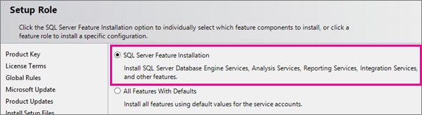
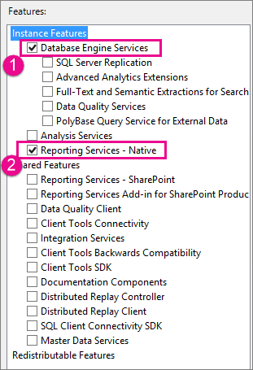
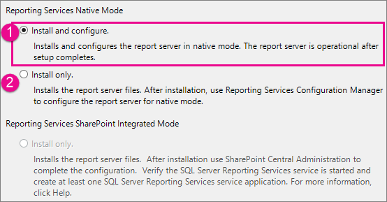

# Install Reporting Services 2016 native mode report server

[!INCLUDE[ssrs-appliesto](../../includes/ssrs-appliesto.md)] [!INCLUDE[ssrs-appliesto-2016](../../includes/ssrs-appliesto-2016.md)] [!INCLUDE[ssrs-appliesto-not-2017](../../includes/ssrs-appliesto-not-2017.md)] [!INCLUDE[ssrs-appliesto-not-pbirsi](../../includes/ssrs-appliesto-not-pbirs.md)]

Learn how to install [!INCLUDE[ssRSnoversion](../../includes/ssrsnoversion-md.md)] in native mode. This will provide access to a [!INCLUDE[ssRSWebPortal](../../includes/ssrswebportal.md)] where you can manage reports and other items.

> [!NOTE]
> Looking for Power BI Report Server? See [Install Power BI Report Server](https://powerbi.microsoft.com/documentation/reportserver-install-report-server/).

A [!INCLUDE[ssRSnoversion](../../includes/ssrsnoversion-md.md)] native mode report server is the default [!INCLUDE[ssRSnoversion](../../includes/ssrsnoversion-md.md)] server mode and can be installed from the [!INCLUDE[ssNoVersion](../../includes/ssnoversion-md.md)] installation wizard or from the command line. In the setup wizard, you can select to either install files and configure the server with default settings or to only install the files. This topic reviews the *Default configuration for native mode* where Setup both installs and configures a report server instance. After Setup is finished, the report server is running and ready to use for basic report viewing and report management.  Additional features such as [!INCLUDE[sspowerbi](../../includes/sspowerbi-md.md)] integration and e-mail delivery with subscription processing require additional configuration.  
  
##   What is the default configuration?  
 Setup installs the following [!INCLUDE[ssRSnoversion](../../includes/ssrsnoversion-md.md)] features when you select the default configuration for native mode option:  
  
-   Report Server service (which includes the Report Server Web service, background processing application, and the [!INCLUDE[ssRSWebPortal-Non-Markdown](../../includes/ssrswebportal-non-markdown-md.md)] for viewing and managing reports as well as permissions.  
  
-   The [!INCLUDE[ssRSnoversion](../../includes/ssrsnoversion-md.md)] Configuration Manager  
  
-   The [!INCLUDE[ssRSnoversion](../../includes/ssrsnoversion-md.md)] command line utilities rsconfig.exe, rskeymgmt.exe and rs.exe.  
  
 [!INCLUDE[ssNoVersion](../../includes/ssnoversion-md.md)] [!INCLUDE[ssManStudio](../../includes/ssmanstudio-md.md)] and [!INCLUDE[ssBIDevStudioFull](../../includes/ssbidevstudiofull-md.md)] are now separate downloads.  
  
 Setup configures the following for a native mode report server installation:  
  
-   Service account for the Report Server service.  
  
-   Report Server Web service URL.  
  
-   The [!INCLUDE[ssRSWebPortal-Non-Markdown](../../includes/ssrswebportal-non-markdown-md.md)] URL.  
  
-   Report Server database.  
  
-   Service account access to the report server databases.  
  
-   Connection information, also known as the data source name (DSN), for the report server databases.  
  
 Setup does not configure the unattended execution account, report server e-mail, back up the encryption keys, or a scale-out deployment. You can use the [!INCLUDE[ssRSnoversion](../../includes/ssrsnoversion-md.md)] Configuration Manager to configure these properties. For more information, see [Reporting Services Configuration Manager &#40;Native Mode&#41;](../../reporting-services/install-windows/reporting-services-configuration-manager-native-mode.md).
  
##   When to install the default configuration for native mode  
 A default configuration installs [!INCLUDE[ssRSnoversion](../../includes/ssrsnoversion-md.md)] in an operational state so that you can use the report server immediately after Setup is finished. Specify this mode when you want to save steps by eliminating any required configuration tasks you would otherwise have to perform in the [!INCLUDE[ssRSnoversion](../../includes/ssrsnoversion-md.md)] Configuration tool.  
  
 Installing the default configuration does not guarantee that the report server will work after Setup is finished. The default URLs might not register when the service starts. Always test your installation to verify that the service starts and runs as expected.  See [Verify a Reporting Services Installation](../../reporting-services/install-windows/verify-a-reporting-services-installation.md).
  
##   Requirements  
 The default configuration option uses default values to configure the core settings required to make a report server operational. It has the following requirements:  
  
-   Review [Hardware and Software Requirements for Installing SQL Server](../../sql-server/install/hardware-and-software-requirements-for-installing-sql-server.md) .  
  
-   [!INCLUDE[ssRSnoversion](../../includes/ssrsnoversion-md.md)] and [!INCLUDE[ssNoVersion](../../includes/ssnoversion-md.md)] [!INCLUDE[ssDE](../../includes/ssde-md.md)] must be installed together in the same instance. The [!INCLUDE[ssDE](../../includes/ssde-md.md)] instance hosts the report server database that Setup creates and configures.  
  
-   The user account used to run Setup must be a member of the local Administrators group and have permission to access and create databases on the [!INCLUDE[ssDE](../../includes/ssde-md.md)] instance that hosts the report server databases.  
  
-   Setup must be able to use the default values to reserve the URLs that provide access to the report server and the [!INCLUDE[ssRSWebPortal-Non-Markdown](../../includes/ssrswebportal-non-markdown-md.md)]. These values are port 80, a strong wildcard, and the virtual directory names in the format **ReportServer_\<***instance_name***>** and **Reports_\<***instance_name***>**.  
  
-   Setup must be able to use the default values to create the report server databases. These values are **ReportServer** and **ReportServerTempDB**. If you have existing databases from a previous installation, Setup will be blocked because it cannot configure the report server in the default configuration for native mode. You must rename, move, or delete the databases to unblock Setup.  
  
 If your computer does not meet all requirements for a default installation, you must install [!INCLUDE[ssRSnoversion](../../includes/ssrsnoversion-md.md)] in files-only mode and then use the [!INCLUDE[ssRSnoversion](../../includes/ssrsnoversion-md.md)] Configuration Manager to configure it after Setup is finished.
 
 > [!IMPORTANT]
 > While Reporting Services can be installed in an environment that has a Read-Only Domain Controller (RODC), Reporting Services needs access to a Read-Write Domain Controller to function properly. If Reporting Services only has access to a RODC, you may encounter errors when trying to administer the service.
  
##   Default URL reservations  
 URL reservations are composed of a prefix, host name, port, and virtual directory:  
  
|Part|Description|  
|----------|-----------------|  
|Prefix|The default prefix is HTTP. If you previously installed a Secure Sockets Layer (SSL) certificate, Setup will try to create URL reservations that use the HTTPS prefix.|  
|Host name|The default host name is a strong wildcard (+). It specifies that the report server will accept any HTTP request on the designated port for any host name that resolves to the computer, including `https://<computername>/reportserver`, `https://localhost/reportserver`, or `https://<IPAddress>/reportserver`.|  
|Port|The default port is 80. Note that if you use any port other than port 80, you will have to explicitly add it to the URL when you open a [!INCLUDE[ssRSnoversion](../../includes/ssrsnoversion-md.md)] Web application in a browser window.|  
|Virtual directory|By default, virtual directories are created in the format of ReportServer_\<*instance_name*> for the Report Server Web service and Reports_\<*instance_name*> for the [!INCLUDE[ssRSWebPortal-Non-Markdown](../../includes/ssrswebportal-non-markdown-md.md)]. For the Report Server Web service, the default virtual directory is **reportserver**. For the [!INCLUDE[ssRSWebPortal-Non-Markdown](../../includes/ssrswebportal-non-markdown-md.md)], the default virtual directory is **reports**.|  
  
 An example of the complete URL string might be as follows:  
  
-   `https://+:80/reportserver`, provides access to the report server.  
  
-   `https://+:80/reports`, provides access to the [!INCLUDE[ssRSWebPortal-Non-Markdown](../../includes/ssrswebportal-non-markdown-md.md)].
  
##   Install native mode with the SQL Server installation wizard  
 The following list describes the  [!INCLUDE[ssRSnoversion](../../includes/ssrsnoversion-md.md)] specific  steps and options you select in the SQL Server Installation Wizard. The list does not described each page you will see in the installation wizard, only the [!INCLUDE[ssRSnoversion](../../includes/ssrsnoversion-md.md)] related pages that are part of a Native mode installation.  
  
1.  Run the SQL Server setup wizard (setup.exe) and step through the following preliminary pages:  
  
    -   Product Key  
  
    -   License Terms  
  
    -   Global Rules  
  
    -   Microsoft Update  
  
    -   Product Updates  
  
    -   Install Setup Files  
  
    -   Install Rules  
  
2.  On the **Setup Role** page, Select **SQL Server Feature Installation**.  
  
       
  
3.  On the **Feature Selection** page, select the following:  
  
    -   (1) **Database Engine Services**, unless an instance of the database engine is already installed.  
  
    -   (2) **Reporting Services-Native**.  
  
       
  
4.  Review the **Feature Rules** passed.  
  
5.  On the Instance configuration page, remember that if you choose to configure a **Named Instance**, you will need to use the instance name in URLS when you browse to Report Manger and the report server itself. If the instance was name was "THESQLINSTANCE" , the URLS would look like the following:  
  
    -   `https://[ServerName]/ReportServer_THESQLINSTANCE`  
  
    -   `https://[ServerName]/Reports_THESQLINSTANCE`  
  
6.  **Server Configuration**: If you plan to use the [!INCLUDE[ssRSnoversion](../../includes/ssrsnoversion-md.md)] subscription feature, then on the **Server Configuration** page, configure SQL Server Agent **Automatic** Startup type.   The default is manual.  
  
7.  Add  SQL Server administrators on the **Database Engine Configuration** page.  
  
8.  On the **Reporting Services Configuration** page select **Install and Configure**.  
  
       
  
    > [!NOTE]  
    >  **Install and Configure** will not be available unless the database feature is also selected to be installed.  
  
9. Feature Configuration Rules: verify the rules passed. The setup wizard automatically advances to the **Ready to install** if the rules all pass.  Specific to [!INCLUDE[ssRSnoversion](../../includes/ssrsnoversion-md.md)], the rules verify a report server catalog and temp catalog database do not already exist.  
  
10. On the **ready to install** page, note the path to the  configuration file as you can refer to it at a later time for a good summary of the servers initial [!INCLUDE[ssNoVersion](../../includes/ssnoversion-md.md)] configuration including the components installed, service accounts and administrators.  
  
11. After the SQL Server installation wizard is complete, verify the default Native mode installation using the following basic steps.  
  
    -   Open [!INCLUDE[ssRSnoversion](../../includes/ssrsnoversion-md.md)] Configuration Manager and confirm you can connect to the report server.  
  
    -   Open your browser **with administrative privileges** and connect to the [!INCLUDE[ssRSWebPortal-Non-Markdown](../../includes/ssrswebportal-non-markdown-md.md)], for example `https://localhost/Reports`.  
  
    -   Open your browser with administrative privileges and connect to the [!INCLUDE[ssRSnoversion](../../includes/ssrsnoversion-md.md)] report server page. For example,  `https://localhost/ReportServer`  
  
 For more information, see the Native section of the following two topics:  
  
 [Verify a Reporting Services Installation](../../reporting-services/install-windows/verify-a-reporting-services-installation.md)  
  
 [Troubleshoot a Reporting Services Installation](../../reporting-services/install-windows/troubleshoot-a-reporting-services-installation.md)   
  
##   Additional configuration  
  
-   To configure [!INCLUDE[sspowerbi](../../includes/sspowerbi-md.md)] integration so you can pin report items to a [!INCLUDE[sspowerbi](../../includes/sspowerbi-md.md)] dashboard, see [Power BI Report Server Integration](../../reporting-services/install-windows/power-bi-report-server-integration-configuration-manager.md).  
  
-   To configure email for subscriptions processing, see [E-Mail Settings - Reporting Services Native mode](../../reporting-services/install-windows/e-mail-settings-reporting-services-native-mode-configuration-manager.md) and [E-Mail Delivery in Reporting Services](../../reporting-services/subscriptions/e-mail-delivery-in-reporting-services.md).  
  
-   To configure the web portal so you can access it on a report computer to view and manage reports, see [Configure a Firewall for Report Server Access](../../reporting-services/report-server/configure-a-firewall-for-report-server-access.md) and [Configure a Report Server for Remote Administration](../../reporting-services/report-server/configure-a-report-server-for-remote-administration.md).  
  
## See Also

[Troubleshoot a Reporting Services Installation](../../reporting-services/install-windows/troubleshoot-a-reporting-services-installation.md)   
[Verify a Reporting Services Installation](../../reporting-services/install-windows/verify-a-reporting-services-installation.md)   
[Configure the Report Server Service Account](../../reporting-services/install-windows/configure-the-report-server-service-account-ssrs-configuration-manager.md)   
[Configure Report Server URLs](../../reporting-services/install-windows/configure-report-server-urls-ssrs-configuration-manager.md)   
[Configure a Report Server Database Connection](../../reporting-services/install-windows/configure-a-report-server-database-connection-ssrs-configuration-manager.md)   
[Files-Only Installation &#40;Reporting Services&#41;](../../reporting-services/install-windows/files-only-installation-reporting-services.md)   
[Initialize a Report Server](../../reporting-services/install-windows/ssrs-encryption-keys-initialize-a-report-server.md)   
[Configure SSL Connections on a Native Mode Report Server](../../reporting-services/security/configure-ssl-connections-on-a-native-mode-report-server.md)   
[Configure Windows Service Accounts and Permissions](../../database-engine/configure-windows/configure-windows-service-accounts-and-permissions.md)   

More questions? [Try asking the Reporting Services forum](https://go.microsoft.com/fwlink/?LinkId=620231)
