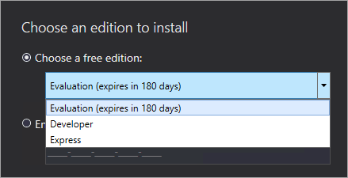

# Install SQL Server Reporting Services

[!INCLUDE[ssrs-appliesto](../../includes/ssrs-appliesto.md)] [!INCLUDE[ssrs-appliesto-2017-and-later](../../includes/ssrs-appliesto-2017-and-later.md)] [!INCLUDE[ssrs-appliesto-not-pbirsi](../../includes/ssrs-appliesto-not-pbirs.md)]

SQL Server Reporting Services installation involves server components for storing report items, rendering reports, and processing of subscription and other report services.

::: moniker range="=sql-server-ver16"
Download [**SQL Server 2022 Reporting Services**](https://www.microsoft.com/download/details.aspx?id=104502) from the Microsoft Download Center.

::: moniker-end

::: moniker range="<=sql-server-ver15"
Download [**SQL Server 2019 Reporting Services**](https://www.microsoft.com/download/details.aspx?id=100122) from the Microsoft Download Center.

::: moniker-end

::: moniker range="=sql-server-2017"
Download [**SQL Server 2017 Reporting Services**](https://www.microsoft.com/download/details.aspx?id=55252) from the Microsoft Download Center.

::: moniker-end

> [!NOTE]
> Looking for Power BI Report Server? See [Install Power BI Report Server](https://powerbi.microsoft.com/documentation/reportserver-install-report-server/).
> 
> Upgrading or migrating from a SQL Server 2016 or earlier version of Reporting Services? See [Upgrade and Migrate Reporting Services](upgrade-and-migrate-reporting-services.md).

## Before you begin

Before you install Reporting Services, review the [Hardware and software requirements for installing SQL Server](../../sql-server/install/hardware-and-software-requirements-for-installing-sql-server.md).

## Install your report server

Installing a report server is straightforward. There are only a few steps to install the files.

> [!NOTE]
> You don't need a SQL Server Database Engine server available at the time of install. You do need one to configure Reporting Services after install.

1. Find the location of SQLServerReportingServices.exe and launch the installer.

2. Select **Install Reporting Services**.

3. Choose an edition to install and then select **Next**.

    For a free edition, choose either Evaluation or Developer from the drop-down.

    

    Otherwise, enter a product key. [Find the product key for SQL Server Reporting Services](find-reporting-services-product-key-ssrs.md).

4. Read and agree to the license terms and conditions and then select **Next**.

5. You need to have a Database Engine available to store the report server database. Select **Next** to install the report server only.

6. Specify the install location for the report server. Select **Install** to continue.

    > [!NOTE]
    > The default path is C:\Program Files\Microsoft SQL Server Reporting Services.

7. After a successful setup, select **Configure Report Server** to launch the Report Server Configuration Manager.

## Configure your report server

After you select **Configure Report Server** in the setup, you're' presented with **Report Server Configuration Manager**. For more information, see [Report Server Configuration Manager](reporting-services-configuration-manager-native-mode.md).

You need to [create a report server database](ssrs-report-server-create-a-report-server-database.md) to complete the initial configuration of Reporting Services. A SQL Server Database server is required to complete this step.

### Creating a database on a different server

If you're creating the report server database on a database server on a different machine, you need to change the service account for the report server to a credential that is recognized on the database server.

By default, the report server uses the virtual service account. If you try to create a database on a different server, you may receive the following error on the Applying connection rights step.

`System.Data.SqlClient.SqlException (0x80131904): Windows NT user or group '(null)' not found. Check the name again.`

To work around the error, you can change the service account to either Network Service or a domain account. Changing the service account to Network Service applies rights in the context of the machine account for the report server.

For more information, see [Configure the report server service account](configure-the-report-server-service-account-ssrs-configuration-manager.md).

## Windows Service

A Windows service is created as part of the installation. It's displayed as **SQL Server Reporting Services**. The service name is **SQLServerReportingServices**.

## Default URL reservations

URL reservations are composed of a prefix, host name, port, and virtual directory:

|Part|Description|
|----------|-----------------|
|Prefix|The default prefix is HTTP. If you previously installed a Transport Layer Security (TLS), previously known as Secure Sockets Layer (SSL), certificate, Setup tries to create URL reservations that use the HTTPS prefix.|
|Host name|The default host name is a strong wildcard (+). It specifies that the report server accepts any HTTP request on the designated port for any host name that resolves to the computer, including `https://<computername>/reportserver`, `https://localhost/reportserver`, or `https://<IPAddress>/reportserver.`|
|Port|The default port is 80. If you use any port other than port 80, you have to explicitly add it to the URL when you open web portal in a browser window.|
|Virtual directory|By default, virtual directories are created in the format of ReportServer for the Report Server Web service and Reports for the web portal. For the Report Server Web service, the default virtual directory is **reportserver**. For the web portal, the default virtual directory is **reports**.|

An example of the complete URL string might be as follows:

- `https://+:80/reportserver`, provides access to the report server.

- `https://+:80/reports`, provides access to the web portal.

## Firewall

If you're accessing the report server from a remote machine, you want to make sure you've configured any firewall rules if there's a firewall present.

You need to open up the TCP port that you've configured for your Web Service URL and Web Portal URL. By default, these are configured on TCP port 80.

## Additional configuration

- To configure integration with the Power BI service so you can pin report items to a Power BI dashboard, see [Integrate with the Power BI service](power-bi-report-server-integration-configuration-manager.md).

- To configure email for subscriptions processing, see [E-Mail settings](e-mail-settings-reporting-services-native-mode-configuration-manager.md) and [E-Mail delivery in a report server](../subscriptions/e-mail-delivery-in-reporting-services.md).

- To configure the web portal so you can access it on a remote computer to view and manage reports, see [Configure a firewall for report server access](../report-server/configure-a-firewall-for-report-server-access.md) and [Configure a report server for remote administration](../report-server/configure-a-report-server-for-remote-administration.md).

## Related information

For information on how to install SQL Server Reporting Services native mode, see [Install Reporting Services native mode report server](install-reporting-services-native-mode-report-server.md). 

::: moniker range="=sql-server-2016"

For information on how to install SQL Server 2016 Reporting Services (and earlier) in SharePoint integration mode, see [Install the first Report Server in SharePoint mode](install-the-first-report-server-in-sharepoint-mode.md).

::: moniker-end

## Next steps

With your report server installed, begin to create reports and deploy those to your report server. For information on how to start with Report Builder, see [Install Report Builder](../../reporting-services/install-windows/install-report-builder.md).

To create reports using SQL Server Data Tools, [download SQL Server Data Tools](../../ssdt/download-sql-server-data-tools-ssdt.md).

More questions? [Try asking the Reporting Services forum](/answers/search.html?c=&f=&includeChildren=&q=ssrs+OR+reporting+services&redirect=search%2fsearch&sort=relevance&type=question+OR+idea+OR+kbentry+OR+answer+OR+topic+OR+user)
