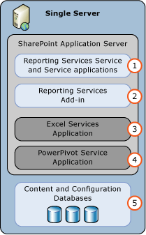
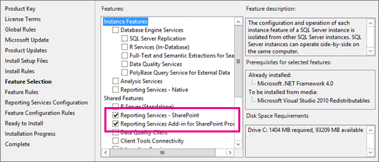
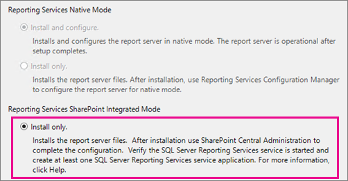

# Install the first Report Server in SharePoint mode

[!INCLUDE[ssrs-appliesto](../../includes/ssrs-appliesto.md)] [!INCLUDE[ssrs-appliesto-2016](../../includes/ssrs-appliesto-2016.md)] [!INCLUDE[ssrs-appliesto-not-pbirsi](../../includes/ssrs-appliesto-not-pbirs.md)] [!INCLUDE[ssrs-appliesto-sharepoint-2013-2016i](../../includes/ssrs-appliesto-sharepoint-2013-2016.md)]

  The procedures in this topic guide you through a single server installation of Reporting Services in SharePoint mode. The steps include running the SQL Server installation wizard as well as configuration tasks that use SharePoint Central Administration. The topic can also be used for individual procedures for updating an existing installation, for example to create a Reporting Services service application.  
  
> [!NOTE]
> Reporting Services integration with SharePoint is no longer available after SQL Server 2016.
  
 For information on adding more Reporting Services servers to an existing farm, see the following:  
  
-   [Add an Additional Report Server to a Farm &#40;SSRS Scale-out&#41;](../../reporting-services/install-windows/add-an-additional-report-server-to-a-farm-ssrs-scale-out.md)  
  
-   [Add an Additional Reporting Services Web Front-end to a Farm](../../reporting-services/install-windows/add-an-additional-reporting-services-web-front-end-to-a-farm.md)  
  
 A single server installation is useful for development and testing scenarios but it is not recommended for production environments.  
  
##  <a name="bkmk_singleserver"></a> Example single-server deployment

 A single-server installation is useful for development and testing scenarios but a single-server is not recommended for a production environment. The single-server environment refers to a single computer that has SharePoint and Reporting Services components installed on the same computer. The topic does not cover scale-out with multiple Reporting Services servers.  
  
 The following diagram illustrates the components that are part of a single server Reporting Services deployment.  
 
 > [!NOTE]
 > For SharePoint 2016, Excel Services has moved to the Office Online Server and cannot be used in a single server deployment. Office Online Server has to be deployed to a different server. For more information, see [Office Online Server overview](https://technet.microsoft.com/library/jj219437\(v=office.16\).aspx) and [Configure Excel Online administrative settings](https://technet.microsoft.com/library/jj219698\(v=office.16\).aspx).
  
|||  
|-|-|  
|**(1)**|SharePoint service installed from SQL Server installation. You can create one or more Reporting Services service applications.|  
|**(2)**|Reporting Services add-in for SharePoint products provides the user interface components on the SharePoint Servers.|  
|**(3)**|The Excel Service Application used by Power View and [!INCLUDE[ssGemini](../../includes/ssgemini-md.md)]. This is not available in a single server deployment for SharePoint 2016. An [Office Online Server](https://technet.microsoft.com/library/jj219437\(v=office.16\).aspx) is required.|  
|**(4)**|[!INCLUDE[ssGemini](../../includes/ssgemini-md.md)] service application.|  
  
   
  
> [!TIP]  
>  For more complex deployment examples, see [Deployment Topologies for SQL Server BI Features in SharePoint](https://msdn.microsoft.com/library/39f76bc7-94e6-4dbc-bfa5-d56f4430bb26).  
  
##  <a name="bkmk_setupaccounts"></a> Setup accounts

 This section describes the accounts and permissions used for the primary deployment steps of Reporting Services in SharePoint mode.  
  
 **Installation and registering the Reporting Services Service:**  
  
-   The current account during the installation (referred to as the 'setup' account) of Reporting Services in SharePoint mode needs to have administrative rights in the local computer. If you are installing Reporting Services after SharePoint is installed and the 'setup' account is also a member of the SharePoint farm administrators group, the Reporting Services installation will register the Reporting Services service for you. If you install Reporting Services before SharePoint is installed or the 'setup' account is not a member of the farm administrators group, you register the service manually. See the section [Step 2: Register and Start the Reporting Services SharePoint Service](#bkmk_install_SSRS_sharedservice).  
  
 **Creating Reporting Services Service Applications**  
  
-   Following installation and registering the Reporting Services service, create one or more Reporting Services service applications. The "SharePoint farm service account " needs to temporarily be a member of the local administrators group so the Reporting Services service application can be created. For more information on SharePoint 2013 account permissions, see [Account permissions and security settings in SharePoint 2013](https://technet.microsoft.com/library/cc678863.aspx) (https://technet.microsoft.com/library/cc678863.aspx) or for SharePoint 2016, see [Account permissions and security settings in SharePoint 2016](https://technet.microsoft.com/library/cc678863\(v=office.16\).aspx).  
  
     It is security best practice that SharePoint farm administrator accounts are not also local operating system administrator accounts. If you add a farm admin account to the local administrators group as part of your installation process, it is recommended you remove the account from the local administrators group after installation is complete.  
  
##  <a name="bkmk_install_SSRS"></a> Step 1: Install Reporting Services Report Server in SharePoint mode

 This step installs a Reporting Services report server in SharePoint mode and the Reporting Services add-in for SharePoint products. Depending on what is already installed on your computer, you may not see some of the installation pages described in the following steps.  
 
 > [!IMPORTANT]
 > For SharePoint 2016, the SharePoint server that Reporting Services will be installed on needs to have the **Custom** server role. The deployment of Reporting Services will succeed on a SharePoint server that is not in the **Custom** role, but during the next SharePoint maintenance window, MinRole will stop the Reporting Services service because it detects that Reporting Services in SharePoint-integrated mode does not indicate support for any of the other SharePoint server roles. The Reporting Services service application only supports the **Custom** role.
 
 > [!NOTE]
 > If you plan to install the Power Pivot service as well, on SharePoint 2016, install that prior to installing Reporting Services. The Power Pivot service can only be installed on a SharePoint server in the **Custom** role.
 
 ### Apply the custom server role to a SharePoint 2016 server
 
 > [!NOTE]
 > This does not apply to SharePoint 2013.
 
 1. Log onto the SharePoint server that you plan to install [!INCLUDE[ssRSnoversion_md](../../includes/ssrsnoversion-md.md)].
 
 2. Launch the **SharePoint 2016 Management Shell** as an adminsitrator. 
  
    You can right-click on the **SharePoint 2016 Management Shell** and select **Run as adminsitrator**.

3. From the PowerShell command prompt, run the following command.

    > [!NOTE]
    > Make sure you specify the correct name of the SharePoint server.
    
        Set-SPServer SERVERNAME -Role Custom

4. You should see a response that a timer job was scheduled. You will need to wait for the job to execute.

5. Use the following command to verify the server's assigned role.

        Get-SPServer SERVERNAME 
 
 6. The **Role** should list **Custom**.
 
 ### Install Reporting Services
  
1.  Run the SQL Server Installation Wizard (Setup.exe).  
  
2.  Select **Installation** in the left side of the wizard and then select **New SQL Server stand-alone installation or add features to an existing installation**.  

3.  If you see the **Product Key** page, type your key or accept the default of the 'Enterprise Evaluation' edition.  
  
     Select **Next**.  
  
4.  If you see the License terms page, review and accept the license terms. Microsoft appreciates you agreeing to send feature usage data to help improve product features and support.  
  
     Select **Next**.  

5.  It is recommended that you select **Use Microsoft Update to check for updates (recommended)**. This is optional.
  
     Select **Next**.   
  
6.  On the **Instal Setup Files** page, depending on what is already installed on your computer, you might see the following message:  
  
    -   "One or more affected files have operations pending. You must restart your computer after the setup process is completed."  
  
    -   Select **Next**.  
  
7.  If you see the **Install Rules** page. Review any warnings or blocking issues. Then select **Next**.
 
8. Select the following on the **Feature Selection** page:  
  
    -   **Reporting Services - SharePoint**  
  
    -   **Reporting Services add-in for SharePoint Products**.  
  
    -   You could optionally also select **Database Engine Services** for a complete environment, however you should have a SQL Server Database Engine instance that is hosting the SharePoint databases.  
  
     Select **Next**.  
  
     
  
9. If you selected the Database Engine services, accept the default instance of **MSSQLSERVER** on the **Instance Configuration** page and click **Next**.  
  
     The Reporting Services SharePoint service architecture is not based on a SQL Server "instance" as was the previous Reporting Services architecture.  
  
10. If you see the **Server Configuration** page type appropriate credentials. If you want to use the Reporting Services data alerting or subscription features, you need to change the **Startup Type** for SQL Server Agent to **Automatic**. You may not see the **Server Configuration** page, depending on what is already installed on the computer.  
  
     Select **Next**.  
  
11. If you selected the Database Engine services, you will see the **Database Engine Configuration** page, add appropriate accounts to the list of SQL Administrators and select **Next**.  
  
12. On the **Reporting Services Configuration** page you should see the **Install only** option is selected. This option installs the report server files, and does not configure the SharePoint environment for Reporting Services.  
  
    > [!NOTE]
    > When the SQL Server installation is complete, follow the other sections of this topic to configure the SharePoint environment. This includes installing the Reporting Services shared service and creating Reporting Services service applications.  
  
     
  
13. Review any warnings and then select **Next** on the **Feature Configuration Rules** page if you stop on this page.  
  
14. On the **Ready to Install** page, review the installation summary. The summary will include a **Reporting Services SharePoint Mode** child node that will show a value of **SharePointFilesOnlyMode**. Select **Install**.  
  
15. The installation will take several minutes. You will see the **Complete** page with the features listed and the status of each feature. You may see an information dialog indicating the computer needs to be restarted.  
  
##  <a name="bkmk_install_SSRS_sharedservice"></a> Step 2: Register and start the Reporting Services SharePoint Service  
   
  
> [!NOTE]
> If you are installing into an existing SharePoint farm, you do not need to complete the steps in this section. The Reporting Services SharePoint service is installed and started when you ran the SQL Server installation wizard as part of the previous section of this document.  
  
 The following are the common reasons why you need to manually register the Reporting Services service.  
  
-   You installed Reporting Services SharePoint mode before SharePoint was installed.  
  
-   The account used to install Reporting Services SharePoint mode, was not a member of the SharePoint farm administrators group. For more information, see the section [Setup accounts](#bkmk_setupaccounts).  
  
 The necessary files were installed as part of the SQL Server installation wizard, but the services need to be registered into the SharePoint farm.  
  
 The following steps guide you through opening the SharePoint Management Shell and running PowerShell cmdlets:  
  
1.  Select the **Start** button  
  
2.  Select  the **Microsoft SharePoint 2016 Products** or **Microsoft SharePoint 2013 Products** group.  
  
3.  Right-click **SharePoint 2016 Management Shell**, or **SharePoint 2013 Management Shell**, select **Run as administrator**. 

    > [!NOTE]
    > The SharePoint commands are not recognized in the standard Windows PowerShell window. Use the **SharePoint Management Shell**.  
  
4.  Run the following PowerShell command to install the Reporting Services SharePoint service. A successful completion of the command displays a new line in the management shell. **No message is returned** to the management shell when the command completes successfully:  
  
    ```  
    Install-SPRSService  
    ```  
  
5.  Run the following PowerShell command to install the Reporting Services service proxy. A successful completion of the command displays a new line in the management shell. **No message is returned** to the management shell when the command completes successfully:  
  
    ```  
    Install-SPRSServiceProxy  
    ```  
  
6.  Run the following PowerShell command to start the service or see the following notes for instructions on how to start the service from SharePoint Central administration:  
  
    ```  
    get-spserviceinstance -all |where {$_.TypeName -like "SQL Server Reporting*"} | Start-SPServiceInstance  
    ```  
  
    > [!IMPORTANT]
    > If you see an error message similar to the following:  
    >   
    >     Install-SPRSService : The term 'Install-SPRSService' **is not recognized** as the name of a cmdlet, function, script file, or operable program. Check the spelling of the name, or if a path was included, verify that the path is correct and try again.  
    >
    > Either you are in the Windows Powershell instead of the SharePoint Management Shell  or Reporting Services SharePoint mode is not installed. For more information on Reporting Services and PowerShell, see [PowerShell cmdlets for Reporting Services SharePoint Mode](../../reporting-services/report-server-sharepoint/powershell-cmdlets-for-reporting-services-sharepoint-mode.md).  
  
 You can also start the service from SharePoint central Administration rather than running the third PowerShell command. The following steps are also useful to verify that the service is running.  
  
1.  In SharePoint Central Administration, click **Manage Services on Server** in the **System Settings** group.  
  
2.  Find **SQL Server Reporting Services Service** and click **Start** in the Action column.  
  
3.  The status of the Reporting Services service will change from **Stopped** to **Started**. If the Reporting Services service is not in the list, use PowerShell to install the service.  
  
    > [!NOTE]  
    >  If the Reporting Services service stays in the **Starting** status and does not change to **Started**, verify the 'SharePoint 2013 Administration' service is started in Windows Server Manager.  
  
##  <a name="bkmk_create_serrviceapplication"></a> Step 3: Create a Reporting Services service application  
 This section provides the steps to create a service application and a description of the properties, if you are reviewing an existing service application.  
  
1.  In SharePoint Central Administration, in the **Application Management** group, select **Manage Service Applications**.  
  
2.  In the SharePoint ribbon, select the **New** button.  
  
3.  In the New menu, select **SQL Server Reporting Services Service Application.**.  
  
    > [!IMPORTANT]  
    >  If the Reporting Services option does not appear in the list, it is an **indication that the Reporting Services shared service is not installed**. Review the previous section on how to use PowerShell cmdlts to install the Reporting Services service.  
  
4.  In the **Create SQL Server Reporting Services Service Application** page, enter a name for the application. If you are creating multiple Reporting Services service applications, a descriptive name or naming convention will help you organize your administration and management operations.  
  
5.  In **Application Pool** section, create a new application pool for the application (recommended). If you use the same name for both the application pool and the services application, it can make ongoing administration easier. This can also be affected by how many service applications you will create and if you need to use several in a single application pool. See the SharePoint Server documentation on recommendations and best practices for application pool management.  
  
     Select or create a security account for the application pool. Be sure to specify a domain user account. A domain user account enables the use of the SharePoint managed account feature, which lets you update passwords and account information in one place. Domain accounts are also required if you plan to scale out the deployment to include additional service instances that run under the same identity.  
  
6.  In the **Database Server**, you can use the current server or choose a different SQL Server.  
  
7.  In **Database Name** the default value is `ReportingService_<guid>`, which is a unique database name. If you type a new value, type a unique value. This is the new database to be created specifically for the services application.  
  
8.  In **Database Authentication**, the default is Windows Authentication. If you choose **SQL Authentication**, refer to SharePoint documentation for best practices on how to use this authentication type in a SharePoint deployment.  
  
9. In the **Web Application Association** section, select the Web Application to be provisioned for access by the current Reporting Services Service Application. You can associate one Reporting Services service application to one web application. If all of the current web applications are already associated with a Reporting Services service application, you see a warning message.  
  
10. Select **OK**.  
  
11. The process to create a service application could take several minutes to complete. When it is complete, you will see a confirmation message and a link to a **Provision Subscriptions and Alerts** page. Complete the provision step if you want to use the Reporting Services subscriptions feature or the data alerts feature. For more information, see [Provision Subscriptions and Alerts for SSRS Service Applications](../../reporting-services/install-windows/provision-subscriptions-and-alerts-for-ssrs-service-applications.md).  
  
  For information on using PowerShell to create a Reporting Services service application, see:  
  
-   See the following section [Windows PowerShell script for Steps 1-4](#bkmk_full_script).  
  
-   Topic [To create a Reporting Services Service Application using PowerShell](../../reporting-services/report-server-sharepoint/reporting-services-sharepoint-service-and-service-applications.md).  

##  <a name="bkmk_powerview"></a> Step 4: Activate the Power View site collection feature.

 [!INCLUDE[ssCrescent](../../includes/sscrescent-md.md)], a feature of SQL Server 2016 Reporting Services Add-in for [!INCLUDE[msCoName](../../includes/msconame-md.md)] SharePoint Products, is a site collection feature. The feature is activated automatically for root site collections and site collections created after the Reporting Services add-in is installed. If you plan to use [!INCLUDE[ssCrescent](../../includes/sscrescent-md.md)], verify that the feature is activated.  
  
 If you install the Reporting Services add-in for SharePoint Products after the installation of the SharePoint Server, then the Report Server integration feature and the Power View integration feature will only be activated for root site collections. For other site collections, manually activate the features.  
  
#### To activate or verify the Power View site collection feature  
  
1.  The following steps assume your SharePoint site is configured for the 2013 **experience version**, for SharePoint 2013.  
  
     Open your browser to the desired SharePoint site. For example https://\<servername>/sites/bi  
  
2.  Select **Settings**.  
  
3.  Select **Site settings**.  
  
4.  In the **Site Collection Administration** group select **Site collection features**.  
  
5.  Find **Power View Integration Feature** in the list.  
  
6.  Select **Activate**. The feature status will change to **Active**.  
  
 This procedure is completed per site collection. For more information, see [Activate the Report Server and Power View Integration Features in SharePoint](../../reporting-services/report-server-sharepoint/site-collection-features-report-server-and-power-view.md).  
  
##  <a name="bkmk_full_script"></a> Windows PowerShell script for steps 1-4  
 The PowerShells script in this section are the equivalent of completing steps 1 to 4 in the previous sections. The script completes the following:  
  
-   Installs Reporting Services service and service proxy, and starts the service.  
  
-   Creates a service proxy named "Reporting Services".  
  
-   Creates a Reporting Services service application named "Reporting Services Application".  
  
-   Enables the [!INCLUDE[ssCrescent](../../includes/sscrescent-md.md)] feature for a site collection.  
  
 Parameters  
  
-   Update the **-Account** for the service proxy. The account needs to be a managed service account in the SharePoint farm. For more information, see the SharePoint topic [Plan for administrative and service accounts in SharePoint 2013](https://technet.microsoft.com/library/cc263445.aspx).  
  
-   Update the **-DatabaseServer** parameter for the service application. This parameter is the database engine instance  
  
-   Update the **-url** parameter of the site that you want the [!INCLUDE[ssCrescent](../../includes/sscrescent-md.md)] feature enabled.  
  
 **To use the script:**  
  
1.  Open Windows PowerShell with administrative privileges.  
  
2.  Copy the following code into the script window.  
  
3.  Update the three parameters described in the previous section, and then run the script.  
  
```  
#This script Configures SQL Server Reporting Services SharePoint mode  
  
$starttime=Get-Date  
write-host -foregroundcolor DarkGray StartTime>> $starttime   
  
Write-Host -ForegroundColor Green "Import the SharePoint PowerShell snappin"  
Add-PSSnapin Microsoft.Sharepoint.Powershell -EA 0  
  
Write-Host -ForegroundColor Green "Install SSRS Service and Service Proxy, and start the service"  
Write-Host -ForegroundColor Green ">>>>>>>>>>>>>>>>>>>>>>>>>>>>>>>>>>>>>>>>>>>>>>>>>>>>>>>>>>>>>>>>>>>>>>>>>>>>>>>"  
  
    Write-Host -ForegroundColor Green "Install the Reporting Services Shared Service"  
    Install-SPRSService  
  
    Write-Host -ForegroundColor Green " Install the Reporting Services Service Proxy"  
    Install-SPRSServiceProxy  
  
    # Get the ID of the RS Service Instance and start the service   
    Write-Host -ForegroundColor Green "Start the Reporting Services Service"  
    $RS = Get-SPServiceInstance | Where {$_.TypeName -eq "SQL Server Reporting Services Service"}  
    Start-SPServiceInstance -Identity $RS.Id.ToString()  
  
    # Wait for the Reporting Services Service to start...  
    $Status = Get-SPServiceInstance $RS.Id.ToString()  
    While ($Status.Status -ne "Online")  
    {  
        Write-Host -ForegroundColor Green "SSRS Service Not Online...Current Status = " $Status.Status  
        Start-Sleep -Seconds 2  
        $Status = Get-SPServiceInstance $RS.Id.ToString()  
    }  
  
$time=Get-Date  
write-host -foregroundcolor DarkGray StartTime>> $starttime   
write-host -foregroundcolor DarkGray $time  
  
Write-Host -ForegroundColor Green "Create a new application pool and Reporting Services service application"  
Write-Host -ForegroundColor Green ">>>>>>>>>>>>>>>>>>>>>>>>>>>>>>>>>>>>>>>>>>>>>>>>>>>>>>>>>>>>>>>>>>>>>>>>>>>>>>>"  
Write-Host -ForegroundColor Green "Create a new application pool"  
#!!!! update "-Account" with an existing Managed Service Account  
New-SPServiceApplicationPool -Name "Reporting Services" -Account "<domain>\User name>"  
$appPool = Get-SPServiceApplicationPool "Reporting Services"  
  
Write-Host -ForegroundColor Green " Create the Reporting Services Service Application"  
#!!!! Update "-DatabaseServer", an instance of the SQL Server database engine   
$rsService = New-SPRSServiceApplication -Name "Reporting Services Application" -ApplicationPool $appPool -DatabaseName "Reporting_Services_Application" -DatabaseServer "<server name>"  
  
Write-Host -ForegroundColor Green "Create the Reporting Services Service Application Proxy"  
$rsServiceProxy = New-SPRSServiceApplicationProxy -Name "Reporting Services Application Proxy" -ServiceApplication $rsService  
  
Write-Host -ForegroundColor Green "Associate service application proxy to default web site and grant web applications rights to SSRS application pool"  
Write-Host -ForegroundColor Green ">>>>>>>>>>>>>>>>>>>>>>>>>>>>>>>>>>>>>>>>>>>>>>>>>>>>>>>>>>>>>>>>>>>>>>>>>>>>>>>"     
# Associate the Reporting Services Service Applicatoin Proxy to the default web site...  
Get-SPServiceApplicationProxyGroup -default | Add-SPServiceApplicationProxyGroupMember -Member $rsServiceProxy  
  
$time=Get-Date  
write-host -foregroundcolor DarkGray StartTime>> $starttime   
write-host -foregroundcolor DarkGray $time  
  
Write-Host -ForegroundColor Green "Enable the PowerView and reportserver site features"  
Write-Host -ForegroundColor Green ">>>>>>>>>>>>>>>>>>>>>>>>>>>>>>>>>>>>>>>>>>>>>>>>>>>>>>>>>>>>>>>>>>>>>>>>>>>>>>>"  
#!!!! update "-url"  of the site where you want the features enabled  
Enable-SPfeature -identity "powerview" -Url https://server/sites/bi  
Enable-SPfeature -identity "reportserver" -Url https://server/sites/bi  
  
####To Verify, you can run the following:  
#Get-SPRSServiceApplication  
#Get-SPServiceApplicationPool | where {$_.name -like "reporting*"}  
#Get-SPRSServiceApplicationProxy  
  
```  
  
##  <a name="bkmk_additional_config"></a> Additional configuration  
 This section describes additional configuration steps that are important in most SharePoint deployments.  
  
###  <a name="bkmk_configure_ECS"></a> Configure Excel Services and Power Pivot  
 If you want to view [!INCLUDE[ssCrescent](../../includes/sscrescent-md.md)] Power View reports in an Excel 2016, or Excel 2013, workbook in SharePoint, Excel Services needs to be configured to use an [!INCLUDE[ssASnoversion](../../includes/ssasnoversion-md.md)] Server in Power Pivot mode. 
 
 For SharePoint 2016, an [Office Online Server](https://technet.microsoft.com/library/jj219456\(v=office.16\).aspx) needs to be configured in order to use Excel Services. For detailed information, refer to the following white papers.
 
 - [Deploying SQL Server 2016 PowerPivot and Power View in SharePoint 2016](../../analysis-services/instances/install-windows/deploying-sql-server-2016-powerpivot-and-power-view-in-sharepoint-2016.md)
 
 - [Deploying SQL Server 2016 PowerPivot and Power View in a Multi-Tier SharePoint 2016 Farm](../../analysis-services/instances/install-windows/deploy-powerpivot-and-power-view-multi-tier-sharepoint-2016-farm.md)
 
 For SharePoint 2016, you will need to create, and configure, an Excel Services Application. For more information, see the following:  
  
-   The section "Configure Excel Services for Analysis Services integration" in [Install Analysis Services in Power Pivot Mode](../../analysis-services/instances/install-windows/install-analysis-services-in-power-pivot-mode.md).  
  
-   [Manage Excel Services data model settings (SharePoint Server 2013)](https://technet.microsoft.com/library/jj219780.aspx).  

Also, the application pool security account used by the Reporting Services service application, must be an administrator on the Analysis Services Server.
  
###  <a name="bkmk_provision_agent"></a> Provision subscriptions and alerts  
 The Reporting Services subscription and data alert features may require the configuration of SQL Server Agent permissions. If you see an error message that indicates SQL Server Agent is required and you have verified SQL Server Agent is running, update the permissions. You can click the link **Provision Subscriptions and Alerts** on the create service application success page to go to another page for provisioning SQL Server Agent. The provision step is needed if your deployment crosses computer boundaries, for example when the SQL Server database instance is on a different computer. For more information, see [Provision Subscriptions and Alerts for SSRS Service Applications](../../reporting-services/install-windows/provision-subscriptions-and-alerts-for-ssrs-service-applications.md)  
  
### Configure e-mail for SSRS service applications  
 The Reporting Services data alerts feature sends alerts in e-mail messages. To send e-mail you may need to configure your Reporting Services service application and you may need to modify the e-mail delivery extension for the service application. If you plan to use the e-mail delivery extension for the Reporting Services subscription feature, the e-mail settings are required. For more information, see [Configure E-mail for a Reporting Services Service Application &#40;SharePoint 2013 and SharePoint 2016&#41;](https://msdn.microsoft.com/38fc34a6-aae7-4dde-9ad2-f1eee0c42a9f). 
  
### Add Reporting Services content types to content libraries  
 Reporting Services provides predefined content types that are used to manage shared data source (.rsds) files, report models (.smdl), and Report Builder report definition (.rdl) files. Adding a **Report Builder Report**, **Report Model**, and **Report Data Source** content type to a library enables the **New** command so that you can create new documents of that type. For more information, see [Add Reporting Services Content Types to a SharePoint Library](../../reporting-services/report-server-sharepoint/add-reporting-services-content-types-to-a-sharepoint-library.md).  
  
### Activate the Report Server File Sync Feature  
 If users will frequently upload published report items directly to SharePoint document libraries, the **Report Server File Sync** site level feature will be beneficial. The file sync feature will synchronize the report server catalog with items in document libraries on a more frequent basis. For more information, see [Activate the Report Server File Sync Feature in SharePoint Central Administration](../../reporting-services/report-server-sharepoint/activate-the-report-server-file-sync-feature-in-sharepoint-ca.md).  
  
##  <a name="bkmk_verify_installation"></a> Verify the installation  
 The following are suggested steps and procedures to verify the Reporting Services SharePoint mode deployment.  
  
-   See the SharePoint section in the verification topic [Verify a Reporting Services Installation](../../reporting-services/install-windows/verify-a-reporting-services-installation.md).  
  
-   In a SharePoint document library, create a basic Reporting Services report that only contains a text box, for example a title. The report does not contain any data sources or datasets. The goal is to verify you can open Report Builder, build a basic report, and preview the report.  
  
     Save the report to the document library and the run the report from the library. For more information on creating reports with Report Builder, see [Start Report Builder (Report Builder)](https://technet.microsoft.com/library/ms159221.aspx).  
  
## Next steps

[PowerShell cmdlets for Reporting Services SharePoint Mode](../../reporting-services/report-server-sharepoint/powershell-cmdlets-for-reporting-services-sharepoint-mode.md)   
[Upgrade and Migrate Reporting Services](../../reporting-services/install-windows/upgrade-and-migrate-reporting-services.md)   
[Editions and Supported Features for SQL Server 2016](../../sql-server/editions-and-components-of-sql-server-2016.md)   
[Reporting Services SharePoint Service and Service Applications](../../reporting-services/report-server-sharepoint/reporting-services-sharepoint-service-and-service-applications.md)  

More questions? [Try asking the Reporting Services forum](https://go.microsoft.com/fwlink/?LinkId=620231)
