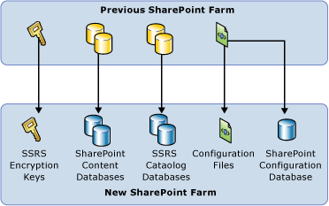

# Migrate a Reporting Services Installation (SharePoint Mode)

[!INCLUDE[ssrs-appliesto](../../includes/ssrs-appliesto.md)] [!INCLUDE[ssrs-appliesto-2016](../../includes/ssrs-appliesto-2016.md)] [!INCLUDE[ssrs-appliesto-not-pbirsi](../../includes/ssrs-appliesto-not-pbirs.md)] [!INCLUDE [ssrs-appliesto-not-2017](../../includes/ssrs-appliesto-not-2017.md)] (../../includes/ssrs-appliesto-not-pbirs.md)] [!INCLUDE[ssrs-appliesto-sharepoint-2013-2016i](../../includes/ssrs-appliesto-sharepoint-2013-2016.md)]

  This topic is an overview of the steps needed to migrate a [!INCLUDE[ssRSnoversion](../../includes/ssrsnoversion-md.md)] SharePoint mode deployment from one SharePoint environment to another. The specific steps can be different depending on the version you are migrating from. For more information on Upgrade and Migration scenarios for SharePoint mode, see [Upgrade and Migrate Reporting Services](../../reporting-services/install-windows/upgrade-and-migrate-reporting-services.md). If you only want to copy the report items from one server to another, see [Sample Reporting Services rs.exe Script to Copy Content between Report Servers](../../reporting-services/tools/sample-reporting-services-rs-exe-script-to-copy-content-between-report-servers.md).  
  
 For information on migrating a [!INCLUDE[ssRSnoversion](../../includes/ssrsnoversion-md.md)] native mode deployment, see [Migrate a Reporting Services Installation &#40;Native Mode&#41;](../../reporting-services/install-windows/migrate-a-reporting-services-installation-native-mode.md).  
  
 A common reason you complete a migration is when you want to upgrade your SharePoint 2010 deployment to SharePoint 2013/2016. SharePoint 2013/2016 does not support in-place upgrade from SharePoint 2010 and you must complete the procedure of **database-attach upgrade** or a content only migration.  
  
 For more information on upgrading SharePoint 2013/2016, see the following:  

-   [Overview of the upgrade process to SharePoint 2016](https://technet.microsoft.com/library/cc262483\(v=office.16\)).

-   [Overview of the upgrade process to SharePoint 2013](https://go.microsoft.com/fwlink/p/?LinkId=256688).
  
-   [Clean up preparations before an upgrade to SharePoint 2013](https://go.microsoft.com/fwlink/p/?LinkId=256689).  
  
-   [Upgrade databases from SharePoint 2013 to SharePoint 2016](https://technet.microsoft.com/library/cc303436\(v=office.16\)).

-   [Upgrade databases from SharePoint 2010 to SharePoint 2013](https://go.microsoft.com/fwlink/p/?LinkId=256690).
  
-   [Move content databases in SharePoint 2016](https://technet.microsoft.com/library/cc262792\(v=office.16\).aspx).

-   [Move content databases in SharePoint 2013](https://technet.microsoft.com/library/cc262792.aspx).
  
##   Migrate from Reporting Services SharePoint mode versions prior to SQL Server 2012  
 The [!INCLUDE[ssRSnoversion](../../includes/ssrsnoversion-md.md)] SharePoint mode architecture changed in [!INCLUDE[ssSQL11](../../includes/sssql11-md.md)], including the service application database schema. If you want to migrate to [!INCLUDE[ssRSCurrent](../../includes/ssrscurrent-md.md)] SharePoint mode from a version prior to [!INCLUDE[ssSQL11](../../includes/sssql11-md.md)], first create the new SharePoint environment by installing SharePoint and SQL Server 2016 Reporting Services SharePoint mode. For more information, see [Install Reporting Services SharePoint Mode](../../reporting-services/install-windows/install-reporting-services-sharepoint-mode.md).  
  
 Once the new SharePoint environment is running, you can choose between a content only migration or a full migration at the database level that includes content databases.  
  
###   Content Only Migration  
 **Reporting Services Content only migration:** If you want to copy the [!INCLUDE[ssRSnoversion](../../includes/ssrsnoversion-md.md)] content to a new farm, then you need to use tools such as **rs.exe** to copy the content to the new SharePoint installation. For more information on content only migrations, see the following:  
  
-   **[!INCLUDE[ssRSnoversion](../../includes/ssrsnoversion-md.md)] RSS scripts:** The Scripts can migrate content and resources between Native mode and SharePoint mode report servers. For more information, see [Sample Reporting Services rs.exe Script to Copy Content between Report Servers](../../reporting-services/tools/sample-reporting-services-rs-exe-script-to-copy-content-between-report-servers.md) and [Reporting Services RS.exe script that migrates content from one report server to another](https://azuresql.codeplex.com/releases/view/115207).  
  
-   **Reporting Services Migration Tool:** The tool can copy your report items from a native mode server to a SharePoint mode server. For more information, see [Reporting Services Migration Tool](https://www.microsoft.com/download/details.aspx?id=29560) (https://www.microsoft.com/download/details.aspx?id=29560).  
  
###   Full Migration  
 **Full Migration:** If you are migrating SharePoint content databases along with the [!INCLUDE[ssRSnoversion](../../includes/ssrsnoversion-md.md)] catalog databases to a new farm you can follow a series of backup and restore options summarized in this topic. In some cases you will need to use a different tool for the restore phase than you used for the backup phase. For example you can use [!INCLUDE[ssRSnoversion](../../includes/ssrsnoversion-md.md)] Configuration Manager to backup encryption keys from a previous version of [!INCLUDE[ssRSnoversion](../../includes/ssrsnoversion-md.md)] but you need to use SharePoint Central administration or PowerShell to restore the encryption keys to a SQL Server 2016 Reporting Services SharePoint mode installation.  
  
####   Databases you will see in the completed migration  
 The following table describes the SQL Server Databases related to [!INCLUDE[ssRSnoversion](../../includes/ssrsnoversion-md.md)] you will have after you successfully migrate your [!INCLUDE[ssRSnoversion](../../includes/ssrsnoversion-md.md)] SharePoint installation:  
  
|Database|Example name||  
|--------------|------------------|-|  
|Catalog database|ReportingService_[service application GUID] **(&#42;)**|User migrates.|  
|Temp database|ReportingService_[service application GUID]TempDB **(&#42;)**|User migrates.|  
|Alerting database|ReportingService_[service application GUID]_Alerting|Created when a [!INCLUDE[ssRSnoversion](../../includes/ssrsnoversion-md.md)] service application is created.|  
  
 **(&#42;)** The example names shown in the table follow the naming convention SSRS uses when you create a new SSRS service application. If you are migrating from a different server, your catalog and tempDBs will have the names from the original installation.  
  
####   Backup operations  
 This section describes the types of information you need to migrate and the tools or process you use to complete the backup.  
  
   
  
||Objects|Method|Notes|  
|-|-------------|------------|-----------|  
|**1**|[!INCLUDE[ssRSnoversion](../../includes/ssrsnoversion-md.md)] encryption keys.|**Rskeymgmt.exe** or [!INCLUDE[ssRSnoversion](../../includes/ssrsnoversion-md.md)] Configuration Manager. See [Back Up and Restore Reporting Services Encryption Keys](../../reporting-services/install-windows/ssrs-encryption-keys-back-up-and-restore-encryption-keys.md).|The noted tools can used for the backup but for the restore operation you will use the [!INCLUDE[ssRSnoversion](../../includes/ssrsnoversion-md.md)] service application management pages or PowerShell.|  
|**2**|SharePoint content databases.||Backup the database and detach it.   See the section "Database attach upgrade " in [Determine upgrade approach (SharePoint Server 2010) (https://technet.microsoft.com/library/cc263447.aspx)](https://technet.microsoft.com/library/cc263447.aspx).|  
|**3**|SQL Server database that is the [!INCLUDE[ssRSnoversion](../../includes/ssrsnoversion-md.md)]catalog database.|SQL Server database backup and restore   or   SQL Server database detach and attach.||  
|**4**|[!INCLUDE[ssRSnoversion](../../includes/ssrsnoversion-md.md)] configuration files.|Simple file copy.|You only need to copy rsreportserver.config if you have made customizations to the file. Example of the default location of the files: C:\Program Files\Common Files\Microsoft Shared\Web Server Extensions\15\WebServices\Reporting\\*:      Rsreportserver.config   Rssvrpolicy.config   Web.config for the Report Server ASP.NET application.   Machine.config for ASP.NET.|  
  
####   Restore Operations  
 This section describes the types of information you need to migrate and the tools or process you use to complete the restore. The tools you use for restoring may be different than the tools you used for the backup.  
  
 Before you complete the restore steps, you need to install and configuring the new SharePoint Farm and [!INCLUDE[ssRSnoversion](../../includes/ssrsnoversion-md.md)] SharePoint mode. For more information on a basic installation of [!INCLUDE[ssRSnoversion](../../includes/ssrsnoversion-md.md)] SharePoint mode, see [Install Reporting Services SharePoint Mode](../../reporting-services/install-windows/install-reporting-services-sharepoint-mode.md).  
  
||Objects|Method|Notes|  
|-|-------------|------------|-----------|  
|**1**|Restore SharePoint Content databases to the new farm.|SharePoint "Database attach upgrade" Method.|Basic Steps:   1) Restore the database on the new server.   2) Attach the content database to a web application by indicating the URL.   3) Get-SPWebapplication lists all web applications and the URLs.      See the section "Database attach upgrade " in [Determine upgrade approach (SharePoint Server 2010) (https://technet.microsoft.com/library/cc263447.aspx)](https://technet.microsoft.com/library/cc263447.aspx)and [Attach databases and upgrade to SharePoint Server 2010 (https://technet.microsoft.com/library/cc263299.aspx)](https://technet.microsoft.com/library/cc263299.aspx).|  
|**2**|Restore the SQL Server database that is the [!INCLUDE[ssRSnoversion](../../includes/ssrsnoversion-md.md)] catalog database (ReportServer).|SQL Database backup and restore.   **or**   SQL Server database attached and detach.|The first time the database is used, [!INCLUDE[ssRSnoversion](../../includes/ssrsnoversion-md.md)] will update the database schema as needed so it will work with the SQL Server 2016 environment.|  
|**3**|Create a new [!INCLUDE[ssRSnoversion](../../includes/ssrsnoversion-md.md)] service application.|Create a new [!INCLUDE[ssRSnoversion](../../includes/ssrsnoversion-md.md)] service application.|When you create the new service application, configure it to use the report server database you copied over.   For more information on using SharePoint Central Administration, see the "Step 3: Create a Reporting Services Service Application" section in [Install The First Report Server in SharePoint Mode](../../reporting-services/install-windows/install-the-first-report-server-in-sharepoint-mode.md).   For examples using PowerShell, see the section "To create a Reporting Services Service Application using PowerShell" in [Reporting Services SharePoint Service and Service Applications](../../reporting-services/report-server-sharepoint/reporting-services-sharepoint-service-and-service-applications.md).|  
|**4**|Restore [!INCLUDE[ssRSnoversion](../../includes/ssrsnoversion-md.md)] configuration files.|Simple file copy.|Example of the default location of the files: C:\Program Files\Common Files\Microsoft Shared\Web Server Extensions\15\WebServices\Reporting.|  
|||||  
|**5**|Restore the [!INCLUDE[ssRSnoversion](../../includes/ssrsnoversion-md.md)]encryption keys.|Restore the key back up file using the [!INCLUDE[ssRSnoversion](../../includes/ssrsnoversion-md.md)] Service Application "SystemSettings" page.   **or**   PowerShell.|See the section "Key Management" in the topic [Manage a Reporting Services SharePoint Service Application](../../reporting-services/report-server-sharepoint/manage-a-reporting-services-sharepoint-service-application.md).|   
  
##   Migrate from a SQL Server 2012 or SQL Server 2014 Deployment  
 In a multi-server farm, users will likely have the Content and Catalog databases on a different machine, in which case you really just need to add a new server with the [!INCLUDE[ssRSnoversion](../../includes/ssrsnoversion-md.md)] service installed, to the SharePoint farm and then remove the old server. There should be no need to copy databases.  
  
### Backup Operations  
  
1.  Backup the [!INCLUDE[ssRSnoversion](../../includes/ssrsnoversion-md.md)] encryption keys.  
  
2.  Backup the [!INCLUDE[ssRSnoversion](../../includes/ssrsnoversion-md.md)] Service application in SharePoint central Administration (or use PowerShell). This will also backup the service application databases in SharePoint. See topic  [Backup and Restore Reporting Services SharePoint Service Applications](../../reporting-services/report-server-sharepoint/backup-and-restore-reporting-services-sharepoint-service-applications.md)  
  
3.  If you have an Unattended Execution account (UEA) and windows authentication, make a note of the credentials so you can use them for the restore process.  
  
4.  For more information, see [Back up service applications in SharePoint 2013](https://technet.microsoft.com/library/ee428318.aspx).  
  
### Restore Operations  
  
1.  Restore the [!INCLUDE[ssRSnoversion](../../includes/ssrsnoversion-md.md)] service application using SharePoint Central Administration. You could also use PowerShell.  
  
2.  Restore [!INCLUDE[ssRSnoversion](../../includes/ssrsnoversion-md.md)] encryption keys.  
  
     See the section "Key Management" in the topic [Manage a Reporting Services SharePoint Service Application](../../reporting-services/report-server-sharepoint/manage-a-reporting-services-sharepoint-service-application.md)  
  
3.  Configure the UEA and windows credentials on the service application.  
  
4.  For more information, see [Restore service applications in SharePoint 2013](https://technet.microsoft.com/library/ee428305.aspx).  
  
##   Additional Resources  
  
-   [Get started with upgrades to SharePoint 2013 (https://technet.microsoft.com/library/ee833948.aspx)](https://technet.microsoft.com/library/ee833948.aspx).  
  
-   [Overview of the upgrade process to SharePoint 2013 (https://technet.microsoft.com/library/cc262483.aspx)](https://technet.microsoft.com/library/cc262483.aspx).  

## Next steps

[Upgrade and Migrate Reporting Services](../../reporting-services/install-windows/upgrade-and-migrate-reporting-services.md)   
[Migrate a Reporting Services Installation](../../reporting-services/install-windows/migrate-a-reporting-services-installation-native-mode.md)  

More questions? [Try asking the Reporting Services forum](https://go.microsoft.com/fwlink/?LinkId=620231)
