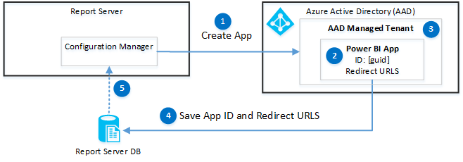
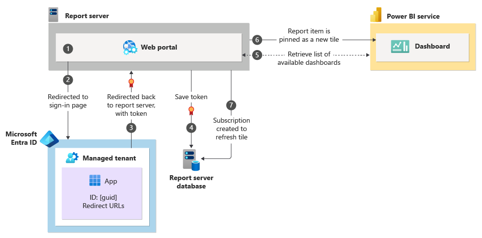
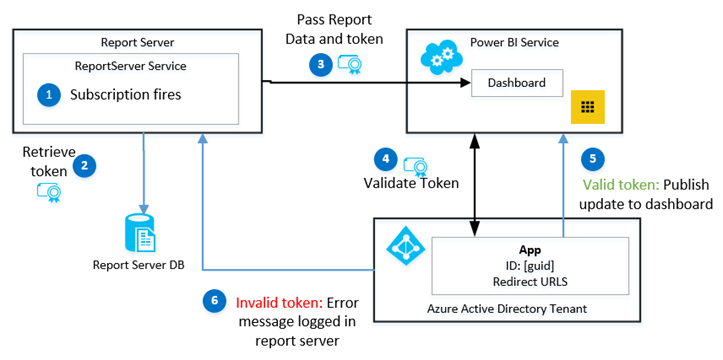

# Power BI Report Server Integration (Configuration Manager)

[!INCLUDE[ssrs-appliesto](../../includes/ssrs-appliesto.md)] [!INCLUDE[ssrs-appliesto-2016-and-later](../../includes/ssrs-appliesto-2016-and-later.md)] [!INCLUDE[ssrs-appliesto-pbirsi](../../includes/ssrs-appliesto-pbirs.md)]

The  **Power BI Integration** page  in [!INCLUDE[ssRSnoversion](../../includes/ssrsnoversion-md.md)] Configuration Manager is used to register the report server with the desired Azure Active Directory (AD) managed tenant to allow users of the report server to pin supported report items to [!INCLUDE[sspowerbi](../../includes/sspowerbi-md.md)] dashboards. For a list of the supported items you can pin, see [Pin Reporting Services items to Power BI Dashboards](../../reporting-services/pin-reporting-services-items-to-power-bi-dashboards.md).

##  Requirements for Power BI Integration

In addition to an active internet connection so you can browse to the [!INCLUDE[sspowerbi](../../includes/sspowerbi-md.md)] service, the following are requirements to complete [!INCLUDE[sspowerbi](../../includes/sspowerbi-md.md)]integration.

- **Azure Active Directory:** Your organization must use Azure Active Directory, which provides directory and identity management for Azure services and web applications. For more information, see [What is Azure Active Directory?](https://azure.microsoft.com/documentation/articles/active-directory-whatis/)

- **Managed Tenant:** The [!INCLUDE[sspowerbi](../../includes/sspowerbi-md.md)] dashboard you want to pin report items to must be part of an Azure AD managed tenant.  A managed tenant is created automatically the first time your organization subscribes to Azure services such as Office 365 and Microsoft Intune.   Viral tenants are currently not supported.  For more information, see  the sections "What is an Azure AD tenant" and "how to get an Azure AD Directory" in [What is an Azure AD directory?](https://msdn.microsoft.com/library/azure/jj573650.aspx#BKMK_WhatIsAnAzureADTenant)

- The user performing the [!INCLUDE[sspowerbi](../../includes/sspowerbi-md.md)] integration needs to be a member of the Azure AD tenant, a [!INCLUDE[ssRSnoversion](../../includes/ssrsnoversion-md.md)] system administrator and a system administrator for the ReportServer catalog database.

- The user performing the [!INCLUDE[sspowerbi](../../includes/sspowerbi-md.md)] integration needs to start the [!INCLUDE[ssRSnoversion](../../includes/ssrsnoversion-md.md)] Configuration Manager either with the account used to install [!INCLUDE[ssRSnoversion](../../includes/ssrsnoversion-md.md)], or the account the [!INCLUDE[ssRSnoversion](../../includes/ssrsnoversion-md.md)] service is running under

- Reports that you want to pin from must use stored credentials. This is not a requirement of the [!INCLUDE[sspowerbi](../../includes/sspowerbi-md.md)] integration itself but of the refresh process for the pinned items.  The action of pinning a report item creates a [!INCLUDE[ssRSnoversion](../../includes/ssrsnoversion-md.md)] subscription to manage the refresh schedule of the tiles in [!INCLUDE[sspowerbi](../../includes/sspowerbi-md.md)]. [!INCLUDE[ssRSnoversion](../../includes/ssrsnoversion-md.md)] subscriptions require stored credentials. If a report does not use stored credentials, a user can still pin report items but when the associated subscription attempts to refresh the data to [!INCLUDE[sspowerbi](../../includes/sspowerbi-md.md)], you will see an error message similar to the following on the **My Subscriptions** page.

    PowerBI Delivery error: dashboard: IT Spend Analysis Sample, visual: Chart2, error: The current action cannot be completed. The user data source credentials do not meet the requirements to run this report or shared dataset. Either the user data source credential.

For more information on how to store credentials, see the section "Configure stored credentials for a report-specific data source" in [Store Credentials in a Reporting Services Data Source](../../reporting-services/report-data/store-credentials-in-a-reporting-services-data-source.md).

An administrator can review the  [!INCLUDE[ssRSnoversion](../../includes/ssrsnoversion-md.md)] log files for more information.  They will see messages similar to the following. A great way to  review and monitor [!INCLUDE[ssRSnoversion](../../includes/ssrsnoversion-md.md)] logs files is to use [!INCLUDE[msCoName](../../includes/msconame-md.md)] Power Query over the files.  for more information and a short video, see [Report Server Service Trace Log](../../reporting-services/report-server/report-server-service-trace-log.md).

- subscription!WindowsService_1!1458!09/24/2015-00:09:27:: e ERROR: PowerBI Delivery error: dashboard: IT Spend Analysis Sample, visual: Chart2, error: The current action cannot be completed. The user data source credentials do not meet the requirements to run this report or shared dataset. Either the user data source credentials are not stored in the report server database, or the user data source is configured not to require credentials but the unattended execution account is not specified.

- notification!WindowsService_1!1458!09/24/2015-00:09:27:: e ERROR: Error occurred processing subscription fcdb8581-d763-4b3b-ba3e-8572360df4f9: PowerBI Delivery error: dashboard: IT Spend Analysis Sample, visual: Chart2, error: The current action cannot be completed. The user data source credentials do not meet the requirements to run this report or shared data set. Either the user data source credentials are not stored in the report server database, or the user data source is configured not to require credentials but the unattended execution account is not specified.

##  To Integrate and Register the Report Server

Complete the following steps from the [!INCLUDE[ssRSnoversion](../../includes/ssrsnoversion-md.md)] Configuration Manager. For more information, see [Reporting Services Configuration Manager](../../reporting-services/install-windows/reporting-services-configuration-manager-native-mode.md).

1. Select the [!INCLUDE[sspowerbi](../../includes/sspowerbi-md.md)] integration page.

2. Select **Register with Power BI**.

    >[!Note]
    > Make sure that port 443 is not blocked.

3. At the [!INCLUDE[msCoName](../../includes/msconame-md.md)] sign-in dialog, enter the credentials you use to sign into [!INCLUDE[sspowerbi](../../includes/sspowerbi-md.md)].

4. After the registration is complete, the **Power BI Registration Details** section will note the Azure Tenant ID and the Redirect URL(s).  The URLs are used as part of the sign-in and communication process for the [!INCLUDE[sspowerbi](../../includes/sspowerbi-md.md)] dashboard to communicate back to the registered report server.

5. Select the **Copy** button in the **Results** window to copy the registration details to the Windows clipboard so you can save them for future reference.

##  Unregister With Power BI

**Unregister:** Un-registering the report server from Azure Active Directory will result in the following:

- The **My Settings** link will no longer be visible from the web portal menu bar.

- Report items that have already been pinned will still be pinned to dashboards, however the tiles will no longer be updated on the dashboard.

- The [!INCLUDE[ssRSnoversion](../../includes/ssrsnoversion-md.md)] subscriptions that were updating the tiles will still  exist on the report server but when they run on their configured schedule, they will show an error message similar to the following.

    **The delivery extension for this subscription could not be loaded**

From the **Power BI** page of configuration manager, select  the **Unregister with Power BI** button.

##   Update Registration

Use the **Update Registration** if the configuration of your report server has changed. For example if you want to add or remove the URLS your users use to browse to the [!INCLUDE[ssRSWebPortal](../../includes/ssrswebportal.md)].

- In [!INCLUDE[ssRSnoversion](../../includes/ssrsnoversion-md.md)] Configuration Manager, select the **Web Portal URL**

     Select **Advanced**.

- Select **Add** to add a new HTTP identity for the [!INCLUDE[ssRSWebPortal](../../includes/ssrswebportal.md)] and then select **OK**.

     The [!INCLUDE[sspowerbi](../../includes/sspowerbi-md.md)] icon will change to indicate the server configuration has changed.  

- On the **Power BI Integration** page, select **Update Registration**.

     You will be prompted to login to Azure AD. The page will refresh and you will see the new URL listed in the **Redirect URLs**.

##   Summary of the Power BI Integration and Pin Process

This sections summarizes the basic steps and technologies involved when you integrate your report server with [!INCLUDE[sspowerbi](../../includes/sspowerbi-md.md)] and pin a report item to a dashboard.

 **Integrate:**

1. In Configuration manager, when you select the **Register with Power BI** button, you  will be prompted to sign in to Azure Active Directory.

2. The [!INCLUDE[sspowerbi](../../includes/sspowerbi-md.md)] Client App is registered with your managed Tenant.

3. Your managed tenant within Azure Active Directory is where the Power BI Client app is created.

4. The registration includes a redirect URL(s) that are used when users sign in from the report server.  The App ID and URLS are saved to the ReportServer database. The redirect URL is used during authentication calls to Azure so that the call can return to the report server. For example, when users sign in or pin items to a dashboard.

5. The App ID and URLS are displayed in Configuration Manager.

 

 **When a user pins a report item to a dashboard:**

1. Users preview reports in the [!INCLUDE[ssRSnoversion](../../includes/ssrsnoversion-md.md)] [!INCLUDE[ssRSWebPortal](../../includes/ssrswebportal.md)] and the first time they click to pin a report item from the [!INCLUDE[ssRSWebPortal](../../includes/ssrswebportal.md)].

2. They will be redirected to the Azure AD sign-in page. They can also sign in from the [!INCLUDE[ssRSWebPortal](../../includes/ssrswebportal.md)] **My Settings** page. When users sign in to the Azure managed tenant, a relationship is established between their Azure account and the [!INCLUDE[ssRSnoversion](../../includes/ssrsnoversion-md.md)] permissions.  For more information, see [My Settings for Power BI Integration &#40;web portal&#41;](https://msdn.microsoft.com/85c2fac7-80bf-45b7-8654-764b5f5231f5).

3. A user security token is returned to the report server.

4. The user security token is saved to the ReportServer database.

5. A list of groups, and dashboards, the user has access to are retrieved from the [!INCLUDE[sspowerbi](../../includes/sspowerbi-md.md)] service.  The user selects the destination group, and dashboard, and the configure how often they want the data refreshed on the [!INCLUDE[sspowerbi](../../includes/sspowerbi-md.md)] tile.

6. The report item is pinned to the dashboard.

7. A [!INCLUDE[ssRSnoversion](../../includes/ssrsnoversion-md.md)] subscription is created to manage the scheduled refresh of the report item to the dashboard tile. The subscription uses the security token that was created when the user signed in.

     The token is good for **90 days**, after which users need to sign in again to create a new user token. When the token is expired,  the pinned tiles will still be displayed on the dashboard but the data will no longer be refreshed.  The [!INCLUDE[ssRSnoversion](../../includes/ssrsnoversion-md.md)] subscriptions used for the pinned items will error until a new user token is created. See [My Settings for Power BI Integration &#40;web portal&#41;](https://msdn.microsoft.com/85c2fac7-80bf-45b7-8654-764b5f5231f5). for more information.

The second time a user pins an item, the steps 1-4 are skipped and instead the App id and URLS are retrieved from the ReportServer database and the flow continues with step 5.

 **When a subscription fires to refresh a dashboard tile:**

1. When the [!INCLUDE[ssRSnoversion](../../includes/ssrsnoversion-md.md)] subscription fires, the report is rendered.

2. The user token is retrieved from the ReportServer database.

3. The report item state and data is sent with the token to the [!INCLUDE[sspowerbi](../../includes/sspowerbi-md.md)]service.

4. The token is sent to Azure AD for validation. If the token is valid, the report item data is sent to the dashboard tile and the date property of the tile is updated.

5. If the token is not valid, and error is returned and logged with the report server.  No status or other information is sent to the dashboard.

   <iframe width="560" height="315" src="https://www.youtube.com/embed/QhPQObqmMPc" frameborder="0" allowfullscreen></iframe>

## Considerations and limitations

* Viral and government tenants are not supported.

## Next steps

[My Settings for Power BI Integration](https://msdn.microsoft.com/85c2fac7-80bf-45b7-8654-764b5f5231f5)  
[Pin Reporting Services items to Power BI Dashboards](../../reporting-services/pin-reporting-services-items-to-power-bi-dashboards.md)
[Dashboards in Power BI](https://powerbi.microsoft.com/documentation/powerbi-service-dashboards/)  

More questions? [Try asking the Reporting Services forum](https://go.microsoft.com/fwlink/?LinkId=620231)
