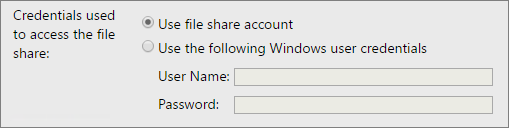

# Subscription Settings and a File Share Account (Configuration Manager)
  Use the **Subscription Settings** page of the [!INCLUDE[ssRSnoversion](../../includes/ssrsnoversion-md.md)] Configuration Manager to configure a file share account for Native mode report servers and file share subscriptions. The file share account allows you to use a single set of credentials in multiple subscriptions that deliver reports to a file share. When it is time to change the credentials, you configure the change for the file share account and you do not need to update each individual subscription.  
  
 Two workflows exist with [!INCLUDE[ssRSnoversion](../../includes/ssrsnoversion-md.md)] file share subscriptions:  
  
-   New in the [!INCLUDE[ssSQL15](../../includes/sssql15-md.md)] release, your [!INCLUDE[ssRSnoversion](../../includes/ssrsnoversion-md.md)] administrator can configure a single file share account, that is used for one to many subscriptions. Configure the **Specify a file share account**, and then on individual subscription configuration pages, users select **Use file share account**.  
  
-   Configure individual subscriptions with specific credentials for the destination file share.  
  
-   You can also mix the two approaches and have some file share subscriptions use the central file share account while other subscriptions use specific credentials.  
  
 [!INCLUDE[applies](../../includes/applies-md.md)] [!INCLUDE[ssRSnoversion](../../includes/ssrsnoversion-md.md)] Native mode.  
  
## Specify a file share account  
 If this option is selected you will be able to provide an account to be used to access file shares from the report server. If you configure the file share account, all users can select the account for any subscriptions that are configured to deliver reports to a file share. If this option is not selected, the file share account is **not** available on any subscriptions.  
  
 Note, you need to verify the account you configure as the file share account has read and write permissions to any file shares users will use for file share delivery.  
  
 The following image is what users see on subscriptions that are configured for file share delivery. The **Use file share account** is disabled if a file share account has not been configured.  
  
   
  
## Prevent privilege escalation or elevated privileges  
  
> [!IMPORTANT]
> The [!INCLUDE[ssRSnoversion](../../includes/ssrsnoversion-md.md)] service account controls subscription delivery and interacts with the account used for file share subscriptions. Windows security features restrict combinations of 1) the [!INCLUDE[ssRSnoversion](../../includes/ssrsnoversion-md.md)] service account and 2) the account used for file share accounts. For example, if a built-in operating system account is used for the file share account, then the [!INCLUDE[ssRSnoversion](../../includes/ssrsnoversion-md.md)] service account must be another service account with impersonation permissions. If an explicit file share account and password is configured, then the file share account requires the right to logon on to the computer running the [!INCLUDE[ssRSnoversion](../../includes/ssrsnoversion-md.md)] service. If the file share account does not have the required permissions, subscriptions using the file share account will fail with an error message similar to the following:  
>   
>  `"Failure writing file {file} : An impersonation error occurred using the security context of the current user."`  
  
## PowerShell sample to audit use of the file share account  
 Run the following Windows PowerShell script to list all [!INCLUDE[ssRSnoversion](../../includes/ssrsnoversion-md.md)] subscriptions that are configured to use the **File share account**. Update `SERVERNAME` to an appropriate value for your report server.  
  
```  
# get all file share subscriptions using the default file share account  
$extensionNameMatch = "Report Server FileShare"  
$extensionSettingMatch = "DEFAULTCREDENTIALS"  
$valueMatch = "True"  
  
# filter for subscriptions that have a given extension setting  
filter script:extensionSettingFilter  
{  
    # subscription must match the extension name  
    if($_.DeliverySettings.Extension -eq $extensionNameMatch)  
    {  
        # locate the extension parameter of interest  
        ForEach($extensionParameter in $_.DeliverySettings.ParameterValues)  
        {  
            # if the setting has the desired value, return the subscription  
            if($extensionParameter.Name -eq $extensionSettingMatch -and $extensionParameter.Value -eq $valueMatch)  
            {  
                $_  
                break  
            }  
        }  
    }  
}  
  
$rs2010 = New-WebServiceProxy -Uri "https:// SERVERNAME/ReportServer/ReportService2010.asmx" -Namespace SSRS.ReportingService2010 -UseDefaultCredential;  
$subscriptions = $rs2010.ListSubscriptions("/");  
  
Write-Host "----- File share subscriptions using the default file share account ----";  
Write-Host "-------------------------------------------------------------------------- ";  
$subscriptions | extensionSettingFilter | select report, owner, status, lastexecuted, description, subscriptionid | format-table -auto  
  
```  
  
 The output of the script looks similar to the following:  
  
 `----- File share subscriptions using the default file share account ----`  
  
 `-----------------------------------------------------------------------------------------------------`  
  
 `Report                    Owner          Status   LastExecuted         SubscriptionID`  
  
 `------------------------  -------------- -------- -------------------- ------------------------------------`  
  
 `Aworks_sales_by_territory DOMAIN\UserName Disabled 10/5/2014 1:04:04 PM e843bc2b-023e-45a3-ba23-22f9dc9a0934`  
  
## See Also  
 [File Share Delivery in Reporting Services](../../reporting-services/subscriptions/file-share-delivery-in-reporting-services.md)   
 [Create and Manage Subscriptions for Native Mode Report Servers](../../reporting-services/subscriptions/create-and-manage-subscriptions-for-native-mode-report-servers.md)
  
  
