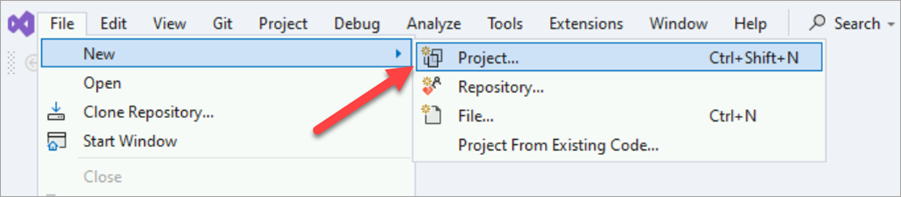
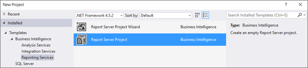
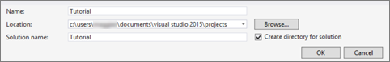
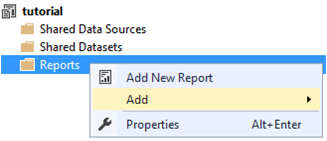
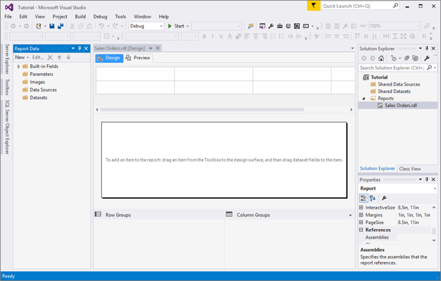

# Lesson 1: Creating a Report Server Project (Reporting Services)

In this lesson, you'll create a *report server project* and a *report definition (.rdl)* file in [!INCLUDE[ssBIDevStudio_md](../includes/ssbidevstudio-md.md)] within Visual Studio. 

To create a report with [!INCLUDE[ssBIDevStudioFull](../includes/ssbidevstudiofull-md.md)], first you need a report server project where you can save your report definition (.rdl) file and other resource files you need for your report. 

In the following lessons, you define a data source for your report, define a dataset, and define the report layout. When you run the report, the data is retrieved and combined with the layout, and then rendered on your screen. From there you can export it, print it, or save it.  
  
  
  
## To create a report server project  
  
1.  Open [!INCLUDE[ssBIDevStudio_md](../includes/ssbidevstudio-md.md)].  
  
2.  On the **File** menu > **New** > **Project**.  

    
  
3.  Under **Installed** > **Templates** > **Business Intelligence**, click **Reporting Services**.

    

5. Click **Report Server Project** . 

   >**Note**: If you don't see the **Business Intelligence** or **Report Server Project** options, you need to update SSDT with the Business Intelligence templates. See [Download SQL Server Data Tools (SSDT)](../ssdt/download-sql-server-data-tools-ssdt.md)  
  
5.  In **Name**, type **Tutorial**.  

    By default, it's created in your Visual Studio 2015\Projects folder in a new directory.
    
    
  
6.  Click **OK** to create the project.  
  
    The Tutorial project is displayed in the Solution Explorer pane on the right.  
  
## To create a new report definition file  
  
1.  In the **Solution Explorer** pane, right-click the **Reports** > **Add** > **New Item**. 

    >**Tip**: If you don't see the **Solution Explorer** pane, on the **View** menu, click **Solution Explorer**. 

    
  
2.  In the **Add New Item** window, click **Report** .  
  
3.  In **Name**, type **Sales Orders.rdl** and then click **Add**.  
  
    Report Designer opens and displays the new .rdl file in Design view.  
    
    
  
     Report Designer is a [!INCLUDE[ssRSnoversion](../includes/ssrsnoversion-md.md)] component that runs in [!INCLUDE[ssBIDevStudioFull](../includes/ssbidevstudiofull-md.md)]. It has two views: **Design** and **Preview**. Click each tab to change views.  
  
    You define your data in the **Report Data** pane. You define your report layout in **Design** view. You can run the report and see what it looks like in **Preview** view.  
  
## Next lesson  
You have successfully created a report project called "Tutorial" and added a report definition (.rdl) file to the report project. Next, you will specify a data source to use for the report. See [Lesson 2: Specifying Connection Information &#40;Reporting Services&#41;](../reporting-services/lesson-2-specifying-connection-information-reporting-services.md).  
  
## See Also  
[Create a Basic Table Report &#40;SSRS Tutorial&#41;](../reporting-services/create-a-basic-table-report-ssrs-tutorial.md)  
  

