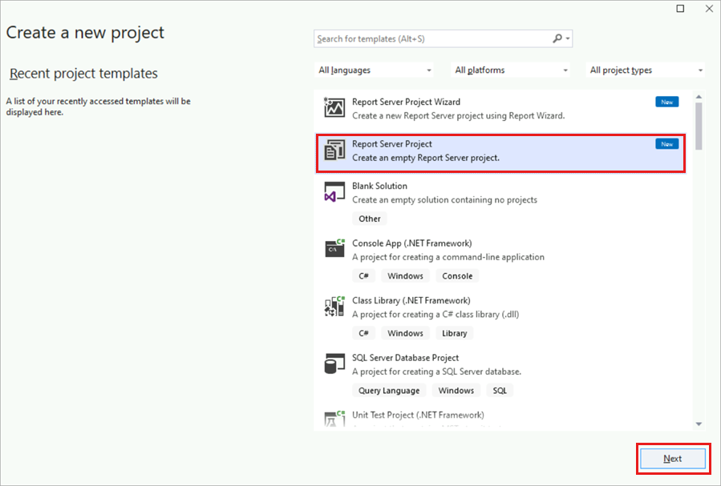
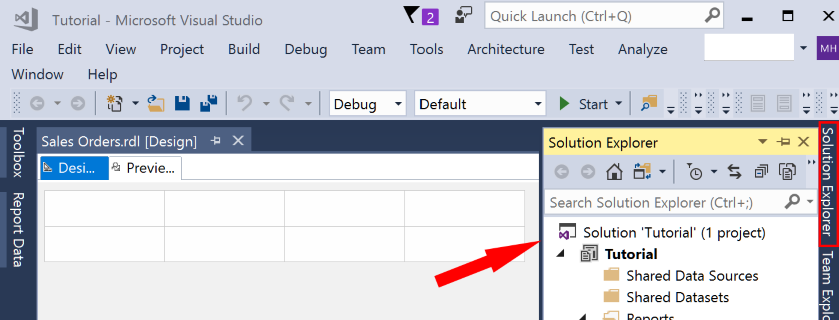

# Lesson 1: Creating a Report Server Project (Reporting Services)

In this lesson, you'll create a *report server project* and a *report definition (.rdl)* file using the **Report Designer** tool within Visual Studio / SQL Server Data Tools (SSDT).  

> [!NOTE]
> [!INCLUDE[ssBIDevStudioFull](../includes/ssbidevstudiofull-md.md)] is a [!INCLUDE[msCoName](../includes/msconame-md.md)] [!INCLUDE[vsprvs](../includes/vsprvs-md.md)] environment for creating business intelligence solutions. SSDT features the Report Designer authoring environment, where you can open, modify, preview, save, and deploy [!INCLUDE[ssrsnoversion_md](../includes/ssrsnoversion-md.md)] paginated report definitions, shared data sources, shared datasets, and report parts.

When using the Report Designer to create a report, create a report server project first to contain the report files and other resource files used by the reports.

## To create a report server project  
  
1. Open Visual Studio / SSDT.  
  
2. From the **File** menu, select **New** > **Project**.  

    
  
3. In the left most column under **Installed**, find and select **Reporting Services**. In some cases it may be under the group *Business Intelligence*.

    

    > [!TIP]  
    > If you don't see **Reporting Services** in the left column or **Report Services** objects in the center column, you need to add the Report Designer to Visual Studio / SSDT by **Reporting Services** extensions. See [Download SQL Server Data Tools (SSDT)](../ssdt/download-sql-server-data-tools-ssdt.md) if you are using SSDT, or install the SSDT workload from by selecting **Tools** > **Get Tools and Features...** from Visual Studio menu, and then the **Reporting Services** extensions by selecting **Tools** > **Extensions and Updates** and select **Online** from the left column of the **Extensions and Updates** dialog box and select **Microsoft Reporting Services Projects** then select **Download** to install it from the Market Place.

4. Select the **Report Server Project** icon displayed here &nbsp;&nbsp; &nbsp;&nbsp;in the center column below the **Report Server Project Wizard** of the *New Project* dialog box.

5. In the **Name:** text box, type **Tutorial** for the project name. By default, the **Location:** text box will display the path to your "Documents\Visual Studio 20xx\Projects\" folder. A folder named *Tutorial* will automatically be created below this path, which is where the **Tutorial** project will be created. If this project does not yet belong to a solution, then a *Solution file* (.sln) also named *Tutorial* will be automatically be created as well.

6. Select **OK** to create the project. The Tutorial project is displayed in the Solution Explorer pane on the right.
  
## To create a new report definition file (RDL)  
  
In the **Solution Explorer** pane, right-click on the **Reports** folder then:

1. Select **Add** > **New Item**.

     

    > [!TIP]  
    > If you don't see the **Solution Explorer** pane, on the **View** menu, select the **Solution Explorer** tab on the far right (outlined with a red rectangle) in the dialog as displayed below.

    

2. In the **Add New Item** window, select the **Report** icon.  

3. Type **Sales Orders.rdl** into the **Name:** text box below.

4. Select the **Add** button on the lower right of the *Add New Item" dialog box to complete the process.
  
 **Report Designer** opens and displays the *Sales Orders* report file in Design view.  

 
  
> [!NOTE]  
> Report Designer is a [!INCLUDE[ssrsnoversion](../includes/ssrsnoversion-md.md)] component that runs in Visual Studio / [!INCLUDE[ssBIDevStudioFull](../includes/ssbidevstudiofull-md.md)].
>
The Report Designer has:
>
- a **Report data** pane to define and select data fields.
- a **Design** view to define your report layout.
- a **Preview** view to display the current output of the report as you design it.  
  
## Next lesson

In this lesson, you created the "Tutorial" report project and the "Sales Orders" report. In the remaining lessons, you'll learn how to:

- Configure a data source for the report.
- Create a dataset from the data source.
- Design and format the report layout.

> [!NOTE]
> When running a report, the data is retrieved as defined in the data set from the data source and formatted by the report layout. The report output is then displayed on your screen, where you may view it, print it, export it to another data format, or save it to a file.

 See [Lesson 2: Specifying Connection Information &#40;Reporting Services&#41;](../reporting-services/lesson-2-specifying-connection-information-reporting-services.md).
