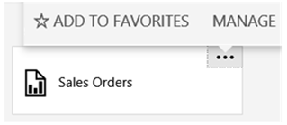
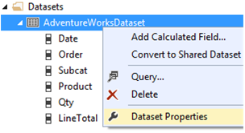
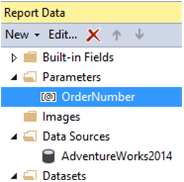
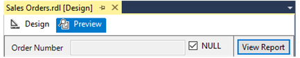

# Lesson 2: Modifying the Report Data Source Properties
In this [!INCLUDE[ssRSnoversion_md](../includes/ssrsnoversion-md.md)] tutorial lesson, you use web portal to select a report that will be delivered to recipients. The data-driven subscription that you will define will distribute the **Sales Order** report created in the tutorial [Create a Basic Table Report &#40;SSRS Tutorial&#41;](../reporting-services/create-a-basic-table-report-ssrs-tutorial.md).  In the steps that follow, you will modify the data source connection information used by the report to get data. Only reports that use **stored credentials** to access a report data source can be distributed through a data-driven subscription. Stored credentials are necessary for unattended report processing.  
  
You will also modify the dataset and report to use a parameter to filter the report on the `[Order]` so the subscription can output different instances of the report for specific orders and rendering formats.  
  
## <a name="bkmk_modify_datasource"></a>To Modify the Data Source to use stored credentials  
  
1.  Browse to the [!INCLUDE[ssRSnoversion_md](../includes/ssrsnoversion-md.md)] web portal with administrator privileges, for example, right-click the icon for Internet Explorer and click **Run as administrator**.  
 
2.    Browse to the web portal URL.  For example:   
    `https://<server name>/reports`.  
    `https://localhost/reports`
 **Note:** The web *portal* URL is "Reports", not the Report *Server* URL of "Reportserver".  
3.  Browse to the folder containing the **Sales Orders** report and in the context menu of the report, click **Manage**.  
 
 
  
3.  Click **Data Sources** in the left pane.  
  
4.  Verify the **Connection Type** is **Microsoft SQL Server**.  
  
5.  Verify the connection string is the following and it assumes that the sample database is on a local database server:  
  
    ```  
    Data source=localhost; initial catalog=AdventureWorks2014  
    ```  
  
6.  Click **Use the following credentials**.  
  
7. In the **Type of credentials**, select **Windows user name and password**
8. Type your user name (use the format *domain\user*) and password. If you do not have permission to access the AdventureWorks2014 database, specify a login that does.  
    
9. Click **Test Connection** to verify you can connect to the data source.  
  
10. Click **Save**.
11. Click **Cancel**  
  
11. View the report to verify that the report runs with the credentials you specified. .  
  
## <a name="bkmk_modify_dataset"></a>To Modify the AdventureWorksDataset  
 In the following steps you will modify the dataset to use a parameter to filter the data set based an order number.
1.  Open the **Sales Orders** report in [!INCLUDE[ssBIDevStudio](../includes/ssbidevstudio-md.md)]  
  
2.  Right-click the dataset `AdventureWorksDataset` and click **Dataset Properties**.  
      
3.  Add the statement `WHERE (UPPER(SalesOrderNumber) =UPPER(@OrderNumber) or  @OrderNumber IS NULL)` before the `Group By` statement. The full query syntax is the following:  
  
    ```  
    SELECT soh.OrderDate AS Date, soh.SalesOrderNumber AS [Order], pps.Name AS Subcat, pp.Name AS Product, SUM(sd.OrderQty) AS Qty, SUM(sd.LineTotal)  AS LineTotal  
    FROM Sales.SalesPerson AS sp INNER JOIN  
      Sales.SalesOrderHeader AS soh ON sp.BusinessEntityID = soh.SalesPersonID INNER JOIN  
       Sales.SalesOrderDetail AS sd ON sd.SalesOrderID = soh.SalesOrderID INNER JOIN  
       Production.Product AS pp ON sd.ProductID = pp.ProductID  
    INNER JOIN  
       Production.ProductSubcategory AS pps ON pp.ProductSubcategoryID = pps.ProductSubcategoryID   
    INNER JOIN  
        Production.ProductCategory AS ppc ON ppc.ProductCategoryID = pps.ProductCategoryID  
  
    WHERE (UPPER(SalesOrderNumber) =UPPER(@OrderNumber) or  @OrderNumber IS NULL)  
  
    GROUP BY ppc.Name, soh.OrderDate, soh.SalesOrderNumber, pps.Name, pp.Name, soh.SalesPersonID  
    HAVING (ppc.Name = 'Clothing')  
    ```  
  
4.  Click **OK**  
 In the following steps you will add a parameter to the report.  The report parameter feeds the dataset parameter. 
## <a name="bkmk_add_reportparameter"></a>To Add a Report Parameter and Republish the Report  
  
1.  In the **Report Data** pane expand the parameters folder and double-click the **Ordernumber** parameter.  It was created automatically as part of the previous steps when you added the parameter to the dataset. click **New** and then click **Parameter...**  
  
2.  Verify the **Name** is `OrderNumber`.  
  
3.  Verify the **Prompt** is `OrderNumber`.  
  
4.  Select **Allow blank value ("")**.  
  
5.  Select **Allow null value**.  
  
6.  Click **OK**.  
  
7.  Click the **Preview** tab to run the report. Note the parameter input box at the top of the report. You can either:  
  
    -   Click View Report to see the full report without using a parameter.  
  
    -   Unselect the **Null** option and type an order number, for example *so71949*, then click **View Report** to view only the one order in the report.  
     
 
  
## <a name="bkmk_redeploy"></a>Re-deploy the Report  
  
1.  Re-deploy the report so the subscription configuration in the next lesson can utilize the changes you made in this lesson. For more information on the project properties used in the table tutorial, see section 'To Publish the Report to the Report Server (Optional)' of [Lesson 6: Adding Grouping and Totals &#40;Reporting Services&#41;](../reporting-services/lesson-6-adding-grouping-and-totals-reporting-services.md).  
  
2.  On the toolbar click **Build** and then click **Deploy tutorial**.  
  
## Next Steps  
+ You successfully configured the report to get data using stored credentials and the data can be filtered with a parameter. 
+ In the next lesson, you configure the subscription using the web portal Data-Driven Subscription pages. See [Lesson 3: Defining a Data-Driven Subscription](../reporting-services/lesson-3-defining-a-data-driven-subscription.md).  
  
## See Also  
[Manage Report Data Sources](../reporting-services/report-data/manage-report-data-sources.md)  
[Specify Credential and Connection Information for Report Data Sources](../reporting-services/report-data/specify-credential-and-connection-information-for-report-data-sources.md)  
[Create a Data-Driven Subscription &#40;SSRS Tutorial&#41;](../reporting-services/create-a-data-driven-subscription-ssrs-tutorial.md)  
[Create a Basic Table Report &#40;SSRS Tutorial&#41;](../reporting-services/create-a-basic-table-report-ssrs-tutorial.md)  
  
  
  

