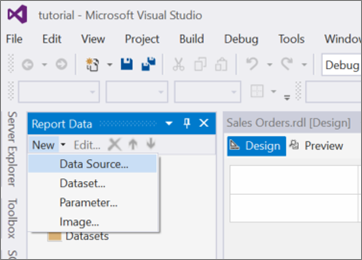
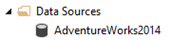

# Lesson 2: Specifying Connection Information (Reporting Services)
After you add a [!INCLUDE[ssRSnoversion_md](../includes/ssrsnoversion-md.md)] paginated report to your Tutorial project in Lesson 1, now you need to define a *data source*, which is the connection information the report uses to access data from either a relational database, multidimensional database, or another source.  
  
In this lesson, you use the [!INCLUDE[ssSampleDBAdventureworks2014_md](../includes/sssampledbadventureworks2014-md.md)]  sample database as your data source. This tutorial assumes that this database is located in a default instance of [!INCLUDE[ssNoVersion](../includes/ssnoversion-md.md)] [!INCLUDE[ssDE](../includes/ssde-md.md)] installed on your local computer.  
  
### To set up a connection  
  
1.  In the **Report Data** pane, click **New** and then click **Data Source**.  
If the **Report Data** pane is not visible, from the **View** menu, click **Report Data**.  

    
  
   2.  In **Name**, type *AdventureWorks2014*.  
  
3.  Make sure **Embedded connection** is selected.  
  
4.  In **Type**, select **Microsoft SQL Server**.  
  
5.  In **Connection string**, type the following:  
  
    ```  
    Data source=localhost; initial catalog=AdventureWorks2014  
    ```  
  
     This connection string assumes that [!INCLUDE[ssBIDevStudioFull](../includes/ssbidevstudiofull-md.md)], the report server, and the [!INCLUDE[ssSampleDBAdventureworks2014_md](../includes/sssampledbadventureworks2014-md.md)] database are all installed on the local computer and that you have permission to log on to the [!INCLUDE[ssSampleDBAdventureworks2014_md](../includes/sssampledbadventureworks2014-md.md)] database. If your AdventureWorks2014 database is not on the local computer, change the connection string and replace *localhost* with the name of your database server instance.
  
     >[!NOTE]  
    >If you are using [!INCLUDE[ssExpress](../includes/ssexpress-md.md)] with Advanced Services or a named instance, the connection string must include instance information:  
    >  
    >`Data source=localhost\SQLEXPRESS; initial catalog=AdventureWorks2014`  
    >  
    >For more information about connection strings, see: [Data Connections, Data Sources, and Connection Strings in Reporting Services](../reporting-services/report-data/data-connections-data-sources-and-connection-strings-report-builder-and-ssrs.md).  
     
  
6.  Click **Credentials** in the left pane and click **Use Windows Authentication (integrated security)**.  
  
7.  [!INCLUDE[clickOK](../includes/clickok-md.md)] The data source **AdventureWorks2014** is added to the **Report Data** pane.  
  
## Next Task  
You have successfully defined a connection to the [!INCLUDE[ssSampleDBAdventureworks2014_md](../includes/sssampledbadventureworks2014-md.md)] sample database. Next, you will create the report. See [Lesson 3: Defining a Dataset for the Table Report &#40;Reporting Services&#41;](../reporting-services/lesson-3-defining-a-dataset-for-the-table-report-reporting-services.md).  
  
## See Also  
[Data Connections, Data Sources, and Connection Strings in Reporting Services](../reporting-services/report-data/data-connections-data-sources-and-connection-strings-report-builder-and-ssrs.md)  
  
  
  

