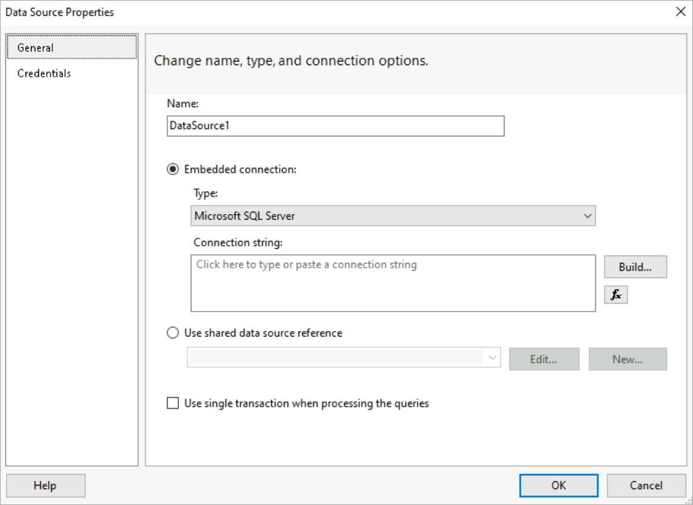
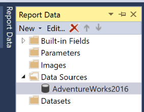

# Lesson 2: Specifying Connection Information (Reporting Services)

In lesson 1, you added a [!INCLUDE[ssrsnoversion-md](../includes/ssrsnoversion-md.md)] paginated report to your Tutorial project.
  
In this lesson, you're going to define a *data source*, connection information the report uses to access data from a relational database or other sources.

For this report, you're going to add the AdventureWorks2016 sample database as your data source. This tutorial assumes that the database is located in the default instance of [!INCLUDE[ssNoVersion](../includes/ssnoversion-md.md)] [!INCLUDE[ssDE](../includes/ssde-md.md)] and installed on your local computer.  

## To set up a connection  

1. In the **Report Data** pane, select **New** > **Data Source**. If the **Report Data** pane isn't visible, then select **View** menu > **Report Data**.

    

    The **Data Source Properties** dialog box opens with the **General** section displayed.

    

2. In the **Name** text box, type "AdventureWorks2016".

3. Select the **Embedded connection** radio button.

4. In the **Type** dropdown selection box, select "Microsoft SQL Server".
  
5. In the **Connection string** text box, type the following string:

    `Data source=localhost; initial catalog=AdventureWorks2016`

    > [!NOTE]
    > This connection string assumes that [!INCLUDE[ssBIDevStudioFull](../includes/ssbidevstudiofull-md.md)], the report server, and the AdventureWorks2016 database are all installed on the local computer.
    >
    >Change the connection string and replace "localhost" with the name of your database server/instance if the assumption isn't true. If you're using [!INCLUDE[ssExpress](../includes/ssexpress-md.md)] or a SQL Server named instance, you need to modify your connection string to include instance information. For example:
    >
    > `Data source=localhost\SQLEXPRESS; initial catalog=AdventureWorks2016`
    >
    > For more information about connection strings, you can refer to the `See also` section below.

6. Select the **Credentials** tab, and under the section **Change the credentials used to connect to the data source**, select the **Use Windows Authentication (integrated security)** radio button.

7. Select **OK** to complete the process.

Report Designer adds the data source AdventureWorks2016 to the **Report Data** pane.

## Next steps

In this lesson, you've successfully defined a connection to the AdventureWorks2016 sample database. Continue with [Lesson 3: Defining a Dataset for the Table Report &#40;Reporting Services&#41;](lesson-3-defining-a-dataset-for-the-table-report-reporting-services.md) to define a dataset for the report.

## See also

[Create data connection strings - Report Builder & SSRS](report-data/data-connections-data-sources-and-connection-strings-report-builder-and-ssrs.md)
