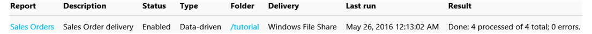

# Lesson 3: Defining a Data-Driven Subscription
In this [!INCLUDE[ssRSnoversion_md](../includes/ssrsnoversion-md.md)] tutorial lesson, you use the [!INCLUDE[ssRSnoversion](../includes/ssrsnoversion-md.md)] web portals data-driven subscription pages to connect to a subscription data source, build a query that retrieves subscription data, and map the result set to report and delivery options.  
  
> [!NOTE]  
> Before you start, verify that **[!INCLUDE[ssNoVersion](../includes/ssnoversion-md.md)] Agent** service is running. If it is not running, you cannot save the subscription.  One method for verification is to open the [SQL Server Configuration Manger](../relational-databases/sql-server-configuration-manager.md).
This lesson assumes you completed Lesson 1 and Lesson 2 and that the report data source uses stored credentials.  For more information, see [Lesson 2: Modifying the Report Data Source Properties](../reporting-services/lesson-2-modifying-the-report-data-source-properties.md)  
  
## <a name="bkmk_startwizard"></a>Start the Data-Driven Subscription Wizard  
  
1.  In [!INCLUDE[ssRSnoversion_md](../includes/ssrsnoversion-md.md)] web portal, click **Home**, and navigate to the folder containing the **Sales Orders** report.  
  
2.  In the context menu  of the report, click **Manage**, and then click **Subscriptions** in the left pane.  
  
3.  Click **+ New Subscription**. If you do not see this button, you do not have Content Manager permissions. 
  
## Define a description  
1.  Type **Sales Order delivery** in description.

## Type
1.  click **Data-driven subscription**..  

## Schedule
1. In the schedule section click **Report-specific schedule**.
2. Click **Edit schedule**.
3.  In **Schedule Details**, click **Once**.  
4.  Specify a start time that is a few minutes ahead of the current time.  
5.  Click **Apply**.

## Destination  
1.  In the Destination section, Select **Windows File Share** for the method of delivery.  

## Dataset
1. click **Edit Dataset**.
2. Select **A custom data source**.
3. Select **Microsoft SQL Server** as the data source **Connection** type.
4. In Connection string, type the following connection string. *Subscribers* is the database you created in lesson 1. 
  
    ```  
    data source=localhost; initial catalog=Subscribers
    ```
    
## Credentials
1. Select **Using the following credentials**.
2. Select **Windows user name and password**.
3.  In **User Name** and **Password**, type your domain user name and password. Include both the domain and user account when specifying **User Name**.

> [!NOTE]  
> Credentials used to connect to a subscriber data source are not passed back to [!INCLUDE[ssManStudio](../includes/ssmanstudio-md.md)]. If you modify the subscription later, you must retype the password used to connect to the data source.

## Query      
1.  In the query box, type the following query:  
  
    ```sql
    Select * from OrderInfo  
    ```  
  
2.  Specify a time-out of 30 seconds.  
  
3.  Click **Validate query**, and then click **Apply**.

## Delivery Options
Fill in the following values:

Parameter  |Source of value  | Value/field  
---------|---------|---------
**File name**     |Get value from dataset | Order     
**Path**     | Enter value  | In the Value, type the name of a public file share for which you have write permissions (for example, `\\mycomputer\public\myreports`). 
**Render Format** | Get value from dataset | Format
**Write mode**| Enter Value| Autoincrement    
**File Extension** |Enter Value |True
**User Name** | Enter Value | Type your domain user account. Enter it in this format: \<domain>\\\<account>. The user account needs to have permissions to the path you configured. 
**Password** | Enter Value | Type your password

## Report parameters
 1. In the **OrderNumber** field , select **Get value from dataset**. In Value, select **Order**. 
 2. Click **Create Subscription**.
   
## Next Steps  
When the subscription runs, four report files will be delivered to the file share you specified, one for each order in the *Subscribers* data source. Each delivery should be unique in terms of data (the data should be order-specific), rendering format, and file format. You can open each report from the shared folder to verify that each version is customized based on the subscription options you defined.  
  
  
  
The subscription page in the Web portal will contain the **Last Run** date and **Status** of the subscription. 
**Note:** Refresh the page after the subscription runs to see the updated information.  
    
  
  
This step concludes the tutorial "Define a Data-Driven Subscription".   
  
## See Also  
[Subscriptions and Delivery &#40;Reporting Services&#41;](../reporting-services/subscriptions/subscriptions-and-delivery-reporting-services.md)  
[Data-Driven Subscriptions](../reporting-services/subscriptions/data-driven-subscriptions.md)  
[Create, Modify, and Delete Data-Driven Subscriptions](../reporting-services/subscriptions/create-modify-and-delete-data-driven-subscriptions.md)  
[Use an External Data Source for Subscriber Data &#40;Data-Driven Subscription&#41;](../reporting-services/subscriptions/use-an-external-data-source-for-subscriber-data-data-driven-subscription.md)  
  
  
  

