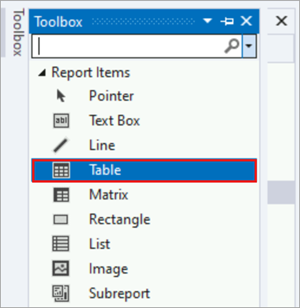
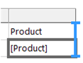
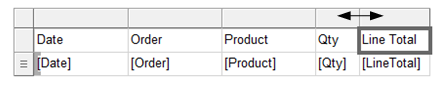
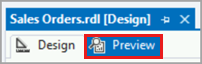
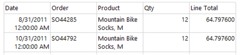

# Lesson 4: Adding a Table to the Report (Reporting Services)

After the dataset is defined, you can start designing the report. You create a report layout by dragging and dropping data regions, text boxes, images, and other items that you want to include in your report to the design surface.

Items that contain repeated rows of data from underlying datasets are called *data regions*. A basic report will have only one data region, but you can add more, such as when you need to add a chart to your tabular report. After you add a data region, you can add fields to the data region.

## Add a table data region and fields to a report layout

1. Select the **Toolbox** tab in the left pane of the *Report Designer*. Select **Table** with your mouse and drag it to the report design surface. Report Designer draws a table data region with three columns in the center of the design surface. The **Toolbox** may appear as a tab on the left side of the **Report Data** pane. To open the **Toolbox**, move the pointer over the **Toolbox** tab. If the **Toolbox** is not visible, from the **View** menu, select **Toolbox**.

    

    You can also add a table to the report from the design surface. Right-click the design surface and select **Insert** > **Table**.

2. In the **Report Data** pane, expand the dataset **AdventureWorksDataset** to display the fields.

3. Drag the *Date* field from the **Report Data** pane to the first column in the table.

    > [!IMPORTANT]
    > When you drop the field into the first column, two things happen. First, the data cell will display the field name, known as the *field expression*, in brackets: `[Date]`. Second, a      column   header value is automatically added to the header row, just above the field expression. By default, the column is the name of the field. You can select the header row text and   type a new     column name if you want to change it.

4. Drag the *Order* field from the **Report Data** pane to the second column in the table.

5. Drag the *Product* field from the **Report Data** pane to the third column in the table.

6. Drag the *Qty* field to the right edge of the third column until you get a vertical cursor and the mouse pointer has a plus sign [+]. When you release the mouse button, a fourth column is    created for `[Qty]`.

    

7. Add the *LineTotal* field in the same way, creating a fifth column. The column header is added as "Line Total". *Report Designer* automatically creates a friendly name for the column by      splitting LineTotal into two words.

The following diagram shows a table data region that has been populated with these fields: Date, Order, Product, Qty, and Line Total.

## Preview your report

Previewing a report enables you to view the rendered report without having to first publish it to a report server. You will probably want to preview your report frequently during design time. Previewing the report will also run validation on the design and data connections so you can correct errors and issues before publishing the report to a report server.

### To preview a report

- Select the **Preview** tab. Report Designer runs the report and displays it in **Preview** view.

    
  
    The following diagram shows part of the report in **Preview** view.
  
    
  
    Notice that the currency (in the Line Total column) has six places after the decimal, and the date has includes a time stamp. You're going to format the *LineTotal* field to display correctly as currency in the next lesson.  
  
    > [!NOTE]
    > On the **File** menu, select **Save All** to save the report.

## Next steps

You have successfully added a table data region to your report, added fields to the data region, and previewed your report. Next, you will format column headers, and date and currency values. Continue with [Lesson 5: Formatting a Report &#40;Reporting Services&#41;](lesson-5-formatting-a-report-reporting-services.md).
  
## See also

[Tables &#40;Report Builder  and SSRS&#41;](report-design/tables-report-builder-and-ssrs.md)  
[Dataset Fields Collection &#40;Report Builder and SSRS&#41;](report-data/dataset-fields-collection-report-builder-and-ssrs.md)  
