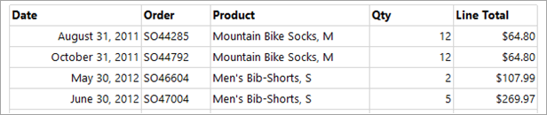

# Lesson 5: Formatting a Report (Reporting Services)
Now that you've added a data region and some fields to the Sales Orders report, you can format the date and currency fields and the column headers.  
  
## Format the Date  
The Date field displays date and time information by default. You can format it to display only the date.  
  
#### To format a date field  
  
1.  Click the **Design** tab.  
  
2.  Right-click the cell with the `[Date]` field expression and then click **Text Box Properties**.  
  
3.  Click **Number**, and then in the **Category** field, click **Date**.  
  
4.  In the **Type** box, select **January 31, 2000**.  
  
5.  [!INCLUDE[clickOK](../includes/clickok-md.md)]  
  
6.  Preview the report to see the change to the `[Date]` field and then change back to design view.  
  
## Format the Currency  
The **LineTotal** field displays a general number. Format it to display the number as currency.  
  
#### To format a currency field  
  
1.  Right-click the cell with the `[LineTotal]` field expression and then click **Text Box Properties**.  
  
2.  Click **Number**, and in the **Category** field, click **Currency**.  
  
3.  If your regional setting is English (United States), the defaults should be:  
  
    -   **Decimal places: 2**  
  
    -   **Negative numbers: ($12345.00)**  
  
    -   **Symbol: $ English (United States)**  
  
4.  Select **Use 1000 separator (,)**.  
  
    If the sample text is:**$12,345.00**, then your settings are correct.  
  
5.  [!INCLUDE[clickOK](../includes/clickok-md.md)]  
  
6.  Preview the report to see the change to the `[LineTotal]` field and then change back to design view.  
  
## Change Text Style and Column Widths  
You can also change the formatting of the header row to differentiate it from the rows of data in the report. Lastly, you will adjust the widths of the columns.  
  
#### To format header rows and table columns  
  
1.  Click the table so that column and row handles appear above and next to the table. The gray bars along the top and side of the table are the column and row handles.  
       
  
2.  Point to the line between column handles so that the cursor changes into a double arrow. Drag the columns to the size you want.
    
  
3.  Select the row containing column header labels and from the **Format** menu, point to **Font** and then click **Bold**.  
  
4.  To preview your report, click the **Preview** tab. It should look something like this:  
  
      
  
5.  On the **File** menu, click **Save All** to save the report.  
  
## Next Steps  
You have successfully formatted column headers and date and currency values. Next, you will add grouping and totals to your report. See [Lesson 6: Adding Grouping and Totals &#40;Reporting Services&#41;](../reporting-services/lesson-6-adding-grouping-and-totals-reporting-services.md).  
  
## See Also  
[Formatting Numbers and Dates &#40;Report Builder and SSRS&#41;](../reporting-services/report-design/formatting-numbers-and-dates-report-builder-and-ssrs.md)  
[Rendering Behaviors &#40;Report Builder  and SSRS&#41;](../reporting-services/report-design/rendering-behaviors-report-builder-and-ssrs.md)  
  
  
  

