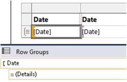
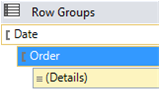
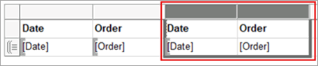
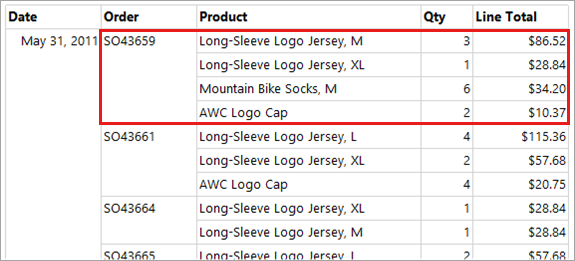
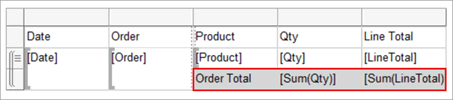
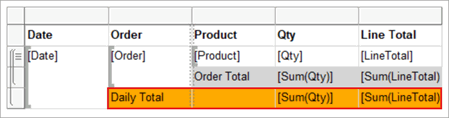
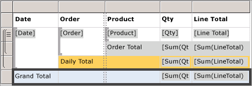
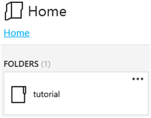

# Lesson 6: Adding Grouping and Totals (Reporting Services)

In the final tutorial lesson, you're going to add grouping and totals to your [!INCLUDE[ssRSnoversion](../includes/ssrsnoversion-md.md)] report to organize and summarize your data.  

## To group data in a report

1. Select the **Design** tab.
2. If you don't see the **Row Groups** pane, right-click the design surface and select **View** >**Grouping**.
3. From the **Report Data** pane, drag the `[Date]` field to the **Row Groups** pane. Place it above the row displayed as **= (Details)**.

    > [!NOTE]
    > Note that the row handle now has a bracket in it, to indicate a group. The table now also has two `[Date]` expression columns, one on both sides of a vertical dotted line.
    >
    >
4. From the **Report Data** pane, drag the `[Order]` field to the **Row Groups** pane. Place it below **Date** and above **= (Details)**.

    

    > [!NOTE]
    > Note that now the row handle has two brackets in it,  to indicate two groups. The table now also has two `[Order]` expression columns.

5. Delete the original `[Date]` and `[Order]` expression columns to the right of the double line. Select the column handles for the two columns, right-click and select **Delete Columns**. Report Designer removes the individual row expressions, so that only the group expressions are displayed.

    

6. To format the new `[Date]` column, right-click the data region cell that contains the `[Date]` expression, and select **Text Box Properties**.
7. Select **Number** in the left-most column list box, and **Date** from the **Category** list box.
8. In the **Type** list box, select **January 31, 2000**.
9. Select **OK** to apply the format.
10. Again, preview the report. It should look as below:

    

## Adding totals to a report

1. Switch to the **Design** view.
2. Right-click the data region cell that contains the `[LineTotal]` expression, and select **Add Total**. Report Designer adds a row with a sum of the dollar amount for each order.
3. Right-click the cell that contains the field `[Qty]`, and select **Add Total**. Report Designer adds a sum of the quantity for each order to the totals row.
4. In the empty cell to the left of the `Sum[Qty]` cell, type the string "Order Total".
5. You can add a background color to the totals row. Select the two sum cells and the label cell.  
6. From the **Format** menu, select **Background Color** > **Light Gray** square.
7. Select **OK** to apply the format.

   

## Add the daily total to the report

1. Right-click the `[Order]`expression cell, and select **Add Total** > **After**. Report Designer adds a new row containing sums of the `[Qty]` and `[Linetotal]` values for each day, and the string "Total" to the bottom of the `[Order]`expression column.
2. Type the word "Daily" before the word "Total" in the same cell, so it reads "Daily Total".
3. Select that cell and the two adjacent total cells to the right and the empty cell in between them.
4. From the **Format** menu, select **Background Color** > **Orange** square.
5. Select **OK** to apply the format.

   

## Add the grand total to the report

1. Right-click the `[Date]` expression cell, and select **Add Total** > **After**. Report Designer adds a new row containing sums of the `[Qty]` and `[LineTotal]` values for the entire report, and the string "Total" to the bottom of the `[Date]` expression column.
2. Type the string "Grand" before the word "Total" in the same cell, so it reads "Grand Total".
3. Select the cell with "Grand Total", the two `Sum()` expression cells and the empty cells between them.
4. From the **Format** menu, select **Background Color** > **Light Blue** square.
5. Select **OK** to apply the format.

    

## Preview the report

To preview the format changes, select the **Preview** tab. In the **Preview** toolbar, select the **Last Page** button, which looks like . The results should display as below:

   

## Publishing the report to the *Report Server* (Optional)

An optional step is to publish the completed report to the Report Server so you can view the report in the web portal.

1. Select **Project** menu > **Tutorial Properties...**
2. In the **TargetServerURL**, type the name of your report server, for example:
    - `http:/<servername>/reportserver` or
    - `https://localhost/reportserver` works if you're designing the report on the report server.

3. The **TargetReportFolder** is named Tutorial from the name of the project. Report Designer deploys the report to this folder.
4. Select **OK**.
5. Select **Build** menu > **Deploy Tutorial**.

    If you see a message like below in the **Output** window, it indicates a successful deployment.

    > ------ Build started: Project: tutorial, Configuration: Debug ------  
    > Skipping 'Sales Orders.rdl'. Item is up to date.  
    > Build complete -- 0 errors, 0 warnings  
    > ------ Deploy started: Project: tutorial, Configuration: Debug ------  
    > Deploying to `https://[server name]/reportserver`  
    > Deploying report '/tutorial/Sales Orders'.  
    > Deploy complete -- 0 errors, 0 warnings  
    > ========== Build: 1 succeeded or up-to-date, 0 failed, 0 skipped ==========  
    > ========== Deploy: 1 succeeded, 0 failed, 0 skipped ==========  

    If you see an error message similar to below, verify you've the appropriate permissions on the report server and you've started [!INCLUDE[ssBIDevStudio](../includes/ssbidevstudio-md.md)] with administrator privileges.
    >
    > "The permissions granted to user 'XXXXXXXX\\[your user name]' are insufficient for performing this operation"

6. Open a browser with administrator privileges. For example, right-click the icon for Internet Explorer and select **Run as administrator**.
7. Browse to the web portal URL.
   - `https://<server name>/reports`.
   - `https://localhost/reports` works if you're designing the report on the report server.

8. Select the Tutorial folder, and then select the "Sales Orders" report to view the report.

      

You've successfully completed the **Creating a Basic Table Report tutorial**.

## See also

[Filter, Group, and Sort Data &#40;Report Builder and SSRS&#41;](report-design/filter-group-and-sort-data-report-builder-and-ssrs.md)
