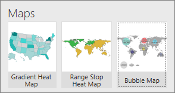
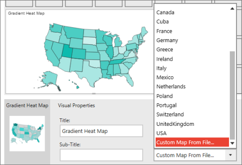
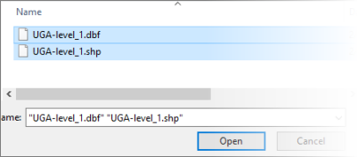
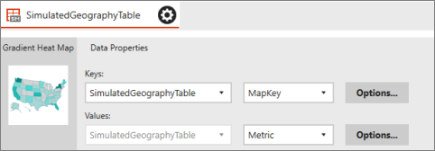

# Add a custom map to a Reporting Services mobile report

[!INCLUDE [ssrs-mobile-report-deprecated](../../includes/ssrs-mobile-report-deprecated.md)]

Custom maps require two files:  
* An .SHP file for shape geometries  
* A .DBF file for metadata  
  
Read more about [custom maps in Reporting Services mobile reports](../../reporting-services/mobile-reports/custom-maps-in-reporting-services-mobile-reports.md).  
  
Store the two files in the same folder. The file names of the two must match (e.g., canada.shp and canada.dbf). The first column of the metadata (DBF file) is used to match with the key value of the corresponding shape's name (key), to be used when populating the map with data.
  
## Load a custom map  
  
1. On the **Layout** tab, select a map type: **Gradient Heat Map**, **Range Stop Heat Map**, or **Bubble Map**, drag it to the design surface, and make it the size you want.  
  
     
  
2. In **Layout** view > **Visual Properties** panel > **Map**, select **Custom Map From File**.   
  
     
  
3. In the **Open** dialog box, browse to the location of the SHP and DBF files and select both of them.   
  
     
  
## Connect data to a custom map  
When you first add the custom map to your report, [!INCLUDE[SS_MobileReptPub_Short](../../includes/ss-mobilereptpub-short.md)] populates it with simulated geography data.  
  
  
  
Displaying real data in your custom map is the same as displaying data in the built-in maps. Follow the steps in [Maps in Reporting Services mobile reports](../../reporting-services/mobile-reports/maps-in-reporting-services-mobile-reports.md) to display your data.  
  
### See also  
- [Custom maps in Reporting Services mobile reports](../../reporting-services/mobile-reports/custom-maps-in-reporting-services-mobile-reports.md)  
- [Maps in Reporting Services mobile reports](../../reporting-services/mobile-reports/maps-in-reporting-services-mobile-reports.md)  
- [Create and publish mobile reports with SQL Server Mobile Report Publisher](../../reporting-services/mobile-reports/create-mobile-reports-with-sql-server-mobile-report-publisher.md)   
  
  
  
  
