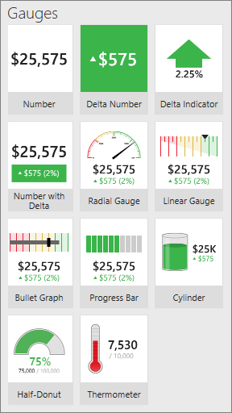
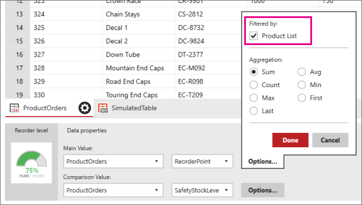

# Add gauges to mobile reports | Reporting Services
Gauges are the most basic and widely used visuals in mobile reports. They display a single value in a dataset - just the value, or the value compared to a goal.

  
  
*Gauge visualizations in the Layout tab*  
  
All gauges in SQL Server Mobile Report Publisher have at least one property in common: a main value, set to a numeric field in one of the data tables in the mobile report.  

All the gauges except the Number gauge can also display a comparison, or *delta*, value -- the relationship between the main and a comparison value. The comparison value is the often the goal, and the gauge is a visual indicator of progress to that goal, or the delta between the actual and the goal.

Gauges can only represent one aggregated value for their main value and one aggregated value for their comparison value. Gauge aggregations are standard -- sum, average, minimum, maximum, and so on. By default, the gauge value is a sum, which displays the total of all values contained within the current filtered data available to the gauge control. 

You can filter gauge values by connecting them to navigators on the mobile report. 

## Set the main and comparison values for a gauge

1. Drag a gauge from the **Layout** tab to the design grid and make it the size you want.

2. Get [data from Excel or a shared dataset](../../reporting-services/mobile-reports/data-for-reporting-services-mobile-reports.md).

3. Select the **Data** tab, and in the **Data properties** pane, under **Main Value** select a data table and a numeric field.

3. In any gauge except the Number gauge, in the **Data properties** pane, under **Comparison Value** select a data table and a numeric field.

4. [optional] To change the aggregation, select **Options** and select a different aggregation.
   
   >**Note**: When you change the aggregation for the main value, you probably also want to change the aggregation for the comparison value, though in some cases you may want to mix aggregation methods.  

## Filter a gauge
  
If the mobile report has any navigators, you can bind a gauge to one or more of them to filter it. You can bind a gauge's value and comparison value to one or more different navigators, leading to almost endless options for gauges.  

1. Select a gauge, and on the **Data** tab in the **Data properties** pane, select **Options** next to **Main Value** or **Comparison Value**.

2. Under Filtered by, select the navigator you want to filter the gauge.

   
 
## Set visual properties for a gauge
  
Along with the data properties which connect gauge elements to data fields, you can also customize a number of functional and visual properties. 

### Set value direction: High or low is better
* Select a gauge, and on the **Layout** tab in the **Visual properties** pane, set **Value direction** to either **Higher values are better** or **Lower values are better**. 

**Higher values are better** colors the positive values green, indicating a desirable change for the better, or lower values red, indicating an undesirable change for the worse. 

The colors for **Lower values are better** are the opposite.

The value direction property relates only to Gauge elements that support a comparison value. The color of the gauge is determined by the sign of the delta integer and the value direction property setting.  
  
### Set range stops for a gauge
The second gauge-specific non-data property is range stops. 

* Select a gauge, and on the **Layout** tab in the **Visual properties** pane, select **Range stops**.

With range stops, you set at what percentage of the comparison value visualization should be presented as on-target (green), neutral (amber), or off-target (red) -- a gauge's comparison value being the target. Again, only gauges with comparison values support range stops.  

### Format the numbers in the gauge  
Another non-data property of gauge element, and one shared by many other elements, is number format. 

* Select a gauge, and on the **Layout** tab in the **Visual properties** pane, select **Range stops**.

It determines how numbers displayed in the gauge are formatted -- for example, currency, percentage, time, or general. You set number formatting on each element of the mobile report.
  
### See also 

* [Create mobile reports with SQL Server Mobile Report Publisher](../../reporting-services/mobile-reports/create-mobile-reports-with-sql-server-mobile-report-publisher.md)
* [Maps in Reporting Services mobile reports](../../reporting-services/mobile-reports/maps-in-reporting-services-mobile-reports.md)
* [Navigators in Reporting Services mobile reports](../../reporting-services/mobile-reports/add-navigators-to-reporting-services-mobile-reports.md)
* [Visualizations in Reporting Services mobile reports](../../reporting-services/mobile-reports/add-visualizations-to-reporting-services-mobile-reports.md)
* [Data grids in Reporting Services mobile reports](../../reporting-services/mobile-reports/add-data-grids-to-mobile-reports-reporting-services.md) 
