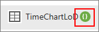
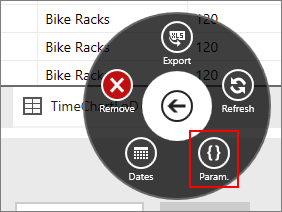
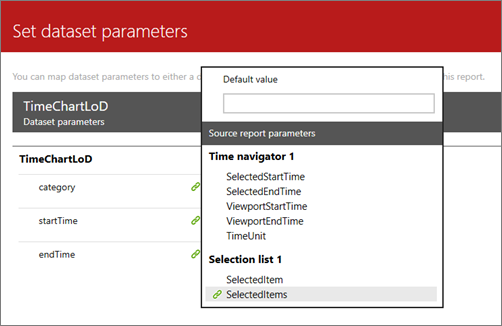
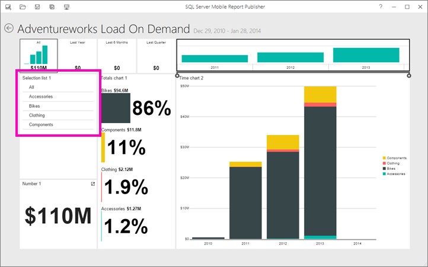

# Add parameters to a mobile report | Reporting Services
You can create a [!INCLUDE[ssRSnoversion_md](../../includes/ssrsnoversion-md.md)] mobile report with parameters, so you and your report readers can filter your reports. A report with parameters can also be the target of a [drillthrough from a source report](../../reporting-services/mobile-reports/add-drillthrough-from-a-mobile-report-to-other-mobile-reports-or-urls.md). 

To create a mobile report with parameters, you start with a shared dataset with at least one parameter. Read about [creating parameters in a shared dataset](../../reporting-services/report-data/create-a-shared-dataset-or-embedded-dataset-report-builder-and-ssrs.md). Mobile reports don't support null value(s) for default parameters, so make sure your parameters have default values other than null.

After you add parameters to a mobile report, you create a URL to [open the report with query string parameters](../../reporting-services/mobile-reports/open-a-mobile-report-with-specific-query-string-parameters-reporting-services.md). 

1. In the top bar of the [!INCLUDE[ssRSnoversion](../../includes/ssrsnoversion.md)] web portal, select **New** > **Mobile Report**.  
  
     
     
2. Select the **Data** tab in the upper-left corner of [!INCLUDE[SS_MobileReptPub_Long](../../includes/ss-mobilereptpub-long.md)].   
  
3. In the upper-right corner, select **Add Data**.  
  
4. Select **Report Server**, then select a server.  
  
5. Navigate to the shared datasets on the server and select one that has parameters.  
  
   In the grid, you see the data in the dataset. The green circle with brackets **{ }** marks a dataset with a parameter.  
     
     
  
6. Select the cog on the tab, then select **Param {}**.  
  
     
  
7. Select the report element that will pass values to the parameter.  
  
     
     
8. Select **Preview** to see how the report will look. In this report, the selection list is using the Category parameter.

    
   
9. When you select a value in the selection list, the report is filtered to that value, in this case, Accessories.

      
  
### See also  
-  [Open a mobile report with specific query string parameters](../../reporting-services/mobile-reports/open-a-mobile-report-with-specific-query-string-parameters-reporting-services.md)
-  [Add drillthrough from a mobile report to other mobile reports or URLs](../../reporting-services/mobile-reports/add-drillthrough-from-a-mobile-report-to-other-mobile-reports-or-urls.md)
-  [Create a shared or embedded dataset](../../reporting-services/report-data/create-a-shared-dataset-or-embedded-dataset-report-builder-and-ssrs.md)
- [Create and publish mobile reports with SQL Server Mobile Report Publisher](../../reporting-services/mobile-reports/create-mobile-reports-with-sql-server-mobile-report-publisher.md)  
  
  

