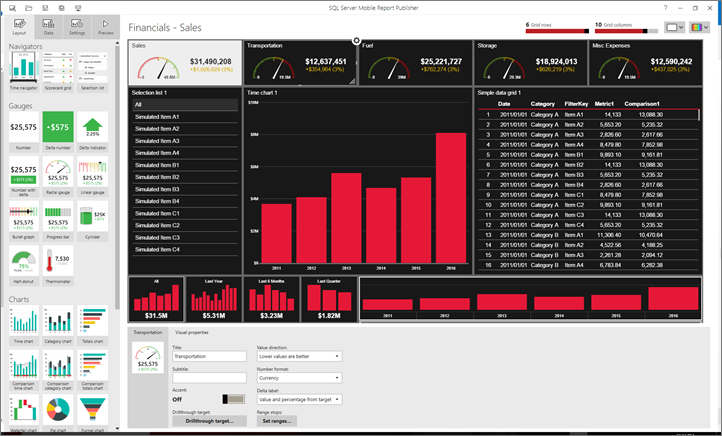
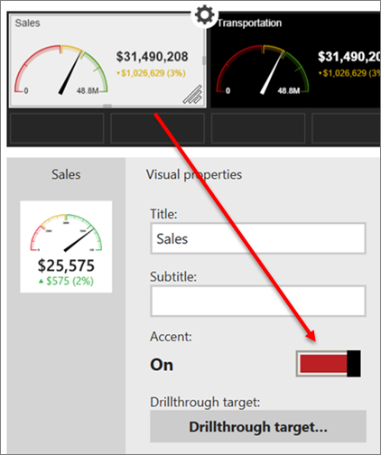
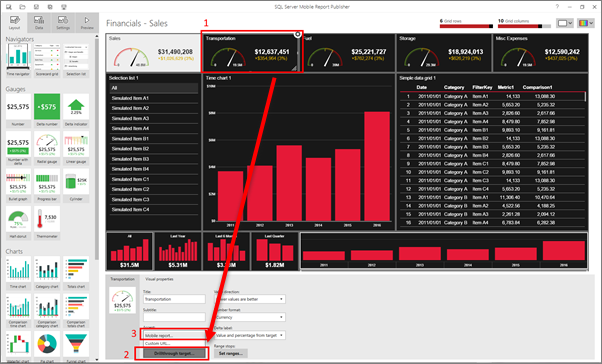
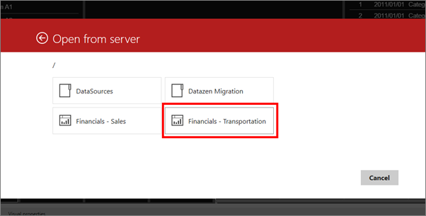
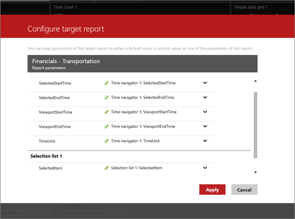
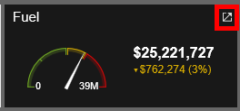
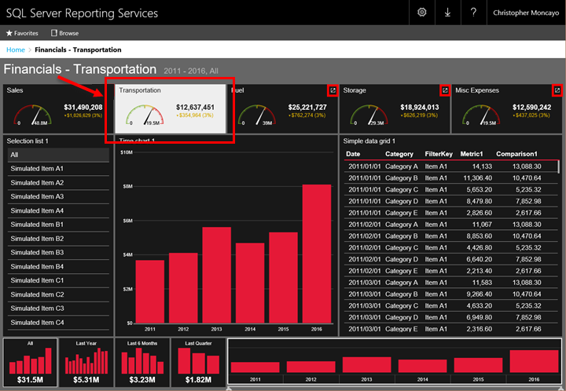

# Create a tabbed mobile report by using drillthrough

[!INCLUDE [ssrs-mobile-report-deprecated](../../includes/ssrs-mobile-report-deprecated.md)]

Learn how to create a [!INCLUDE[ssRSnoversion_md](../../includes/ssrsnoversion-md.md)] mobile report that looks and acts like a tabbed report by using drillthrough and parameters.

For example, in this report, the gauges across the top act like tabs. When you click the Transportation gauge, the data in the rest of the chart is filtered to the transportation data.

Behind the scenes, this is really a set of five separate reports, each with a different parameter that filters the report to match the gauge selected at the top of the report. You create all five reports first, then for each of the five reports, you make the other four gauges into drillthroughs to the other four reports.

Here are the steps for this example.

## Create the basic report

1. Create a report called Sales, with five gauges:

    * Sales
    * Transportation
    * Fuel
    * Storage
    * Misc Expenses

   
    
2. Set **Accent** to **On** for the Sales gauge, so it will contrast with the rest of the report--in this case, white on black.

    
    
3. Save it to a [!INCLUDE[ssRSnoversion_md](../../includes/ssrsnoversion-md.md)] report server.

## Make copies of the report

1. Make four copies of the Sales report and name them: 

    * Transportation
    * Fuel
    * Storage
    * Misc Expenses

3. Save them to the [!INCLUDE[ssRSnoversion_md](../../includes/ssrsnoversion-md.md)] report server.

## Set the gauge as a drillthrough

In this section, you set each gauge (other than the Sales gauge) as a drillthrough to its respective report.

1. In the Sales report, select the Transportation gauge.

    

2. With the **Layout** tab selected, in the **Visual properties** pane select **Drillthrough target**.

3. Select **Mobile report**.

4. Navigate to and select the report that will be the destination for the drillthrough--in this case, "Financials - Transportation."

    

5. In **Configure target report**, select the parameter to filter the report, and select **Apply**.

   
   
6. Repeat these steps for each of the other gauges in the Sales report. 

## Set the gauges for the other reports

1.  Open the Transportation report, set the Sales gauge as a drillthrough to the Sales report, and the other three gauges as drillthroughs to their respective reports.

2. Still in the Transportation report, set **Accent** for the Transportation gauge to **On**, contrast with the rest of the report.

3. Repeat these steps for the Fuel, Storage, and Misc Expenses reports. 

## View the report in the web portal

1. Go to the [!INCLUDE[ssRSnoversion_md](../../includes/ssrsnoversion-md.md)] report server and open one of the reports. 

2. Notice that each of the gauges has a drillthrough icon in the upper-right corner.

    

3. Select one of the gauges to go to the report filtered to that gauge's data.

   

### See also
	
* [Add parameters to a mobile report](../../reporting-services/mobile-reports/add-parameters-to-a-mobile-report-reporting-services.md)
* [Add drillthrough from a mobile report to other mobile reports or URLs](../../reporting-services/mobile-reports/add-drillthrough-from-a-mobile-report-to-other-mobile-reports-or-urls.md)

  

