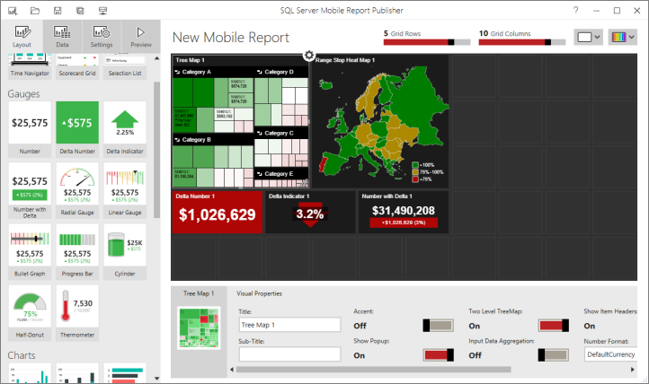
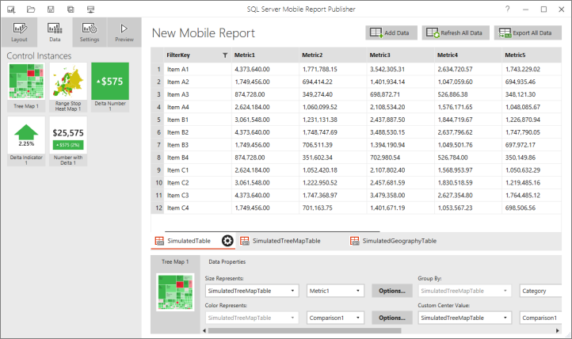

# Design first or data first when creating in Reporting Services mobile reports
  
With [!INCLUDE[PRODUCT_NAME](../../includes/ss-mobilereptpub-long.md)], you can quickly create mobile reports that scale well to any screen size, on a design surface with adjustable grid rows and columns, and flexible mobile report elements.   
  
When creating mobile reports, you have your choice of two basic approaches: start with the data first, or start with the design first. [!INCLUDE[SS_MobileReptPub_Long](../../includes/ss-mobilereptpub-short.md)] supports both.   
  
## Design first  
  
The following diagram shows the components of the [!INCLUDE[SS_MobileReptPub_Long](../../includes/ss-mobilereptpub-short.md)] layout view:   
  
  
  
In the design-first approach, you create a mobile report layout first without importing any data. This is a good way to create a mobile report when you are not sure if the data is formatted correctly. Without real data, gallery elements are automatically bound to generated simulated data, which you can export and use as a template to describe the required data.  
  
## Data first  
The data-first approach is to import all required data first, then design the mobile report and set data properties on the mobile report elements. This has the advantage of being able to connect each element to real data when you add it to the layout. When using a data-first approach, be sure that your real data is formatted correctly for use with [!INCLUDE[SS_MobileReptPub_Long](../../includes/ss-mobilereptpub-short.md)].   
  
 The following diagram shows all the components of the [!INCLUDE[SS_MobileReptPub_Long](../../includes/ss-mobilereptpub-short.md)] data view:  
  
  
  
### See also  
- [Create and publish mobile reports with SQL Server Mobile Report Publisher](../../reporting-services/mobile-reports/create-mobile-reports-with-sql-server-mobile-report-publisher.md)  
-  View [SQL Server mobile reports and KPIs in the iPad app](https://pbiwebprod-docs.azurewebsites.net/documentation/powerbi-mobile-ipad-kpis-mobile-reports)  (Power BI for iOS)  
-  View [SQL Server mobile reports and KPIs in the iPhone app](https://pbiwebprod-docs.azurewebsites.net/documentation/powerbi-mobile-iphone-kpis-mobile-reports) (Power BI for iOS)  
  
  
  
  

