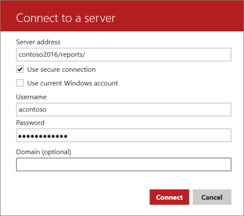
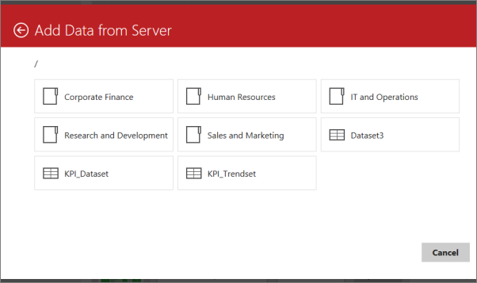
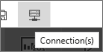

# Get data from shared datasets in Reporting Services mobile reports

[!INCLUDE [ssrs-mobile-report-deprecated](../../includes/ssrs-mobile-report-deprecated.md)]

Besides [loading data from Excel files](../../reporting-services/mobile-reports/prepare-excel-data-for-reporting-services-mobile-reports.md), SQL Server Mobile Report Publisher can also access data from almost any source. Accessing data requires a shared data source, configured on a Reporting Services web portal. Read more about [creating shared data sources](../../reporting-services/report-data/create-modify-and-delete-shared-data-sources-ssrs.md) and [creating shared datasets](../../reporting-services/report-data/manage-shared-datasets.md).  
  
After shared data sources and shared datasets are configured on the  Reporting Services server, you can use them in mobile reports you create in [!INCLUDE[PRODUCT_NAME](../../includes/ss-mobilereptpub-short.md)].   
  
After you've connected to a [!INCLUDE[PRODUCT_NAME](../../includes/ssrsnoversion-md.md)] server from the [!INCLUDE[PRODUCT_NAME](../../includes/ss-mobilereptpub-short.md)], connecting a mobile report to a shared dataset is straightforward.   
  
1. On the **Data** tab, select **Add Data**.  
  
2. Select **Report Server**.   
  
3.  If this is the first time connecting to the server, fill in the server name and your name and password. Put the server name in the Server address box in this format:  
  
    \<"servername">/reports/  
  
    As in this example:  
       
      
      
  
4. When you select the [!INCLUDE[PRODUCT_NAME](../../includes/ssrsnoversion-md.md)] server, you see the available datasets in folders. Select a dataset to import the data into [!INCLUDE[PRODUCT_NAME](../../includes/ss-mobilereptpub-short.md)].  
  
     
  
After you've imported the dataset, you can design your mobile report just as you would with simulated data, or local data from an Excel file.  
  
By default, the shared dataset is always up to date with the latest data, because every time someone views a mobile report based on that dataset, SQL Server runs the underlying query and returns the latest data. Clearly, if lots of people view your mobile report this might not be ideal, so you can set up caching to run the query periodically and cache the resulting dataset. This blog post explains [how caching and data refresh works in the web portal](https://christopherfinlan.com/2016/02/10/so-refreshinghow-data-refresh-works-with-mobile-reports-and-kpis-in-reporting-services/).  
  
## Add, edit, or remove a report server  
  
If you're already connected to a report server, when you select **Add Data** on the Data tab, you don't see an option to add another report server. Follow these steps instead.  
  
1. In the upper-left corner, select **Connections**.  
  
     
     
   The Server Connection pane opens on the right.  
     
     
     
2. Add a new server connection, or edit or remove existing connections.  
  
### See also  
- [Create and publish mobile reports with SQL Server Mobile Report Publisher](../../reporting-services/mobile-reports/create-mobile-reports-with-sql-server-mobile-report-publisher.md)  
-  [Web portal (SSRS Native Mode)](../../reporting-services/web-portal-ssrs-native-mode.md)  
-  View [SQL Server mobile reports and KPIs in the iPad app](https://pbiwebprod-docs.azurewebsites.net/documentation/powerbi-mobile-ipad-kpis-mobile-reports)  (Power BI for iOS)  
-  View [SQL Server mobile reports and KPIs in the iPhone app](https://pbiwebprod-docs.azurewebsites.net/documentation/powerbi-mobile-iphone-kpis-mobile-reports) (Power BI for iOS)  
  
  
  
  

