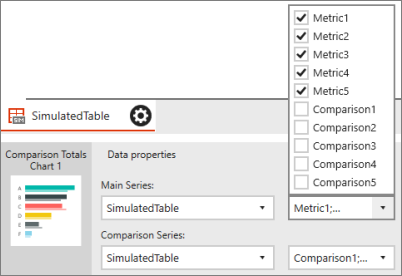
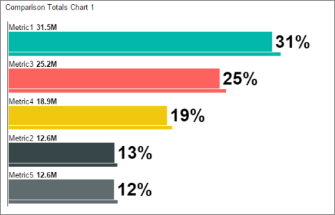
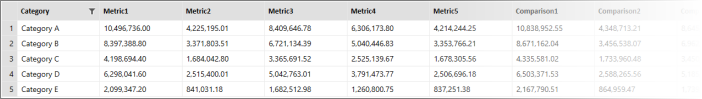
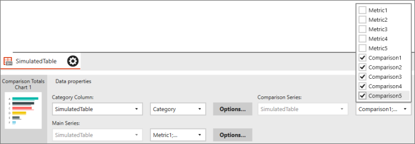
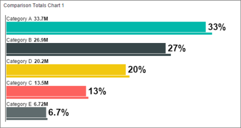

# Group data by columns or rows in a mobile report | Reporting Services

[!INCLUDE [ssrs-mobile-report-deprecated](../../includes/ssrs-mobile-report-deprecated.md)]

You can organize data by columns or by rows in many types of charts in [!INCLUDE[SS_MobileReptPub_Short](../../includes/ss-mobilereptpub-short.md)]. Follow along in this step-by-step.

In time, totals, pie, and funnel charts, you can organize the data by rows or by columns. 
* Organizing by columns is useful if a table has several columns of data you'd like to compare. 
* Organizing by rows works better if one column in the table contains the names of the different categories. 

The following steps use a comparison totals table with the simulated data in [!INCLUDE[SS_MobileReptPub_Short](../../includes/ss-mobilereptpub-short.md)] to illustrate the difference between structuring the data by rows or by columns in a chart.  

1. Drag a **Comparison totals chart** from the **Layout** tab to the design surface and make it bigger.

2. Select the **Data** tab. You see the SimulatedTable table contains a series of columns, **Metric1** through **Metric5** and **Comparison1** through **Comparison5**. 

   

3. In the **Data properties** pane, **Main Series** is **SimulatedTable**. Select the arrow in the box next to **Main Series**, and you see **Metric1** through **Metric5** selected.

   

   Likewise for **Comparison Series** -- **Comparison1** through **Comparison5** are selected.
   
4. Select **Preview**.

   

   Each bar in the chart represents one column in the table. The thicker bars are the Metrics columns and the thinner bars are the Comparison columns.

5. Select the back arrow in the upper-left corner to leave preview mode.

6. On the **Layout** tab, in the **Visual properties** pane change **Data structure** from **By columns** to **By rows**.  

7. Select the **Data** tab. Now the SimulatedTable table has a **Category** column along with the **Metric** and **Comparison** columns, with Category A through E. 

   

8.  In the **Data properties** pane, there's now a Category Column box, which lists the Category column from SimulatedTable. In Main Series, you can pick which column to use for the values. By default, [!INCLUDE[SS_MobileReptPub_Short](../../includes/ss-mobilereptpub-short.md)] selects Metric1 through Metric5 for the Main Series and Comparison1 through Comparison5 for the Comparison Series. 

    

9. Select **Preview**.

   

   Now each bar in the chart represents the values for each category in the Category column.

### See also
* [Visualizations in Reporting Services mobile reports](../../reporting-services/mobile-reports/add-visualizations-to-reporting-services-mobile-reports.md)
