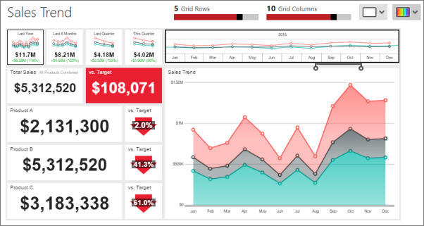
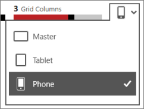
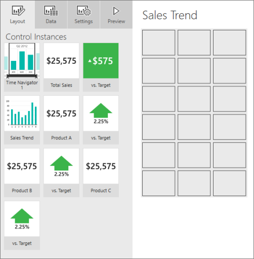
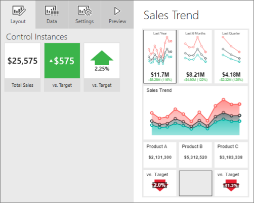
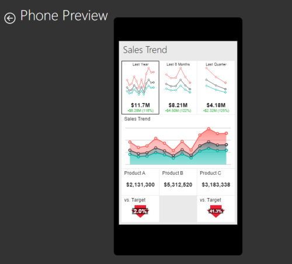

# Lay out a Reporting Services mobile report for phone or tablet
Now that you've [created your Reporting Services mobile report](../../reporting-services/mobile-reports/create-a-reporting-services-mobile-report.md) in [!INCLUDE[SS_MobileReptPub_Short](../../includes/ss-mobilereptpub-long.md)], you can lay out a phone and tablet version of it.  
  
   
*The master layout for the mobile report.*  
  
1. In the upper-right corner of [!INCLUDE[SS_MobileReptPub_Short](../../includes/ss-mobilereptpub-short.md)], select the layout icon > either **Phone** or **Tablet**.  
  
     
     
   The phone layout grid opens. All the visualizations are on the **Layout** tab.  
     
     
     
2. Drag the visualizations to the grid and resize them.  
  
     
     
3. Select **Preview** to see how the report will look on a phone.  
  
     
  
### See also  
- [Create and publish mobile reports with SQL Server Mobile Report Publisher](../../reporting-services/mobile-reports/create-mobile-reports-with-sql-server-mobile-report-publisher.md)  
  
  
