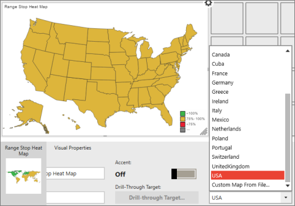
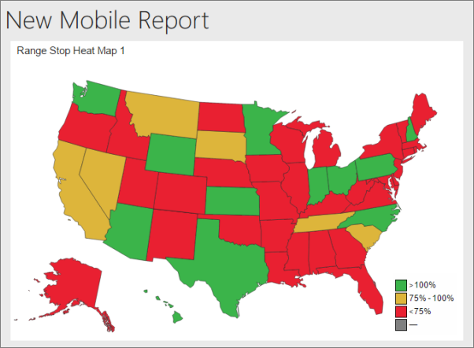

# Maps in Reporting Services mobile reports
Maps are a great way to visualize geographical data. [!INCLUDE[SS_MobileReptPub_Long](../../includes/ss-mobilereptpub-long.md)] provides three different types of map visualization, and built-in maps for continents and a number of individual countries. You can also [upload and use custom maps](../../reporting-services/mobile-reports/custom-maps-in-reporting-services-mobile-reports.md).   
  
## Types of maps  
  
SQL Server mobile reports offer three different types of maps, useful for different circumstances.  
  
  
  
**Gradient Heat Maps** The field in the Values property is displayed as shades of a single color filling each region in a map. You can set whether the higher or the lower values are darker in the **Value Direction** box.  
  
**Bubble Map** The Values property determines the radius of a bubble visualization displayed over the associated region. You can set whether all the bubbles are the same or all different colors.   
  
**Range Stop Heat Maps** shows a value in relation to a target. The **Targets** property determines the delta between a Comparison field and the Values field. The resulting delta determines the color that fills the associated region of the map, from green to yellow to red. You can set whether higher or the lower values are green in the **Value Direction** box.  
  
## Select the map type and region  
  
1. On the **Layout** tab, select a map type, drag it to the design surface, and make it the size you want.  
  
2. In **Layout** view > **Visual Properties** panel > **Map**, select the specific map region you need.  
  
     
  
3. For both radiant and range stop heat maps, set whether higher or lower values are better in the **Value Direction** box under **Visual Properties**.  
  
7. For bubble maps, under **Visual Properties** set **Use Different Colors** to **On** or **Off** to make the bubbles all the same color or all different colors.  
  
## Select the map data  
When you first add a map to your report, [!INCLUDE[SS_MobileReptPub_Short](../../includes/ss-mobilereptpub-short.md)] populates it with simulated geography data.  
  
  
  
To display real data in your map, you need to set values for at least two of the map's data properties:   
* The **Keys** property connects the data to specific map regions -- states in the USA, for instance, or countries in Africa.  
* The **Values** property is a numeric field in the same table as the selected keys field. These values are represented differently in different maps. The **gradient map** uses these values to color each region with a varying shades based on the range of values. The **bubble map** base the size of a bubble visualization over each region on the value property.   
* For range stop heat maps, you also need to set the **Targets** property.  
  
### Set map data properties  
  
1. Select the **Data** tab in the upper-left corner.  
  
2. Select **Add Data**, then either **Local Excel** or **SSRS Server**.  
  
   > **Tip**: Make sure the [data is in a format that works for mobile reports](../../reporting-services/mobile-reports/prepare-data-for-reporting-services-mobile-reports.md).  
  
3. Select the worksheets you want and select **Import**.  
   You see your data in the [!INCLUDE[SS_MobileReptPub_Short](../../includes/ss-mobilereptpub-short.md)].  
  
4. In this **Data** view > **Data Properties** panel > under **Keys**, in the left box select the table containing the map data, and in the right box select the key field that matches the regions in your map.  
  
5. Under **Values**, the same table is already in the left box. Select the numeric field whose values you want to display on the map.   
  
6. If this is a range stop heat map, under the **Targets** box the same table is in the left box. In the box on the right, select the numeric field whose values you want to be the target.   
  
     
  
7. Select **Preview** in the upper-left corner.  
  
     
     
8. Select the **Save** icon in the upper-left corner and **Save Locally** on your computer or **Save to Server**.  
  
### See also  
-  [Custom maps in Reporting Services mobile reports](../../reporting-services/mobile-reports/custom-maps-in-reporting-services-mobile-reports.md)  
- [Create and publish mobile reports with SQL Server Mobile Report Publisher](../../reporting-services/mobile-reports/create-mobile-reports-with-sql-server-mobile-report-publisher.md)  
  
  
