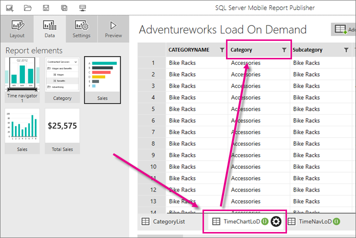
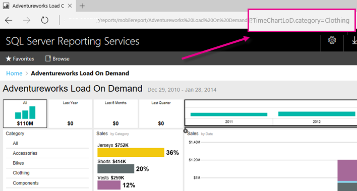

# Open a mobile report with specific query string parameters | Reporting Services
If you have a [!INCLUDE[ssRSnoversion_md](../../includes/ssrsnoversion-md.md)] mobile report with parameters and a [!INCLUDE[ssNoVersion_md](../../includes/ssnoversion-md.md)] or [!INCLUDE[ssASnoversion_md](../../includes/ssasnoversion-md.md)] data source, you can include query string parameters in the report URL so it opens automatically with values you've specified. 
1.	Create a [mobile report with parameters](../../reporting-services/mobile-reports/add-parameters-to-a-mobile-report-reporting-services.md).

2. Open the report in Mobile Report Publisher and select the Data tab. 

2. Find the name of the dataset on the tab at the bottom of the table, and the field name you want. 
    
    
    
2.	The syntax of the URL depends on your data source. 

     **For a SQL Server Analysis Services data source**: Build a URL with a query string parameter in this format:

    `https://<servername>/reports/<report-folder-name>/<report-name>?<dataset-name>.<field-name>=<parameter-value>`

    For example:
    
    `https://sampleserver/reports/adventureworks-reports/adventureworks-load-on-demand?TimeChartLoD.category=Clothing` 
    
     **For a SQL Server data source**: The query string parameter is almost the same, but has the \@ symbol in front of the field name:

    `https://<servername>/reports/<report-folder-name>/<report-name>?<dataset-name>.@<field-name>=<parameter-value>`

    For example:
    
      `https://sampleserver/reports/adventureworks-reports/adventureworks-load-on-demand?TimeChartLoD.@category=Clothing` 

    
3.	This URL will open the report on the server, automatically filtered to the parameter value you specified.

    

### See also

[Add parameters to a mobile report](../../reporting-services/mobile-reports/add-parameters-to-a-mobile-report-reporting-services.md)

