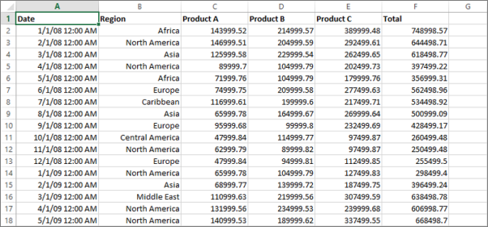

# Prepare Excel data for Reporting Services mobile reports
  
Here are some things to keep in mind when preparing an Excel file and worksheets for use with a mobile report:  
  
## Do  
  
- Have one worksheet per dataset.  
- Have column headers in the first row.  
- Keep data types consistent within each column.  
- Format cells as proper types in Excel.  
- Have the data in worksheets, not in the Data Model in Excel.  
- When using formulas, ensure that the entire column is calculated using the same formula.  
- Use Excel 2007 or later.  
- Save Excel files with the extension XLSX.  
          
## Don't  
  
- Include images, graphs, PivotTables, or other embedded objects in dataset worksheets.  
- Include total or calculated rows.  
- Keep the file open in Excel when importing.  
- Format numbers manually by adding currency or other symbols.  
- Use a workbook with data stored in the Data Model.  
  
## Worksheets  
          
When preparing an Excel file as a dataset for a mobile report, make sure you have only one dataset per worksheet. Each individual worksheet is imported into the [!INCLUDE[PRODUCT_NAME](../../includes/ss-mobilereptpub-short.md)] as a separate table. Identically named worksheets from multiple Excel sources are renamed upon importing by appending incrementing numbers. For example if a workbook has three worksheets entitled "MyWorksheet", the second and third will be renamed "MyWorksheet0" and "MyWorksheet1". The screenshot below illustrates the first few rows of an ideal Excel worksheet ready for import.  
  
  
          
## Column headers  
  
As you can see in the example above, the first row contains the name of the metric in that column. [!INCLUDE[PRODUCT_NAME](../../includes/ss-mobilereptpub-short.md)] preserves these column headers for easy reference in gallery element settings. Column headers aren't required, however. If missing, [!INCLUDE[PRODUCT_NAME](../../includes/ss-mobilereptpub-short.md)] generates headings using the Excel A,B,C,...,AA,BB,... convention.  
  
[!INCLUDE[PRODUCT_NAME](../../includes/ss-mobilereptpub-short.md)] automatically detects first-row headers when importing Excel worksheets by comparing the data types of the first two cells in each column. If the data types of the first two cells in any column don't match, the first row is determined to contain column headers. Thus, if a table has numeric column headers, prefix the header names with a string so they're detected as headers in the import process.  
  
## Cells  
  
Cell data in each column of a worksheet dataset needs to be consistent. Each column is assigned a data type upon importing. [!INCLUDE[PRODUCT_NAME](../../includes/ss-mobilereptpub-short.md)] automatically detects data types as string, double (numeric), boolean (true/false), or datetime. Mixed data types in the same column can cause this detection to be inaccurate or fail completely. This detection accounts for possible column headers being of string type. Cells should be formatted as the correct type in Excel to ensure that the [!INCLUDE[PRODUCT_NAME](../../includes/ss-mobilereptpub-short.md)] detects the desired types. In the above example the six columns would be typed as:  
*  A datetime column  
*  A string column  
*  Four double columns  
  
If a worksheet contains calculated cells or formulas, only the resulting display value is imported into the [!INCLUDE[PRODUCT_NAME](../../includes/ss-mobilereptpub-short.md)].  
  
## File Location and Refreshing Excel Data  
  
There are no restrictions on where you store Excel files you import into the [!INCLUDE[PRODUCT_NAME](../../includes/ss-mobilereptpub-short.md)]. However, if you move or rename the file after importing, you won't be able to refresh that data through the **refresh all data** command found in the Data View.   
  
>**Note**: [!INCLUDE[PRODUCT_NAME](../../includes/ss-mobilereptpub-short.md)] doesn't automatically refresh Excel data. You can refresh the data through the [!INCLUDE[PRODUCT_NAME](../../includes/ss-mobilereptpub-short.md)] **refresh** command, but only if the file hasn't moved.  
  
## Dates  
  
Date fields are essential to many mobile reports, so make cells are properly formatted as dates in Excel. In some cases this means a conversion is necessary. Here are examples of formulas for converting cells from text to dates in Excel.  
  
    Week 24-2013=DATE(MID(A2,9,4),1,-2)-WEEKDAY(DATE(MID(A2,9,4),1,3))+MID(A2,6,2)*7  
  
    2013/03/21=DATEVALUE(A1)  
  
    2013-mar-12=DATEVALUE(RIGHT(A1,2)&"-"&MID(A1,6,3)&"-"&LEFT(A1,4))  
  
After you've converted the cells, you have to format them as dates by selecting them, or the entire column > **Context** menu > **Format Cells** > **Date** from the **Category** list. You can also use the Excel text-to-columns wizard to convert text cells to properly formatted dates.  
  
## Unsupported  
  
Worksheet data in formats other than those described above could cause unpredictable results when imported. It is a good idea to restrict worksheets in an Excel file to only those that are in the correct format for use with a mobile report.  
  
Custom objects in Excel worksheets, including PivotTables, visualizations, and images, aren't imported into the [!INCLUDE[PRODUCT_NAME](../../includes/ss-mobilereptpub-short.md)].  
  
### See also  
- [Prepare data for Reporting Services mobile reports](../../reporting-services/mobile-reports/prepare-data-for-reporting-services-mobile-reports.md)  
- [Create and publish mobile reports with SQL Server Mobile Report Publisher](../../reporting-services/mobile-reports/create-mobile-reports-with-sql-server-mobile-report-publisher.md)  
-  View [SQL Server mobile reports and KPIs in the iPad app](https://pbiwebprod-docs.azurewebsites.net/documentation/powerbi-mobile-ipad-kpis-mobile-reports)  (Power BI for iOS)  
-  View [SQL Server mobile reports and KPIs in the iPhone app](https://pbiwebprod-docs.azurewebsites.net/documentation/powerbi-mobile-iphone-kpis-mobile-reports) (Power BI for iOS)  
  
  
  
  
  
  
  

