# SQL Server mobile reports: End-to-end walk-through
Walk through creating mobile reports for any screen size with [!INCLUDE[PRODUCT_NAME](../../includes/ss-mobilereptpub-long.md)] on the [!INCLUDE[ssRSnoversion_md](../../includes/ssrsnoversion-md.md)] web portal, and viewing them in the Power BI mobile apps.

Create mobile reports on a design surface with adjustable grid rows and columns, and flexible mobile report elements. Connect to a variety of on-premises data sources, or upload Excel workbooks to create mobile reports. Then save your reports to a [!INCLUDE[PRODUCT_NAME](../../includes/ssrsnoversion.md)] web portal and view them in a browser, or in the Power BI mobile apps.  
  
This article walks you through:   
  
- Creating a shared data source and dataset on the [!INCLUDE[PRODUCT_NAME](../../includes/ssrsnoversion.md)] web portal, using the AdventureWorks database as a sample data source.  
- Creating  a Reporting Services mobile report in the [!INCLUDE[PRODUCT_NAME](../../includes/ss-mobilereptpub-short.md)]  
- Publishing the mobile report to the [!INCLUDE[PRODUCT_NAME](../../includes/ssrsnoversion.md)] web portal.  
- Viewing the mobile report in the Power BI mobile app.  
  
## Before we start  
To follow along, you need these products:  
  
* To create data sources and KPIs, and publish datasets and mobile reports, you need access to a [Reporting Services native mode report server](../install-windows/install-reporting-services-native-mode-report-server.md).  
* To create shared datasets, [install Report Builder](../install-windows/install-report-builder.md).  
* To create mobile reports, [install SQL Server Mobile Report Publisher](https://go.microsoft.com/fwlink/?LinkId=717766).  
* [AdventureWorks sample databases](https://github.com/Microsoft/sql-server-samples/releases).  
*  OR: World Wide Importers sample database, available from the [Microsoft SQL Server Samples](../../sample/microsoft-sql-server-samples.md) page.
* To view the result: 
  *   [Sign up for the Power BI service](https://go.microsoft.com/fwlink/?LinkID=513879) and
  *  [Download the Power BI mobile app](https://docs.microsoft.com/en-us/power-bi/consumer/mobile/mobile-apps-for-mobile-devices) to your mobile device: iOS, Android phone, or Windows 10 device.  

  
## Create a shared data source  
  
You can create a shared data source for your mobile reports from any of the data sources Reporting Services supports. See the [list of supported data sources](../report-data/data-sources-supported-by-reporting-services-ssrs.md).  
  
1. From your [!INCLUDE[PRODUCT_NAME](../../includes/ssrsnoversion.md)] web portal, click **New** > **Data Source**.  
  
   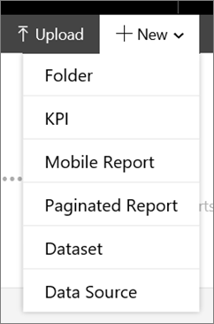  
3. Enter your data source information > **OK**.  
  
    By default, data sources aren't displayed in the portal.    
   
5. To view data sources, click **Display** > **Data Source**.  
  
   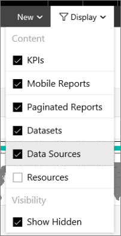  
   
6. Now you see the data source in the [!INCLUDE[PRODUCT_NAME](../../includes/ssrsnoversion.md)] portal.  
  
   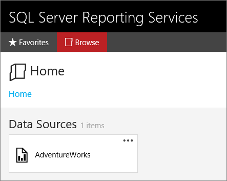  
  
Read more about [shared data sources in Reporting Services](../report-data/create-modify-and-delete-shared-data-sources-ssrs.md).  
   
## <a name="shared-dataset">Create a shared dataset</a>  
  
Use an existing [!INCLUDE[PRODUCT_NAME](../../includes/ssrsnoversion.md)] client tool, such as Report Designer in [!INCLUDE[ssBIDevStudioFull_md](../../includes/ssbidevstudiofull-md.md)], to create the shared dataset.  This walkthrough uses [!INCLUDE[PRODUCT_NAME](../../includes/ssrbnoversion.md)]. [Install Report Builder](../install-windows/install-report-builder.md), or launch it from your web portal. You'll create three datasets, one each for: the KPI value, the KPI trend, and one with more fields for the Reporting Services mobile report.     
  
1. From your [!INCLUDE[PRODUCT_NAME](../../includes/ssrsnoversion.md)] web portal, click **New** > **Paginated Report** to start [!INCLUDE[PRODUCT_NAME](../../includes/ssrbnoversion.md)].  
  
      
2. Click **New Dataset**.  
  
   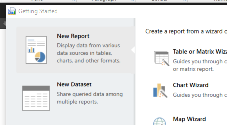  
   
3. Click **Browse other data sources**.  
   
4. In the Name field, type the name of the server where you saved your data source, in this format:   
   
   Name: https://*localhost*/ReportServer  
   Items of type: Data Sources (*.rsds)  
   
5. Click **Open**, and navigate to the data source you created on that server.  
   
6. Select your data source and click **Open** again.    
  
7. Design  your dataset in [!INCLUDE[PRODUCT_NAME](../../includes/ssrbnoversion.md)].  
  
   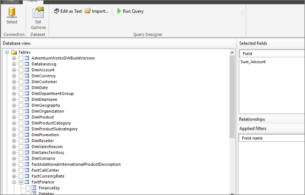  
   
8. When complete, save the dataset to the [!INCLUDE[PRODUCT_NAME](../../includes/ssrs.md)] report server.    
   
Now you can use the dataset as the basis for your KPIs and mobile reports.  You can create multiple datasets against the same data source. And you can create multiple KPIs and mobile reports against these shared datasets.   
  
## <a name="create-KPI">Create a KPI</a>  
You create KPIs right in the [!INCLUDE[PRODUCT_NAME](../../includes/ssrsnoversion.md)] web portal.    
  
1. In the upper-right corner of the web portal, click **New** > **New KPI**.   
  
     
      
   In the KPI creation screen, you can manually enter values, or to use a shared dataset.    
2. Change **Value** from **Set manually** to **Dataset field**.  
   
   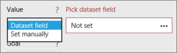  
   
3. Click the ellipsis (**...**) in the **Pick dataset field** box, and select a dataset from the previous step.  
   
   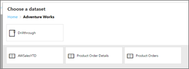  
   
4. Choose the field in the dataset.    
   
   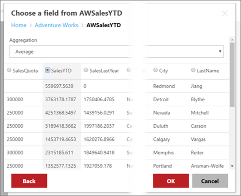  
     
5. Choose the aggregation your want. KPIs can only display one number, so the field will be aggregated to show that number.

   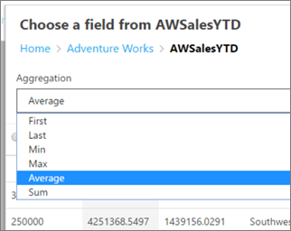

6. Click **OK**.

7. In the **Trend set** box, click **Dataset trend**.  
  
6. In the **Pick dataset trend** box, click the ellipsis (**...**)  
   
7. Select a field and click **OK**.  

   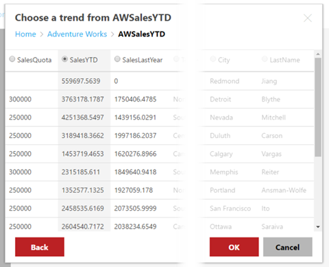  
  
8. Give your KPI a name and pick a visualization type, and click **Create**.   
  
   The KPI appears on the [!INCLUDE[PRODUCT_NAME](../../includes/ssrsnoversion.md)] web portal.  
   
    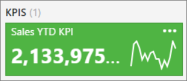  
    
## <a name="create-mobile-report">Create a Reporting Services mobile report</a>  
   
To create a Reporting Services mobile report, [install SQL Server Mobile Report Publisher](https://go.microsoft.com/fwlink/?LinkId=717766), or launch it from the [!INCLUDE[ssRSnoversion_md](../../includes/ssrsnoversion-md.md)] web portal. 

When you first open [!INCLUDE[PRODUCT_NAME](../../includes/ss-mobilereptpub-short.md)], you see a blank canvas where you can create your mobile report. You can start by creating visuals first, or start with your data. If you create the visuals first, [!INCLUDE[PRODUCT_NAME](../../includes/ss-mobilereptpub-short.md)] automatically generates simulated data that is tied to the report and changes dynamically as you change your visual selections. Try this yourself.   
  
## Start with the visuals  
  
1. From your [!INCLUDE[PRODUCT_NAME](../../includes/ssrsnoversion.md)] web portal, click **New** > **Mobile Report** to start [!INCLUDE[PRODUCT_NAME](../../includes/ss-mobilereptpub-short.md)].  
  
   

   [!INCLUDE[PRODUCT_NAME](../../includes/ss-mobilereptpub-short.md)] opens to the master layout grid.  
  
2. On the **Layout** tab, scroll down to the Charts section.  
  
     
  
2. Drag the **Tree Map** to the grid, and drag the lower-right corner to make it three columns wide and three rows high.  
  
   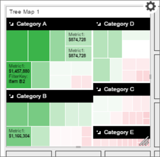  
  
3. You can see its visual properties at the bottom. You may have to scroll sideways to see them all.   
  
   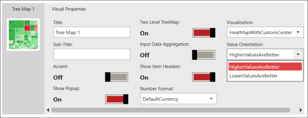  
  
4. With the tree map visual selected, select the **Data** tab in the upper-left corner.   
  
   Now you see the simulated fields and values that [!INCLUDE[PRODUCT_NAME](../../includes/ss-mobilereptpub-short.md)] has generated, and see what the size and the color represent in the tree map.  
  
   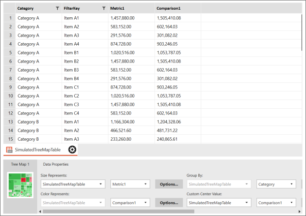  
  
6. Click the **Layout** tab.  
  
7. Click the Options cog  in the upper-right corner of the tree map to see the menu it contains.   
  
   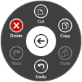  
  
8. Click the arrow in the middle of the wheel to close it.  
  
## Add your own data  
  
1. Switch to the **Data** tab.    
   
2. To add your own data, click **Add Data** in the upper-right corner, and navigate to your data.    
  
3. You could use data from a local Excel workbook, but in this case, it's from the shared dataset on your [!INCLUDE[PRODUCT_NAME](../../includes/ssrsnoversion.md)] web portal. You see a "Server added" message.  
  
4. Select the server, then select the dataset you created.  
   
3. Back on the **Data** tab, in the **Data Properties** pane change **Size Represents**, **Color Represents**, and other properties to fields in your own data. 
   
   *  **Size Represents**, **Color Represents**, and **Custom Center Value** have to be fields with numeric values. 
   *  **Group By** is a category, so it's a text field.
   
   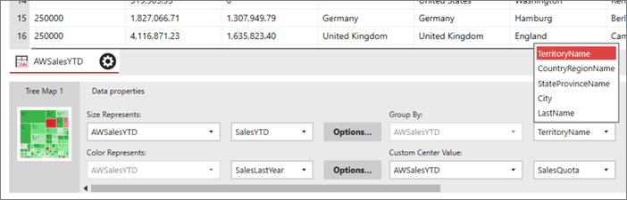
   
6. Select **Preview** to see the tree map updated with your data.  

## Add a gauge to your mobile report

Let's add a gauge to see how year-to-date sales compare to last year's sales, using the same dataset.

1. On the Layout tab, drag a Half-donut to the canvas. place it under the tree map and drag the lower-right corner to make it three squares wide by two squares high. 

2. Again, it starts with simulated data. 

   Note that in **Visual properties**, by default **Higher values are better**, and the **Delta label** is a **Percentage of target**. It has default **Range stops** you can change, but for now they're fine.

   
   
3. On the **Data** tab, select the table with your data and select the **Main Value** field and the field you want to compare it to in **Comparison Value**.

4. You can choose different aggregations to come up with one number for **Main Value** and one for **Comparison Value**. By default, it's a sum.

   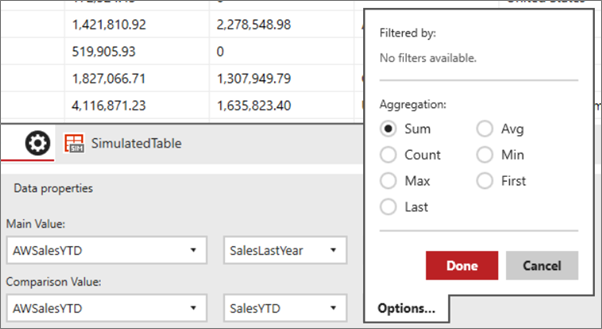

5. Select **Preview** to see how it looks. 

   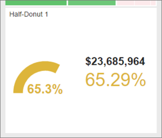

## Add a selection list as a filter

Selection lists act like slicers in Power BI and Excel. We can add one to filter the other visuals in the mobile report.

1. On the **Layout** tab, drag a selection list to the right of the tree map, and drag the lower-right corner to make it two squares wide and as tall as the canvas, five squares. 

   

2. On the **Data** tab, **Data properties**, set **Keys** and **Labels** to a field in your data that you want to filter on.

   
   
## Create a mobile report for phones  
  
Now that you've created visuals on the master layout, you can create a mobile report with a layout specifically optimized for your phone users.    
  
1. In the upper-right corner, click the canvas icon > **Phone**.  
  
2. On the Layout tab under **Control Instances**, you see the two charts you've created.   
  
3. Drag the tree map to the phone canvas and make it four columns wide and three rows high.  
  

## Save your mobile report  
You can save your report locally or to a [!INCLUDE[PRODUCT_NAME](../../includes/ssrsnoversion.md)] web portal. If you save it locally, [!INCLUDE[PRODUCT_NAME](../../includes/ss-mobilereptpub-short.md)] saves it with cached data, so you can open it and continue working on it. But you can't view it on a mobile device.   
  
1. Click the save icon in the upper-left corner.   
   
2. To share it with others and view it on a mobile device, click **Save to Server**.  
  
3. On the server, browse to the folder where you want to save your mobile report.  
  
4. Click **Choose Folder** > **Save**.  
  
   You get a message confirming the report is saved.  
    
   After you save, you can return to the portal and see your mobile report thumbnail.   
    
5. Tap the thumbnail to see the report in the web portal.  
  
## View your report on the web portal

  
## View your report on a mobile device   
  
To view your [!INCLUDE[ssRSnoversion_md](../../includes/ssrsnoversion-md.md)] report, you first need to:

*  [Sign up for the Power BI service](https://go.microsoft.com/fwlink/?LinkID=513879), if you don't have an account yet.
*  [Download the Power BI mobile app](https://powerbi.microsoft.com/documentation/powerbi-power-bi-apps-for-mobile-devices/) to your mobile device.  

### View your mobile report
  
1.  Open and sign into the Power BI app on your mobile device.  
    
2.  To view your Reporting Services mobile reports and KPIs, tap **Reporting Services**.  
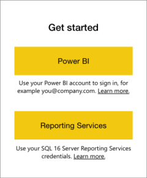  
  
3. Tap the options icon  in the upper-left corner, and tap **Connect to Server**.  
  
   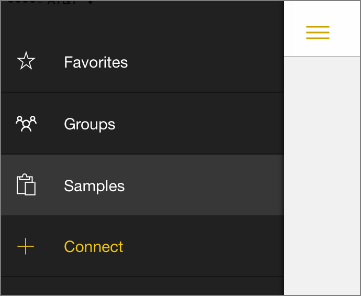  
  
4. Give the server a name, and fill in the server address and your email address and password, in this format:  
  
   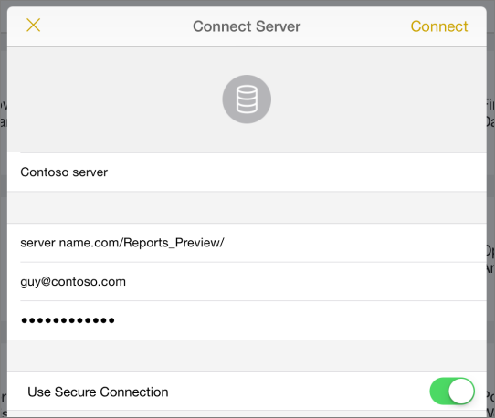   
  
5.  Now you see the server in the left navigation bar.  
  
    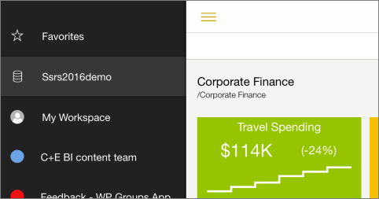  
      
> [!TIP]
> Tap the options icon  anytime to go between your Reporting Services mobile reports in the Reporting Services web portal and your dashboards in the Power BI service.  

  
## View KPIs and mobile reports in the Power BI app  
  
Tap the **KPIs** or **Mobile Reports** tab.   
  
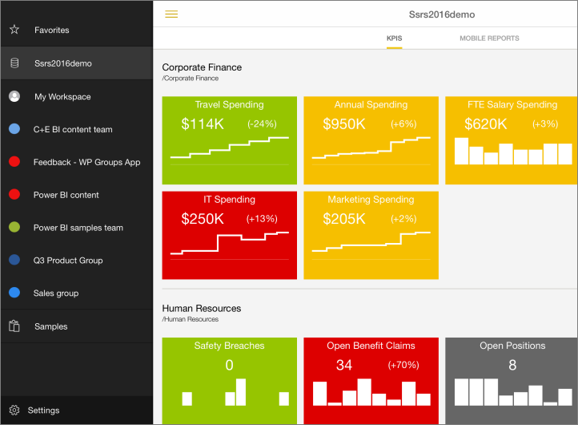  
  
- Tap a KPI to see it in focus mode.  
  
      
  
- Tap a mobile report to open and interact with it in the Power BI app.  
  
The KPIs and mobile reports are displayed in the same folders they're in on the Reporting Services web portal.   
  
## See also  
 
-  View [on-premises report server mobile reports and KPIs in the Power BI mobile app](https://docs.microsoft.com/power-bi/consumer/mobile/mobile-app-ssrs-kpis-mobile-on-premises-reports) for iOS and Android devices
-  View [on-premises report server mobile reports and KPIs in the Power BI mobile app for Windows 10 devices](https://powerbi.microsoft.com/documentation/powerbi-mobile-win10-kpis-mobile-reports/)    
  
   

