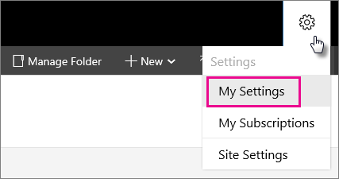
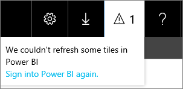
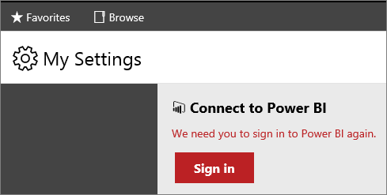

# My Settings for Power BI Integration (web portal)

[!INCLUDE[ssrs-appliesto](../includes/ssrs-appliesto.md)] [!INCLUDE[ssrs-appliesto-2016-and-later](../includes/ssrs-appliesto-2016-and-later.md)] [!INCLUDE[ssrs-appliesto-pbirsi](../includes/ssrs-appliesto-pbirs.md)]

The **My Settings** page in the [!INCLUDE[ssRSnoversion](../includes/ssrsnoversion-md.md)] [!INCLUDE[ssRSWebPortal](../includes/ssrswebportal.md)] is used by individual users to manage their sign-in with [!INCLUDE[sspowerbi](../includes/sspowerbi-md.md)]. When you  go through the steps to pin a report item, you will automatically be prompted to sign.  However,  you can use the **My Settings** page if you need to manually sign in or if you need to sign out.  If the **My Settings** menu option is not visible, the report server has not been integrated with  [!INCLUDE[sspowerbi](../includes/sspowerbi-md.md)].  For more information, see [Power BI Report Server Integration &#40;Configuration Manager&#41;](../reporting-services/install-windows/power-bi-report-server-integration-configuration-manager.md).  
  
  
  
## Why Sign-in

 When you sign in, you establish a relationship between your [!INCLUDE[ssRSnoversion](../includes/ssrsnoversion-md.md)] user account and  your [!INCLUDE[sspowerbi](../includes/sspowerbi-md.md)] account.  The sign-in creates a security token that is good for 90 days. If the token expires, and you have items pinned to Power BI, you will see a notification.  
   
     
   
Tiles within [!INCLUDE[sspowerbi](../includes/sspowerbi-md.md)] dashboards will not refresh until you sign in again through **MySettings**.  
  
  
  
Once you sign in, a new security token will be created.  Your dashboard tiles will begin updating on their previously configured schedules.  

## Next steps

[Power BI Report Server Integration](../reporting-services/install-windows/power-bi-report-server-integration-configuration-manager.md)   
[Pin Reporting Services items to Power BI Dashboards](../reporting-services/pin-reporting-services-items-to-power-bi-dashboards.md)   
[Dashboards in Power BI](https://powerbi.microsoft.com/documentation/powerbi-service-dashboards/)  
[Web portal](../reporting-services/web-portal-ssrs-native-mode.md)  

More questions? [Try asking the Reporting Services forum](https://go.microsoft.com/fwlink/?LinkId=620231)
