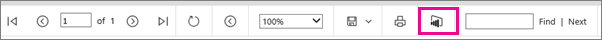
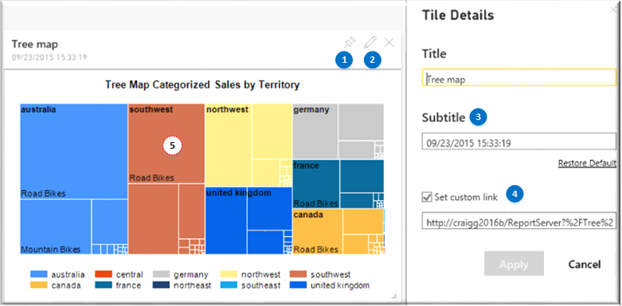
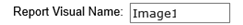

# Pin Reporting Services paginated report items to dashboards in Power BI

[!INCLUDE[ssrs-appliesto](../includes/ssrs-appliesto.md)] [!INCLUDE[ssrs-appliesto-2016-and-later](../includes/ssrs-appliesto-2016-and-later.md)] [!INCLUDE[ssrs-appliesto-pbirsi](../includes/ssrs-appliesto-pbirs.md)]

You can pin an on-premises [!INCLUDE[ssRSnoversion](../includes/ssrsnoversion-md.md)] paginated report item to a dashboard in the [!INCLUDE[sspowerbi](../includes/sspowerbi-md.md)] service, as a new tile.   To pin, your administrator needs to first integrate your report server with Azure Active Directory and [!INCLUDE[sspowerbi](../includes/sspowerbi-md.md)].  
 
[!INCLUDE [ssrs-no-pin-2-power-bi](../includes/ssrs-no-pin-2-power-bi.md)]
 
##   Requirements to Pin  
  
-   The report server is configured for [!INCLUDE[sspowerbi](../includes/sspowerbi-md.md)] integration. For more information, see [Power BI Report Server Integration &#40;Configuration Manager&#41;](../reporting-services/install-windows/power-bi-report-server-integration-configuration-manager.md). If the report server has not been configured, you won't see the **Pin to Power BI Dashboard** button on the report viewer toolbar.  
  
       
  
-   You pin from the [!INCLUDE[ssRSnoversion](../includes/ssrsnoversion-md.md)] report viewer in the [!INCLUDE[ssRSWebPortal](../includes/ssrswebportal.md)], for example, `https://myserver/Reports`.  You can't pin from [!INCLUDE[ssRBnoversion](../includes/ssrbnoversion.md)], from report designer in [!INCLUDE[ssBIDevStudioFull](../includes/ssbidevstudiofull-md.md)], or from a report server URL.  For example,  `https://myserver/ReportServer`.  
  
-   You need to configure your browser to allow pop-ups from your report server site.  
  
-   You need to configure reports for stored credentials, if you want the pinned item to refresh.  When you pin an item, a [!INCLUDE[ssRSnoversion](../includes/ssrsnoversion-md.md)] subscription is automatically created to manage the data refresh of the item to the dashboard.  If the report does not use stored credentials, when the  subscription runs you'll see a message similar to  this one on the **My subscriptions** page.  
  
    "Power BI Delivery error: dashboard: IT Spend Analysis Sample, visual: Chart2, error: The current action cannot be completed. The user data source credentials do not meet the requirements to run this report or shared dataset. Either the user data source credential."
 
    See the section "Configure stored credentials for a report-specific data source (Native mode)" in [Store Credentials in a Reporting Services Data Source](../reporting-services/report-data/store-credentials-in-a-reporting-services-data-source.md)  
  
##   Items You Can Pin  
 The following report items can be pinned to a [!INCLUDE[sspowerbi](../includes/sspowerbi-md.md)] dashboard.  You can't pin items that are nested inside a data region. For example, you can't pin an item that is nested inside a [!INCLUDE[ssRSnoversion](../includes/ssrsnoversion-md.md)] table or list.  
  
-   Charts  
-   Gauge panels  
-   Maps  
-   Images  
-   Items need to be in the report body.  You can't pin items that are in the page header or page footer.  
-   You can pin individual items that are inside a top-level rectangle but you can't pin them all as a single group.  
  
##   To Pin a Report Item  
  
1. Verify you  are signed into [!INCLUDE[sspowerbi](../includes/sspowerbi-md.md)]. In the [!INCLUDE[ssRSnoversion](../includes/ssrsnoversion-md.md)] [!INCLUDE[ssRSWebPortal](../includes/ssrswebportal.md)], select the menu item **My Settings** and sign in. See [My Settings for Power BI Integration &#40;web portal&#41;](my-settings-for-power-bi-integration-web-portal.md) for more information.

      
  
2. Navigate to the [!INCLUDE[ssRSWebPortal](../includes/ssrswebportal.md)] folder  that contains your report, and then view the report.  
  
3. While viewing the report, select the **Pin to Power BI** button the toolbar.  You will be prompted to sign in, if you are not already signed in.  If the [!INCLUDE[sspowerbi](../includes/sspowerbi-md.md)] button is not visible, the report server has not been integrated with [!INCLUDE[sspowerbi](../includes/sspowerbi-md.md)]. For more information, see [Power BI Report Server Integration &#40;Configuration Manager&#41;](../reporting-services/install-windows/power-bi-report-server-integration-configuration-manager.md).  
  
      
  
4. Select the report item you want to pin to [!INCLUDE[sspowerbi](../includes/sspowerbi-md.md)]. You can only pin one item at a time.  The report viewer presents a shaded view of your report and the report items you can pin are highlighted while the items that you can't pin, will be shaded dark.  
  
    **(1)** select the group that contains the dashboard you want to pin to, **(2)** select the dashboard you want to pin the item too and **(3)** select how frequently you want the tile updated in the dashboard.    The refresh is managed by  [!INCLUDE[ssRSnoversion](../includes/ssrsnoversion-md.md)] subscriptions and after the item is pinned, you can edit the subscription and configure a different  refresh schedule.  
  
      
  
5. Select **Pin**  
  
    In the **Pin Successful** dialog, you can select the link **See it in Power BI** to navigate to the dashboard and see the item you just pinned.  
  
6. Select **Close** to return the report to the normal view.  
  
##   In the Dashboard

After your report item is pinned  in the dashboard, the tile looks like other dashboard tiles and there is no visible indication the tile came from [!INCLUDE[ssRSnoversion](../includes/ssrsnoversion-md.md)]. The following list summarizes how tile properties are populated from the report item.  
  
From the [!INCLUDE[sspowerbi](../includes/sspowerbi-md.md)] dashboard the pinned report item behaves like other tiles:

**(1)** You can pin the tile to other dashboards.

**(2)** In the **Tile Details** you'll notice the [!INCLUDE[ssRSnoversion](../includes/ssrsnoversion-md.md)] report title is used for the default title of the tile.

**(3)** The tile subtitle is based on the date and time the tile was pinned or the data was last refreshed from [!INCLUDE[ssRSnoversion](../includes/ssrsnoversion-md.md)]. The refresh schedule is managed by the [!INCLUDE[ssRSnoversion](../includes/ssrsnoversion-md.md)] subscription that was automatically created when you pinned the report item.

**(5)** If you select the tile itself, [!INCLUDE[sspowerbi](../includes/sspowerbi-md.md)] uses the **(4) custom link** to navigate to the [!INCLUDE[ssRSWebPortal](../includes/ssrswebportal.md)] page of the registered report server. the link was set when the item was pinned from [!INCLUDE[ssRSnoversion](../includes/ssrsnoversion-md.md)]. If you do not have internet connectivity to the report server, you will see an error in the browser.  

  
  
##   Troubleshoot Issues  
  
-   **No [!INCLUDE[sspowerbi](../includes/sspowerbi-md.md)] button on the report viewer toolbar:**  This message indicates the report server has not been integrated with [!INCLUDE[sspowerbi](../includes/sspowerbi-md.md)]. For more information, see [Power BI Report Server Integration &#40;Configuration Manager&#41;](../reporting-services/install-windows/power-bi-report-server-integration-configuration-manager.md).  
  
- **Cannot Pin**: When you attempt to pin an item, you see the following error message: See the section [Items You Can Pin](#bkmk_supported_items).  
  
    "Cannot Pin: There are no report items on this page that you can pin to [!INCLUDE[sspowerbi](../includes/sspowerbi-md.md)]."  
  
-   **Pinned items show stale data** in a [!INCLUDE[sspowerbi](../includes/sspowerbi-md.md)] dashboard and it did update for a period of time.  The user credentials token has expired and you need to sign in again.  The user credential registration with Azure and [!INCLUDE[sspowerbi](../includes/sspowerbi-md.md)] is good for 90 days. In the [!INCLUDE[ssRSWebPortal](../includes/ssrswebportal.md)], click **My Settings**. For more information, see [My Settings for Power BI Integration &#40;web portal&#41;](my-settings-for-power-bi-integration-web-portal.md).  
  
-   **Pinned items show stale data** in a [!INCLUDE[sspowerbi](../includes/sspowerbi-md.md)] dashboard and it has not refreshed even once.  The issue is the report is not configured to use stored credentials. A report must use stored credentials because the action of pinning a report item creates a [!INCLUDE[ssRSnoversion](../includes/ssrsnoversion-md.md)] subscription to manage the refresh schedule of the tiles. [!INCLUDE[ssRSnoversion](../includes/ssrsnoversion-md.md)] subscriptions require stored credentials. If you review  the **My Subscriptions** page, you see an error message similar to this one:  
  
    "Power BI Delivery error: dashboard: SSRS items, visual: Image3, error: The current action can't be completed. The user data source credentials do not meet the requirements to run this report or shared dataset. Either the user data source credentials are not stored in the report server database, or the user data source is configured not to require credentials but the unattended execution account is not specified. (rsInvalidDataSourceCredentialSetting)"
  
-   **Expired Power BI credentials:**  You attempt to pin an item and see the following error message. In the [!INCLUDE[ssRSWebPortal](../includes/ssrswebportal.md)], click **My Settings** and on the My Settings  page, click **Sign in**. See [My Settings for Power BI Integration &#40;web portal&#41;](my-settings-for-power-bi-integration-web-portal.md) for more information.  
  
    "Cannot Pin: Unexpected Server Error: Missing, invalid or expired Power BI credentials."  
  
-   **Cannot Pin**: If you attempt to pin an item to a dashboard that is in a read-only state, you will see an error message similar to this one:  
  
    "Server Error: The item 'Dashboard deleted 015cf022-8e2f-462e-88e5-75ab0a04c4d0' can't be found. (rsItemNotFound)"  

-   **Tiles in Power BI apps show stale data:** If you pin a Reporting Services report item to a dashboard, and then distribute that dashboard in an app, the pinned report item in that dashboard won't update. 

##   Subscription Management  
 In addition to the subscription-related issues described in the troubleshooting section, the following information will help you maintain [!INCLUDE[sspowerbi](../includes/sspowerbi-md.md)] related subscriptions.
  
-   **Item name changed:** If a pinned report item is renamed or deleted, the [!INCLUDE[sspowerbi](../includes/sspowerbi-md.md)] tile will no longer update and you will see an error message similar to the following.  If you rename the item back the original name, the subscription will start working again and the tile will be refreshed on the subscriptions schedule.  
  
    "Power BI Delivery error: dashboard: SSRS items, visual: Image1, error: Error: Report item 'Image1' cannot be found."  
  
    You could also edit the subscription properties and change the **Report Visual Name** to the appropriate report item name.   
  
-   **Delete a tile**. If you delete a tile in [!INCLUDE[sspowerbi](../includes/sspowerbi-md.md)], the associated subscription is not deleted in [!INCLUDE[ssRSnoversion](../includes/ssrsnoversion-md.md)] and on the **My subscriptions** page, you see an error similar to the following. You can delete the subscription.  
  
    "Power BI Delivery error: dashboard: SSRS items, visual: Image3, error: The item 'Tile deleted af7131d9-5eaf-480f-ba45-943a07d19c9f' cannot be found."  

## Video

<iframe width="560" height="315" src="https://www.youtube.com/embed/QhPQObqmMPc" frameborder="0" allowfullscreen></iframe>

## See Also  
 [Power BI Report Server Integration &#40;Configuration Manager&#41;](../reporting-services/install-windows/power-bi-report-server-integration-configuration-manager.md)   
 [My Settings for Power BI Integration &#40;web portal&#41;](my-settings-for-power-bi-integration-web-portal.md)  
 [Dashboards in Power BI](https://powerbi.microsoft.com/documentation/powerbi-service-dashboards/)  
  
  
[!INCLUDE[feedback_stackoverflow_msdn_connect_md](../includes/feedback-stackoverflow-msdn-connect-md.md)]