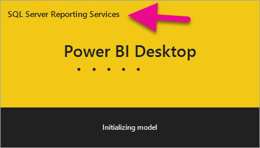
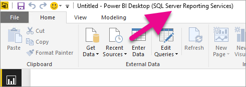
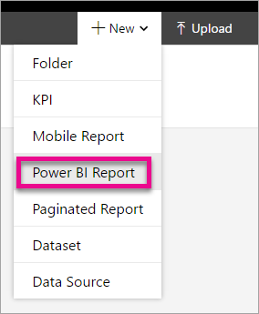
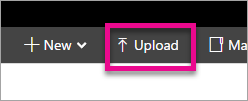
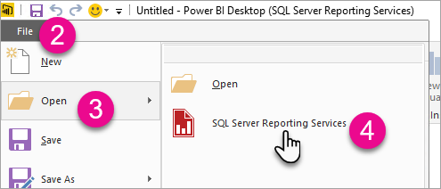

# Power BI reports in Reporting Services
 ||  
|-|  
|**[!INCLUDE[applies](../includes/applies-md.md)]**  January 2017 Technical Preview of Power BI reports in SQL Server Reporting Services|

Power BI reports can be uploaded and viewed within the Reporting Services web portal within the January 2017 Technical Preview of Power BI reports in SQL Server Reporting Services.

## Power BI Desktop (SQL Server Reporting Services)

You will need to download and install Power BI Desktop (SQL Server Reporting Services). This is a different release from the Power BI Desktop that is used with the Power BI service. This is needed to make sure that the report server can indirect with a known version of the reports and model. You can download Power BI Desktop (SSRS) from the **[Microsoft Download Center](https://go.microsoft.com/fwlink/?linkid=839351)**.

Power BI Desktop and Power BI Desktop (SSRS) can be installed side by side.

### Verify you are using the correct version
You can verify that you are using the correct Power BI Desktop by looking at the launch screen or title bar within Power BI Desktop. The launch screen and the title bar will indicate SQL Server Reporting Services.

## File extension association
If you installed both Power BI Desktop and Power BI Desktop (SSRS) on the same machine, the last install of Power BI Desktop will have the file association with .pbix. This means that when you double click on a pbix file, it will launch the Power BI Desktop that was last installed.

If you had Power BI Desktop and then installed Power BI Desktop (SSRS), all pbix files will open in Power BI Desktop (SSRS) by default. If you would rather Power BI Desktop be the default to launch when opening a pbix file, reinstall Power BI Desktop from the Power BI service.

You can always open the version of Power BI Desktop you want to use first. And then open the file from within Power BI Desktop or Power BI Desktop (SSRS).

## Creating your report

Creating your report within Power BI Desktop (SSRS) is similar to creating it within Power BI Desktop.

For information on how to use Power BI Desktop, see [Getting started with Power BI desktop](https://powerbi.microsoft.com/documentation/powerbi-desktop-getting-started/), along with other documentation, on the Power BI documentation site.

You can create a new report by either opening Power BI Desktop (SSRS) or from the web portal by doing the following.

1.	Browse to the web portal.
2.	Select **New** from the top right.
3.	Select **Power BI Report**.

This will launch Power BI Desktop (SSRS).

## Supported data sources

Currently, the only data source supported with Reporting Services is a live connection to Analysis Services (tabular or multidimensional). More data sources will be added in future releases. 

## Uploading your report to the web portal

To upload your report to the web portal, do the following.

1.	Browse to the Reporting Services web portal.
2.	Select **Upload** from the upper right.

    

3.	Select the Power BI Desktop file you want to upload.
4.	Select **Open**.

## Editing existing reports

Within Power BI Desktop, you can open a Power BI Report directly from the report server. When you save modifications, the report will be saved back to the report server.

1.	Open Power BI Desktop (SSRS).
2.	Select **File**.
3.	Select **Open**.
4.	Select **SQL Server Reporting Services**.

    

5.	Enter the URL for your report server. This should be in the format `http://<host name>/reports`.
6.	Select **OK**.
7.	Select the report you want to open and then select **OK**.
8.	Make your changes.
9.	**Save** the report. This will save changes back to the report server.

## Limitations
The following features within Power BI Desktop (SSRS) are not supported for use within Reporting Services.

-	Data sources other than a live connection to Analysis Services (tabular or multidimensional).
-	No support for custom visuals.
-	No support for R visuals.

## See also
[Getting started with Power BI desktop](https://powerbi.microsoft.com/documentation/powerbi-desktop-getting-started/)  
[Configure Kerberos to use Power BI reports](../reporting-services/report-server/configure-kerberos-to-use-power-bi-reports.md)  
[Install the January 2017 Technical Preview of Power BI reports in SQL Server Reporting Services](../reporting-services/install-windows/install-january-2017-technical-preview-power-bi-reports.md)
