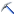

# Analysis Services Connection Type for DMX (SSRS)
  When you create a dataset using a [!INCLUDE[ssNoVersion](../../includes/ssnoversion-md.md)] [!INCLUDE[ssASnoversion](../../includes/ssasnoversion-md.md)] data source, Report Designer displays the Multidimensional Expression (MDX) query designer if it detects a valid cube. If no cube is detected, but a data mining model is available, Report Designer displays the Data Mining Extensions (DMX) query designer. To switch between the MDX and DMX designers, click the **Command Type DMX** () button on the toolbar. Use the DMX Query Designer to interactively build a DMX query using graphical elements. To use DMX Query Designer, the data source that you specify must already have a data mining model that provides the data. Query results are converted to a flattened rowset for use in the report.  
  
> [!NOTE]  
>  You must train your model before designing your report. For more information, see [Data Mining Solutions](../../analysis-services/data-mining/data-mining-solutions.md).  
  
## Design Mode  
 The DMX query designer opens in Design mode. Design mode includes a graphical design surface used for selecting a single data mining model and input table, and a grid used for specifying the prediction query. There are two other modes in DMX query designer: Query mode and Result mode. In Query mode, the grid from Design mode is replaced with a Query pane, which you can use to type DMX queries. In Result mode, the result set returned by the query appears in a data grid.  
  
 To change modes for the DMX query designer, right-click on the query design surface and select **Design**, **Query**, or **Result**. For more information, see [Analysis Services DMX Query Designer User Interface](../../reporting-services/report-data/analysis-services-dmx-query-designer-user-interface.md) and [Retrieve Data from a Data Mining Model &#40;DMX&#41; &#40;SSRS&#41;](../../reporting-services/report-data/retrieve-data-from-a-data-mining-model-dmx-ssrs.md).  
  
## Designing a Prediction Query  
 The Query Design pane of the Design mode contains two windows: **Mining Model** and **Select Input Table**. Use the **Mining Model** window to select the mining model to use in your query. Use the **Select Input Table** window to select the table on which to base your predictions. If you want to use a singleton query instead of an input table, right-click in the Query Design pane and select **Singleton Query**. The **Select Input Table** window is replaced with a **Singleton Query Input** window.  
  
 In Design mode, drag fields from the **Mining Model** and **Select Input Table** windows to the **Field** column in the Grid pane. You can also fill in the remaining columns to specify an alias, to show the field in the results, to group fields together, and to specify an operator to restrict the field value to a given criteria or argument. If you are in Query mode, build the DMX query by dragging fields to the Query pane.  
  
## Using Parameters  
 You can pass report parameters to a DMX query parameter. To do this, you must add a parameter to your DMX query, define the query parameters in the **Query Parameters** dialog box, and then modify the associated report parameters. To define a query parameter, click the **Query Parameters** () button on the toolbar. To view instructions about defining parameters in a DMX query, see [Define Parameters in the MDX Query Designer for Analysis Services &#40;Report Builder and SSRS&#41;](../../reporting-services/report-data/define-parameters-in-the-mdx-query-designer-for-analysis-services.md).  
  
 For more information about how to manage the relationship between report parameters and query parameters, see [Associate a Query Parameter with a Report Parameter &#40;Report Builder and SSRS&#41;](../../reporting-services/report-data/associate-a-query-parameter-with-a-report-parameter-report-builder-and-ssrs.md). For more information about parameters, see [Report Parameters &#40;Report Builder and Report Designer&#41;](../../reporting-services/report-design/report-parameters-report-builder-and-report-designer.md).  
  
## See Also  
 [Data Mining Solutions](../../analysis-services/data-mining/data-mining-solutions.md)   
 [Query Design Tools &#40;SSRS&#41;](../../reporting-services/report-data/query-design-tools-ssrs.md)   
 [Data Connections, Data Sources, and Connection Strings &#40;Report Builder and SSRS&#41;](../../reporting-services/report-data/data-connections-data-sources-and-connection-strings-report-builder-and-ssrs.md)  
  
  
