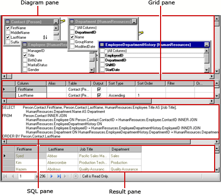
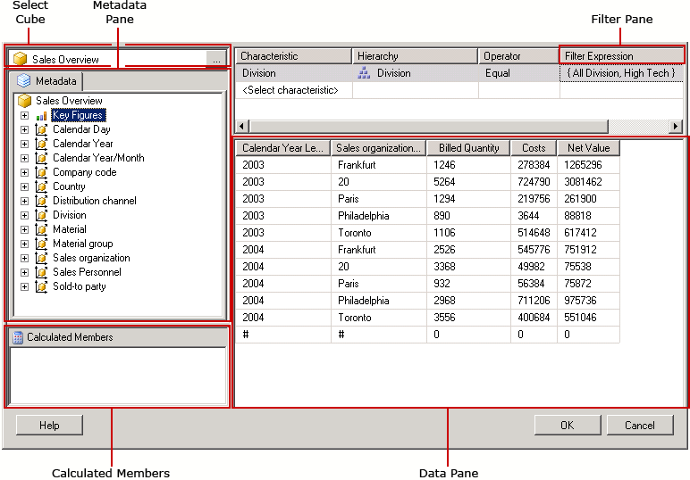

# Query Design Tools (SSRS)
  [!INCLUDE[ssRSnoversion](../../includes/ssrsnoversion-md.md)] provides a variety of query design tools that you can use to create dataset queries in Report Designer. Some query designers provide alternate modes so that you can choose whether to work in visual mode or directly in the query language. This topic introduces each tool and describes the type of data source each one supports. The following tools are described in this topic:  
  
-   [Text-based Query Designer](#Textbased)  
  
-   [Graphical Query Designer](#Graphical)  
  
-   [Report Model Query Designer](#Model)  
  
-   [MDX Query Designer](#MDX)  
  
-   [DMX Query Designer](#DMX)  
  
-   [SapNetWeaver BI Query Designer](#SAPBW)  
  
-   [Hyperion Essbase Query Designer](#Hyperion)  
  
 All of the query design tools run in the data design environment of [!INCLUDE[ssBIDevStudioFull](../../includes/ssbidevstudiofull-md.md)] when you work with a Report Server project template or Report Server Wizard project template. For more information about working with the query designers, see [Reporting Services Query Designers](https://msdn.microsoft.com/library/07efd3f1-804f-45f7-b62a-3e727a3d9835).  
  
 The type of data source that you are working with determines the availability of a particular query designer.  
  
 The data source types that are available in your report are determined by the [!INCLUDE[ssRSnoversion](../../includes/ssrsnoversion-md.md)] data extensions installed on your client or report server. For more information, see [RSReportDesigner Configuration File](../../reporting-services/report-server/rsreportdesigner-configuration-file.md) and [RsReportServer.config Configuration File](../../reporting-services/report-server/rsreportserver-config-configuration-file.md).  
  
 A data processing extension and its associated query designer can differ in support for data sources in the following ways:  
  
-   **By query designer type.** For example, a [!INCLUDE[ssNoVersion](../../includes/ssnoversion-md.md)] data source supports both the graphical and text-based query designers.  
  
-   **By query language variation.** For example, a query language such as [!INCLUDE[tsql](../../includes/tsql-md.md)] can differ in syntax depending on the data source type. The [!INCLUDE[msCoName](../../includes/msconame-md.md)] [!INCLUDE[tsql](../../includes/tsql-md.md)] language and the Oracle SQL language have some variation in syntax for a query command.  
  
-   **By support for the schema part of a database object name.** When a data source uses schemas as part of the database object identifier, the schema name must be supplied as part of the query for any names that do not use the default schema. For example, `SELECT FirstName, LastName FROM [Person].[Person]`.  
  
-   **By support for query parameters.** Data providers differ in support for parameters. Some data providers support named parameters; for example, `SELECT Col1, Col2 FROM Table WHERE <parameter identifier><parameter name> = <value>`. Some data providers support unnamed parameters; for example, `SELECT Col1, Col2 FROM Table WHERE <column name> = ?`. The parameter identifier might differ by data provider; for example, [!INCLUDE[ssNoVersion](../../includes/ssnoversion-md.md)] uses the "at" (@) symbol, Oracle uses the colon (:). Some data providers do not support parameters.  
  
-   **By ability to import queries.** For example, for a [!INCLUDE[ssNoVersion](../../includes/ssnoversion-md.md)] data source, you can import a query from a report definition file (.rdl) or from a .sql file.  
  
##   Text-based Query Designer  
 The text-based query designer is the default query building tool for most supported relational data sources, including [!INCLUDE[msCoName](../../includes/msconame-md.md)] [!INCLUDE[ssNoVersion](../../includes/ssnoversion-md.md)], Oracle, Teradata, OLE DB, XML, and ODBC. In contrast with the graphical query designer, this query design tool does not validate query syntax during query design. The following image provides an illustration of the text-based query designer.  
  
   
  
 The text-based query designer is recommended for creating complex queries, using stored procedures, querying XML data, and for writing dynamic queries. Depending on the data source, you may be able to toggle the **Edit As Text** button on the toolbar to switch between the graphical query designer and the text-based query designer. For more information, see [Text-based Query Designer User Interface](https://msdn.microsoft.com/library/44b7c664-03aa-494e-a484-052b318e810c).  
  
##   Graphical Query Designer  
 The graphical query designer is used to create or modify [!INCLUDE[tsql](../../includes/tsql-md.md)] queries that run against a relational database. This query design tool is used in several [!INCLUDE[msCoName](../../includes/msconame-md.md)] products and in other [!INCLUDE[ssNoVersion](../../includes/ssnoversion-md.md)] components. Depending on the data source type, it supports Text, StoredProcedure, and TableDirect modes. The following image provides an illustration of the graphical query designer.  
  
   
  
 You can toggle the **Edit As Text** button on the toolbar to switch between the graphical query designer and the text-based query designer. For more information, see [Graphical Query Designer User Interface](../../reporting-services/report-data/graphical-query-designer-user-interface.md).  
  
##   Report Model Query Designer  
 The Report Model query designer is used to create or modify queries that run against a SMDL report model that has been published to a report server. Reports that run against models support clickthrough data exploration. The query determines the path of data exploration at run time. The following image provides an illustration of the Report Model query designer.  
  
   
  
 To use the Report Model query designer, you must define a data source that points to a published model. When you define a dataset for the data source, you can open the dataset query in the Report Model query designer. The Report Model query designer can be used in graphical or text-based modes. You can toggle the **Edit As Text** button on the toolbar to switch between the graphical query designer and the text-based query designer. For more information, see [Report Model Query Designer User Interface](../../reporting-services/report-data/report-model-query-designer-user-interface.md).  
  
##   MDX Query Designer  
 The Multidimensional Expression (MDX) query designer is used to create or modify queries that run against an [!INCLUDE[ssASnoversion](../../includes/ssasnoversion-md.md)] data source with multidimensional cubes. The following image provides an illustration of the MDX query designer after the query and filter are defined.  
  
   
  
 To use the MDX query designer, you must define a data source that has an Analysis Services cube available that is valid and has been processed. When you define a dataset for the data source, you can open the query in the MDX query designer. If necessary, use the MDX and DMX buttons on the toolbar to switch between MDX and DMX modes. For more information, see [Analysis Services MDX Query Designer User Interface](../../reporting-services/report-data/analysis-services-mdx-query-designer-user-interface.md).  
  
##   DMX Query Designer  
 The Data Mining Prediction Expression (DMX) query designer is used to create or modify queries that run against an [!INCLUDE[ssASnoversion](../../includes/ssasnoversion-md.md)] data source with mining models. The following image provides an illustration of the DMX query designer after the model and input tables are selected.  
  
   
  
 To use the DMX query designer, you must define a data source that has a valid, data mining model available. When you define a dataset for the data source, you can open the query in the DMX query designer. If necessary, use the MDX and DMX buttons on the toolbar to switch between MDX and DMX modes. After you select the model, you can create data mining prediction queries that provide data to a report. For more information, see [Analysis Services DMX Query Designer User Interface](../../reporting-services/report-data/analysis-services-dmx-query-designer-user-interface.md).  
  
##   Sap NetWeaver BI Query Designer  
 The [!INCLUDE[SAP_DPE_BW_1](../../includes/sap-dpe-bw-1-md.md)] query designer is used to retrieve data from a [!INCLUDE[SAP_DPE_BW_1](../../includes/sap-dpe-bw-1-md.md)] database. To use this query designer, you must have an [!INCLUDE[SAP_DPE_BW_1](../../includes/sap-dpe-bw-1-md.md)] data source that has at least one InfoCube, MultiProvider, or Web-enabled query defined. The following image provides an illustration of the [!INCLUDE[SAP_DPE_BW_1](../../includes/sap-dpe-bw-1-md.md)] query designer. For more information, see [SAP NetWeaver BI Query Designer User Interface](../../reporting-services/report-data/sap-netweaver-bi-query-designer-user-interface.md).  
  
   
  
##   Hyperion Essbase Query Designer  
 The [!INCLUDE[extEssbase](../../includes/extessbase-md.md)] query designer is used to retrieve data from [!INCLUDE[extEssbase](../../includes/extessbase-md.md)] databases and applications. The following image provides an illustration of the [!INCLUDE[extEssbase](../../includes/extessbase-md.md)] query designer.  
  
   
  
 To use this query designer, you must have a [!INCLUDE[extEssbase](../../includes/extessbase-md.md)] data source that has at least one database.  
  
 For more information, see [Hyperion Essbase Query Designer User Interface](../../reporting-services/report-data/hyperion-essbase-query-designer-user-interface.md).  
  
## See Also  
 [Reporting Services Tools](../../reporting-services/tools/reporting-services-tools.md)   
 [Report Datasets &#40;SSRS&#41;](../../reporting-services/report-data/report-datasets-ssrs.md)   
 [Data Connections, Data Sources, and Connection Strings &#40;Report Builder and SSRS&#41;](../../reporting-services/report-data/data-connections-data-sources-and-connection-strings-report-builder-and-ssrs.md)   
 [Reporting Services Tutorials &#40;SSRS&#41;](../../reporting-services/reporting-services-tutorials-ssrs.md)   
 [Data Sources Supported by Reporting Services &#40;SSRS&#41;](../../reporting-services/report-data/data-sources-supported-by-reporting-services-ssrs.md)   
 [Create an Embedded or Shared Data Source &#40;SSRS&#41;](https://msdn.microsoft.com/library/b111a8d0-a60d-4c8b-b00a-51644b19c34b)  
  
  
