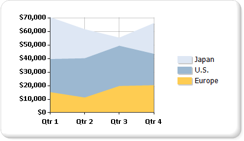

# Area charts in a paginated report (Report Builder)

[!INCLUDE[ssrs-appliesto](../../includes/ssrs-appliesto.md)] [!INCLUDE [ssrs-appliesto-ssrs-rb](../../includes/ssrs-appliesto-ssrs-rb.md)] [!INCLUDE [ssrs-appliesto-pbi-rb](../../includes/ssrs-appliesto-pbi-rb.md)] [!INCLUDE [ssrb-applies-to-ssdt-yes](../../includes/ssrb-applies-to-ssdt-yes.md)]

  An area chart in a paginated report displays a series as a set of points connected by a line, with all the area filled in below the line. For more information on how to add data to an area chart, see [Charts &#40;Report Builder and SSRS&#41;](../../reporting-services/report-design/charts-report-builder-and-ssrs.md).  
  
 The following illustration shows an example of a stacked area chart. The data is well suited for display on a stacked area chart because the chart can display totals for all series as well as the proportion that each series contributes to the total.  
  
   
  
> [!NOTE]  
>  [!INCLUDE[ssRBRDDup](../../includes/ssrbrddup-md.md)]  
  
## Variations  
  
-   **Stacked area**. An area chart where multiple series are stacked vertically. If there is only one series in your chart, the stacked area chart will display the same as an area chart.  
  
-   **Percent stacked area**. An area chart where multiple series are stacked vertically to fit the entire chart area. If there is only one series in your chart, the stacked area chart will display the same as an area chart.  
  
-   **Smooth area**. An area chart where the data points are connected by a smooth line instead of a regular line. Use a smooth area chart instead of an area chart when you are more concerned with displaying trends than with displaying the values of individual data points.  
  
## Data Considerations for Area Charts  
  
-   Along with the line chart, the area chart is the only chart type that displays data contiguously. For this reason, an area chart is commonly used to represent data that occurs over a continuous period of time.  
  
-   A percent stacked area chart is useful for showing proportional data that occurs over time.  
  
-   If there is only one series, a stacked area chart will be drawn as an area chart.  
  
-   In a plain area chart, if the values in multiple series are similar, the areas may overlap, obscuring important data point values. You can resolve this issue by changing the chart type to a stacked area chart, which is designed to show multiple series on an area chart.  
  
-   If your stacked area chart contains gaps, it is possible that your dataset includes empty values, which will be shown as a vacant section on a stacked area chart. If your dataset includes empty values, consider inserting empty points on the chart. Adding empty points will fill in the empty areas on the chart with a different color to indicate null or zero values. For more information, see [Add Empty Points to a Chart &#40;Report Builder and SSRS&#41;](../../reporting-services/report-design/add-empty-points-to-a-chart-report-builder-and-ssrs.md).  
  
-   Area chart types are very similar to column and line charts in behavior. If you are making a comparison between multiple series, consider using a column chart instead. If you are analyzing trends over a period of time, consider using a line chart.  
  
## See Also  
 [Charts &#40;Report Builder and SSRS&#41;](../../reporting-services/report-design/charts-report-builder-and-ssrs.md)   
 [Chart Types &#40;Report Builder and SSRS&#41;](../../reporting-services/report-design/chart-types-report-builder-and-ssrs.md)   
 [Line Charts &#40;Report Builder and SSRS&#41;](../../reporting-services/report-design/line-charts-report-builder-and-ssrs.md)   
 [Change a Chart Type &#40;Report Builder and SSRS&#41;](../../reporting-services/report-design/change-a-chart-type-report-builder-and-ssrs.md)   
 [Empty and Null Data Points in Charts &#40;Report Builder and SSRS&#41;](../../reporting-services/report-design/empty-and-null-data-points-in-charts-report-builder-and-ssrs.md)  
  
  
