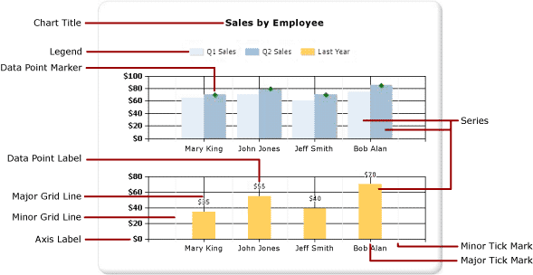
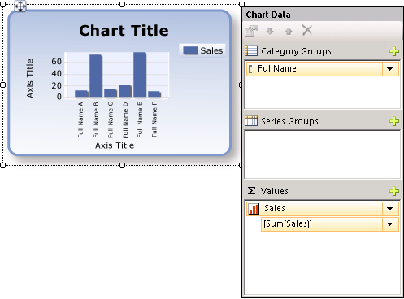

# Charts (Report Builder and SSRS)
Read about using chart data regions to help readers of your [!INCLUDE[ssRSnoversion_md](../../includes/ssrsnoversion-md.md)] paginated reports understand large volumes of aggregated data at a glance.  

The more time you spend carefully preparing and understanding your data before you create a chart, the easier it will be to design your charts quickly and efficiently. For help choosing which chart to use, see [Chart Types](../../reporting-services/report-design/chart-types-report-builder-and-ssrs.md) To start experimenting with charts immediately, see the bar, column, sparkline, and pie chart tutorials in [Report Builder Tutorials](../../reporting-services/report-builder-tutorials.md).  
  
 The following illustration shows many of the different elements used in the chart.  
  
   
  
 You can publish charts separately from a report as *report parts*. For more information, see [Report Parts](../../reporting-services/report-design/report-parts-report-builder-and-ssrs.md).
  
 
##   Designing a Chart  
 After you add a chart data region to the design surface, you can drag report dataset fields for numeric and non-numeric data to the Chart Data pane of the chart. When you click the chart on the design surface, the Chart Data pane appears, with three areas-Category Groups, Series Groups, and Values. If the report has a shared or embedded dataset, the fields in the dataset appear in the Report Data pane. Drag fields from the dataset into the appropriate area of the Chart Data pane. By default, when a field is added to one of the areas of the chart, [!INCLUDE[ssRSnoversion](../../includes/ssrsnoversion-md.md)] calculates an aggregate for the field. You can also use series grouping to dynamically generate series. A chart is [organized like a matrix](#SimilarMatrix).  
  
   
  
> [!NOTE]  
>  The data in the chart at design time is different from the data in the chart when the report is processed. It is not your real data. It is generated data that has been added so that you can design your chart with an idea of what the chart will look like.  
  
##   How a Chart is like a Matrix  
 One way to think about how charts work is to compare them to matrices.  
  
   
  
 Conceptually, their organization is identical:  
  
-   The Columns group in the matrix is like the Category Groups area in the chart.  
  
-   The Rows group in the matrix is like the Series Groups area in the chart.  
  
-   The Data area in the matrix is like the Values area in the chart.  
  
 
##   Adding Data to the Chart  
 Suppose you have a report that shows Sales by Name. You drop the Full Name field to the Category Groups area and the Sales field to the Values area.  
  
 When you add the Sales field to the Values area, the text of the data field appears in the legend, and the data from this numeric field will be aggregated into one value. By default, the value is aggregated using the built-in function Sum. The Chart Data pane will contain a simple expression for your field. In our example, `[Sum(Sales)]` will appear for the field expression `=Sum(Fields!Sales.Value)`. If no groups are specified, the chart will only show one data point. In order to show multiple data points, you must group your data by adding a grouping field. When you add the Name field to the Category Groups area, a grouping field of the same name as the name of the field is automatically added to the chart. When fields that define the values along the x and y axes are added, the chart has enough information to plot the data correctly.  
  
   
  
 When the Series Groups area is left empty, the number of series is fixed at design time. In this example, Sales is the only series that appears on the chart.  
  
 
##   Category and Series Groups in a Chart  
 A chart supports nested category and series groups. Charts do not display detail data. Add groups to a chart by dragging dataset fields to the category and series drop zones for a selected chart.  
  
 Shape charts such as pie charts support category groups and nested category groups. Other charts such as bar charts support category groups and series groups. You can nest groups, but make sure that the numbers of categories or series do not obscure the presentation of information in the chart.  
  
### Adding Series Grouping to a Chart  
 If you add a field to the Series Groups area, the number of series depends on the data that is contained in that field. In our earlier example, suppose you add a Year field to the Series Groups area. The number of values in the Year field will determine how many series will appear on the chart. If the Year field contains the years 2004, 2005, and 2006, the chart will display three series for every field in the Values area.  
  
##   Dataset Considerations Before Creating a Chart  
 Charts provide a summary view of your data. However, with large datasets, the information on a chart can become obscured or unreadable. Missing or null data points, data types ill-suited to the type of chart, and advanced applications such as combining charts with tables can all affect the readability of a chart. Before designing a chart, you should carefully prepare and understand your data so that you can design your charts quickly and efficiently.  
  
 You can have as many charts in your report as you want. A chart, like any other data region such as a matrix or table, is bound to a single dataset. If you want to display multiple datasets on the same chart, you can create an additional dataset that uses a JOIN or UNION statement in your SQL query before adding data to the chart. For more information about the JOIN and UNION statement, see Books Online or another SQL reference.  
  
 Consider pre-aggregating data in the dataset query if detail data is not necessary or useful. To display each data point more clearly, reduce the number of categories in your dataset. You can filter the dataset or add a condition to your query that reduces the number of rows returned. 
  
##   Best Practices When Displaying Data in a Chart  
 Charts are most effective when the number of elements that are displayed presents a clear image of the underlying information. Some charts, like scatter graphs, benefit from numerous data points, while others, like pie charts, are more effective with fewer data points. Choose a chart type carefully based on the values in your dataset and how you want this information to be shown. For more information, see [Chart Types &#40;Report Builder and SSRS&#41;](../../reporting-services/report-design/chart-types-report-builder-and-ssrs.md).  
  
 There are several ways you can consolidate data on a chart:  
  
-   When using a pie chart, collect small slices into one slice called "Other." This will reduce the number of slices on your pie chart. For more information, see [Collect Small Slices on a Pie Chart &#40;Report Builder and SSRS&#41;](../../reporting-services/report-design/collect-small-slices-on-a-pie-chart-report-builder-and-ssrs.md).  
  
-   Avoid using data point labels when there are numerous data points. Data point labels are most effective when there are only a few points on the chart.  
  
-   Filter unwanted or irrelevant data. This helps you highlight the key data that you are trying to show on the chart. To filter data points in a chart, set a filter on a category group or a series group. By default, the chart uses the built-in function Sum to aggregate values that belong to the same group into an individual data point in the series. If you change the aggregate function of a series, you must also change the aggregate function in the filter expression. For more information, see [Filter, Group, and Sort Data &#40;Report Builder and SSRS&#41;](../../reporting-services/report-design/filter-group-and-sort-data-report-builder-and-ssrs.md).  
  
-   To display ratio data in a table or matrix template, consider using a linear gauge instead of a bar graph. Gauges are better suited for showing a single value inside a cell. For more information, see [Nested Data Regions &#40;Report Builder and SSRS&#41;](../../reporting-services/report-design/nested-data-regions-report-builder-and-ssrs.md).  
   
##   Aggregating Values from a Data Field on the Chart  
 By default, when a field is added to the Values area of the chart, [!INCLUDE[ssRSnoversion](../../includes/ssrsnoversion-md.md)] calculates an aggregate for the field. If you drag a field onto the chart without dropping the field into a specific area, the chart will determine whether this field belongs on the category (x) axis or value (y) axis based on the data type of the field. Numeric fields that are dropped in the Values area are aggregated using the SUM function. If the data type of your value field is String in the Values area, the chart cannot display a numeric value, even if there are numbers in the fields, so the chart displays the COUNT function. To avoid this behavior, make sure that the fields that you use have numeric data types, instead of Strings that contain formatted numbers. You can use a Visual Basic expression to convert String values to a numeric data type using the **CDbl** or **CInt** constant. For example, the following complex expression converts a field that is named `MyField` that contains numeric values that are formatted as Strings.  
  
 `=Sum(CDbl(Fields!MyField.Value))`  
  
 For more information about aggregate expressions, see [Aggregate Functions Reference &#40;Report Builder and SSRS&#41;](../../reporting-services/report-design/report-builder-functions-aggregate-functions-reference.md).  
   
##   In This Section  
 [Add a Chart to a Report &#40;Report Builder and SSRS&#41;](../../reporting-services/report-design/add-a-chart-to-a-report-report-builder-and-ssrs.md)  
 Describes the first steps in adding a chart to your report.  
  
 [Chart Types &#40;Report Builder and SSRS&#41;](../../reporting-services/report-design/chart-types-report-builder-and-ssrs.md)  
 Describes all of the chart types and sub-types available in [!INCLUDE[ssRSnoversion](../../includes/ssrsnoversion-md.md)], including considerations and best practices for using various chart types.  
  
 [Formatting a Chart &#40;Report Builder and SSRS&#41;](../../reporting-services/report-design/formatting-a-chart-report-builder-and-ssrs.md)  
 Use formatting to improve the overall appearance and highlight key data points of your chart.  
  
 [Empty and Null Data Points in Charts &#40;Report Builder and SSRS&#41;](../../reporting-services/report-design/empty-and-null-data-points-in-charts-report-builder-and-ssrs.md)  
 Describes considerations when working with charts based on fields with empty or null values.  
  
 [Displaying a Series with Multiple Data Ranges on a Chart &#40;Report Builder and SSRS&#41;](../../reporting-services/report-design/displaying-a-series-with-multiple-data-ranges-on-a-chart.md)  
 Describes how to add scale breaks to a series that contains more than one range of data.  
  
 [Multiple Series on a Chart &#40;Report Builder and SSRS&#41;](../../reporting-services/report-design/multiple-series-on-a-chart-report-builder-and-ssrs.md)  
 Describes several methods of showing multiple series on the same chart, including combining chart types, using the secondary axis, specifying different chart types and using multiple chart areas.  
  
 [Linking Multiple Data Regions to the Same Dataset &#40;Report Builder and SSRS&#41;](../../reporting-services/report-design/linking-multiple-data-regions-to-the-same-dataset-report-builder-and-ssrs.md)  
 Provide different views of data from the same report dataset.  
  
 [Add or Delete a Group in a Chart &#40;Report Builder and SSRS&#41;](../../reporting-services/report-design/add-or-delete-a-group-in-a-chart-report-builder-and-ssrs.md)  
 Describes adding groups and nested groups to a chart.  
  
 [Add a Moving Average to a Chart &#40;Report Builder and SSRS&#41;](../../reporting-services/report-design/add-a-moving-average-to-a-chart-report-builder-and-ssrs.md)  
 Describes using the Moving Average formula to calculate the average of the data in your series.  
  
 [Troubleshoot Charts &#40;Report Builder and SSRS&#41;](../../reporting-services/report-design/troubleshoot-charts-report-builder-and-ssrs.md)  
 Describes tips for working with charts.  
  
## See Also  
 [Images, Text Boxes, Rectangles, and Lines &#40;Report Builder and SSRS&#41;](../../reporting-services/report-design/images-text-boxes-rectangles-and-lines-report-builder-and-ssrs.md)   
 [Interactive Sort, Document Maps, and Links &#40;Report Builder and SSRS&#41;](../../reporting-services/report-design/interactive-sort-document-maps-and-links-report-builder-and-ssrs.md)   
 [Nested Data Regions &#40;Report Builder and SSRS&#41;](../../reporting-services/report-design/nested-data-regions-report-builder-and-ssrs.md)   
 [Tutorial: Add a Column Chart to Your Report &#40;Report Builder&#41;](../../reporting-services/tutorial-add-a-column-chart-to-your-report-report-builder.md)   
 [Tutorial: Add a Pie Chart to Your Report &#40;Report Builder&#41;](../../reporting-services/tutorial-add-a-pie-chart-to-your-report-report-builder.md)   
 [Tutorial: Add a Bar Chart to Your Report &#40;Report Builder&#41;](../../reporting-services/tutorial-add-a-bar-chart-to-your-report-report-builder.md)  
  
  
