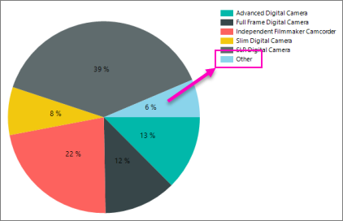

# Collect small slices on a paginated report pie chart (Report Builder)

[!INCLUDE[ssrs-appliesto](../../includes/ssrs-appliesto.md)] [!INCLUDE [ssrs-appliesto-ssrs-rb](../../includes/ssrs-appliesto-ssrs-rb.md)] [!INCLUDE [ssrs-appliesto-pbi-rb](../../includes/ssrs-appliesto-pbi-rb.md)] [!INCLUDE [ssrb-applies-to-ssdt-yes](../../includes/ssrb-applies-to-ssdt-yes.md)]

Pie charts with too many slices can look cluttered. Learn to collect many small slices in a pie chart into one single slice in paginated reports.
 
 To collect small slices into one slice, first decide whether your threshold for collecting small slices is measured as a percentage of the pie chart or as a fixed value. 
 
 The [Tutorial: Add a Pie Chart to Your Report (Report Builder)](../tutorial-add-a-pie-chart-to-your-report-report-builder.md) walks you through collecting small slices into a single slice, if you'd like to try this with sample data first.
 
 
  
 You can also collect small slices into a second pie chart that is called out from a collected slice of the first pie chart. The second pie chart is drawn to the right of the original pie chart.  
  
 You cannot combine slices of funnel or pyramid charts into one slice.  
  
 
## To collect small slices into a single slice on a pie chart  
  
1.  Open the Properties pane.  
  
2.  On the design surface, click on any slice of the pie chart. The properties for the series are displayed in the Properties pane.  
  
3.  In the **General** section, expand the **CustomAttributes** node.  
  
4.  Set the CollectedStyle property to **SingleSlice**.  

    
  
5.  Set the collected threshold value and type of threshold. The following examples are common ways of setting collected thresholds.  
  
    -   **By percentage.** For example, to collect any slice on your pie chart that is less than 10% into a single slice:  
  
         Set the CollectedThresholdUsePercent property to **True**.  
  
         Set the CollectedThreshold property to **10**.  
  
        > [!NOTE]  
        >  If you set CollectedStyle to **SingleSlice**, CollectedThreshold to a value greater than **100**, and CollectedThresholdUsePercent to **True**, the chart will throw an exception because it cannot calculate a percentage. To resolve this issue, set CollectedThreshold to a value less than **100**.  
  
    -   **By data value.** For example, to collect any slice on your pie chart that is less than 5000 into a single slice:  
  
         Set the CollectedThresholdUsePercent property to **False**.  
  
         Set the CollectedThreshold property to **5000**.  
  
6.  Set the CollectedLabel property to a string that represents the text label that will be shown on the collected slice.  
  
7.  (Optional) Set the CollectedSliceExploded, CollectedColor, CollectedLegendText and CollectedToolTip properties. These properties change the appearance, color, label text, legend text and tooltip aspects of the single slice.  
  
## To collect small slices into a secondary, callout pie chart  
  
1.  Follow Steps 1-3 from above.  
  
2.  Set the CollectedStyle property to **CollectedPie**.  
  
3.  Set the CollectedThresholdproperty to a value that represents the threshold at which small slices will be collected into one slice. When the CollectedStyle property is set to **CollectedPie**, the CollectedThresholdUsePercentproperty is always set to **True**, and the collected threshold is always measured in percent.  
  
4.  (Optional) Set the CollectedColor, CollectedLabel, CollectedLegendText and CollectedToolTip properties. All other properties named "Collected" do not apply to the collected pie.  
  
> [!NOTE]  
>  The secondary pie chart is calculated based on the small slices in your data so it will only appear in Preview. It does not appear on the design surface.  
  
> [!NOTE]  
>  You cannot format the secondary pie chart. For this reason, it is strongly recommended to use the first approach when collecting pie slices.  
  
## See Also  
* [Tutorial: Add a Pie Chart to Your Report (Report Builder)](../tutorial-add-a-pie-chart-to-your-report-report-builder.md)
*  [Pie Charts &#40;Report Builder and SSRS&#41;](../../reporting-services/report-design/pie-charts-report-builder-and-ssrs.md)   
*  [Formatting Data Points on a Chart &#40;Report Builder and SSRS&#41;](../../reporting-services/report-design/formatting-data-points-on-a-chart-report-builder-and-ssrs.md)   
*  [Display Data Point Labels Outside a Pie Chart &#40;Report Builder and SSRS&#41;](../../reporting-services/report-design/display-data-point-labels-outside-a-pie-chart-report-builder-and-ssrs.md)   
*  [Display Percentage Values on a Pie Chart &#40;Report Builder and SSRS&#41;](../../reporting-services/report-design/display-percentage-values-on-a-pie-chart-report-builder-and-ssrs.md)     
  
