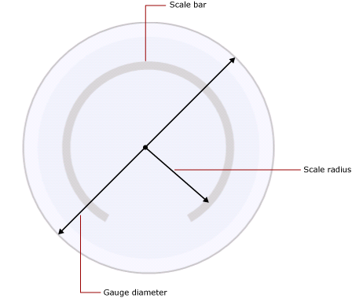

# Formatting Scales on a Gauge (Report Builder and SSRS)
  In a [!INCLUDE[ssRSnoversion_md](../../includes/ssrsnoversion-md.md)] paginated report, the gauge scale is the range of numbers, bound by a minimum and a maximum, shown on a gauge. Typically, a gauge scale contains gauge labels and tick marks to give an accurate reading of what the gauge pointer shows. A gauge scale is generally associated with one or more gauge pointers. You can have more than one scale on the same gauge.  
  
   
  
 Unlike the chart, where multiple groups are defined, the gauge only shows one value. You must define the minimum and maximum values of the scale. The interval numbers are calculated automatically based on the values specified for the minimum and maximum.  
  
 When you add a second scale on a gauge that already contains one scale, the appearance properties of the first scale are cloned on the second scale.  
  
 You can set properties on the scale by right-clicking on the scale labels or tick marks and selecting **Radial Scale Properties** or **Linear Scale Properties**. Each gauge type contains at least one scale with the same set of properties. There are also properties unique to each gauge type:  
  
-   On a radial gauge, you can specify the radius, start angle, and sweep angle of the radial scale.  
  
-   On a linear gauge, you can specify the width of the start and end margins relative to the endpoints on a linear gauge.  
  
 To quickly get started with formatting scales, see [Set a Minimum or Maximum on a Gauge &#40;Report Builder and SSRS&#41;](../../reporting-services/report-design/set-a-minimum-or-maximum-on-a-gauge-report-builder-and-ssrs.md).  
  
##   Defining Minimum, Maximum, and Intervals on a Scale  
 A gauge is frequently used to display KPIs that are measured in percentages from 0 to 100, so these are the default values given to the minimum and maximum properties on the gauge. However, these values may not represent the scale of values that you are trying to show. Because there is no built-in logic to determine what the KPI data field represents, the gauge does not automatically calculate minimum and maximum values. If your KPI data field is not a value between 0 and 100, you must explicitly set values for the minimum and maximum properties in order to give context to the one value that is being displayed on the gauge.  
  
 On the scale are major and minor tick marks. In addition, the scale has labels that are typically associated with the major tick marks. For example, a scale might have major tick marks at 0, 20, 40, 60, 80, and 100. The labels should correspond to those tick marks. The difference between the label values is called the scale interval. In this example, the scale interval is set to 20. You can set the Interval property in the **Radial Scale Properties** or **Linear Scale Properties** dialog box.  
  
 The application calculates scale intervals according to the following steps:  
  
1.  Specify minimum and maximum values. These values are not calculated automatically based on your dataset, so you must provide the values on the gauge's **Properties** dialog box.  
  
2.  If you do not specify a value for Interval, the default value is Auto. This means the application will calculate an equidistant number of intervals based on the minimum and maximum values specified in the first step. If you do specify a value for Interval, the gauge will calculate the difference between the maximum and minimum value, and divide that number by the value specified in the Interval property.  
  
 There are also properties to define label and tick mark intervals. If you specify a value for these properties, they will override the value specified for the scale interval property. For example, if the scale interval is Auto, but you specify 4 for the label interval, the labels will be displayed as 0, 4, 8 and so on, but the major tick marks will still be calculated by the gauge based on its own calculation. This may cause situations where the labels are not in sync with the tick marks. Consider hiding tick marks from display if you set a label interval.  
  
 The interval offset determines the number of units that will be skipped before the first label is shown. All successive major tick marks and labels that appear on the scale will use the interval specified. A value of 0 for label or tick mark intervals is the same as resetting the interval to Auto.  
  
##   Reducing Label Collisions with Multipliers  
 If your values contain many digits, they may begin to obscure the readability of the gauge. You can use a scale multiplier to increase or reduce the scale of the values. When a scale multiplier is specified, each original value on the scale is multiplied by the multiplier before being displayed on the scale. To reduce the scale of values, you must specify a decimal number. For example, if your scale goes from 0 to 10000 but you want to show the numbers 0 to 10 on the gauge, you can use a multiplier value of 0.001.  
  
> [!NOTE]  
>  Using a multiplier does not multiply the actual value of the aggregated field that the gauge uses. It only multiplies the values of the labels displayed on the gauge after the minimum, maximum, and intervals are defined. Consider keeping the interval calculations as automatic when using a multiplier.  
  
##   Specifying the Scale Bar Width, Radius, and Angles on a Radial Scale  
 Use the **Layout** page of the **Radial Scale Properties** dialog box to set the scale bar width, scale radius, start angle, and sweep angle of the scale. You can use these properties to customize the size and format of the scale. For example, if you position scale labels outside the scale, you will need to resize the radius of the scale so that the labels fit inside the gauge.  
  
> [!NOTE]  
>  When you click the scale of a gauge, a dotted outline appears around the scale. This outline is not the scale bar, and it is not used when calculating measurements on the gauge. It is available only at design time so that you can highlight the scale in order to access the scale properties.  
  
 All measurements are based on the scale bar. When you select a gauge, the scale bar width is not shown. If you specify a value for the scale bar, it will help you with all other measurements related to the scale. To view the scale bar, set the **Scale bar width** property on the **Layout** page of the **Radial Scale Properties** dialog box to a value greater than 0. On a radial gauge, the scale bar is measured as a percentage of the gauge diameter. On a linear gauge, the scale bar is measured as a percentage of the gauge width or height, whichever is smallest.  
  
 The scale radius is the distance from the center of the gauge to the middle of the scale bar. The value of the scale radius is measured as a percentage of the gauge diameter. It is a good practice to keep the scale radius below a value of 35. If you specify a value higher than 35, the scale will likely be drawn outside the boundaries of the gauge. The following illustration shows how the scale radius is measured, relative to the diameter of the gauge, on the scale bar.  
  
   
  
 The start angle is the angle of rotation, between 0 and 360, at which the scale will begin. The zero (0) position is located at the bottom of the gauge, and the start angle rotates clockwise. For example, a start angle of 90 degrees starts the scale at the 9 o'clock position.  
  
 The sweep angle is the number of degrees, between 0 and 360 that the scale will sweep in a circle. A sweep angle of 360 degrees produces a scale that is a complete circle. This is useful if you want to design a gauge to look like a clock.  
  
##   Positioning Labels on a Linear or Radial Scale  
 There are two properties that determine the position of labels. The label placement property specifies whether the labels are displayed on the inside, outside, or across the scale bar. The distance property sets the label distance from the scale, starting at the scale bar. If you want to position labels within the scale bar, specify a negative number. For example, if your labels are outside the scale and you have set a distance from scale of 10, the labels will be shown at 10 units outside where the labels would typically be placed, where 1 unit is either:  
  
-   1% of the gauge diameter on a radial gauge, or  
  
-   1% of the smallest value of the gauge height or width on a linear gauge.  
  
## See Also  
 [Formatting Ranges on a Gauge &#40;Report Builder and SSRS&#41;](../../reporting-services/report-design/formatting-ranges-on-a-gauge-report-builder-and-ssrs.md)   
 [Formatting Pointers on a Gauge &#40;Report Builder and SSRS&#41;](../../reporting-services/report-design/formatting-pointers-on-a-gauge-report-builder-and-ssrs.md)   
 [Format Axis Labels as Dates or Currencies &#40;Report Builder and SSRS&#41;](../../reporting-services/report-design/format-axis-labels-as-dates-or-currencies-report-builder-and-ssrs.md)   
 [Formatting Axis Labels on a Chart &#40;Report Builder and SSRS&#41;](../../reporting-services/report-design/formatting-axis-labels-on-a-chart-report-builder-and-ssrs.md)   
 [Gauges &#40;Report Builder and SSRS&#41;](../../reporting-services/report-design/gauges-report-builder-and-ssrs.md)  
  
  
